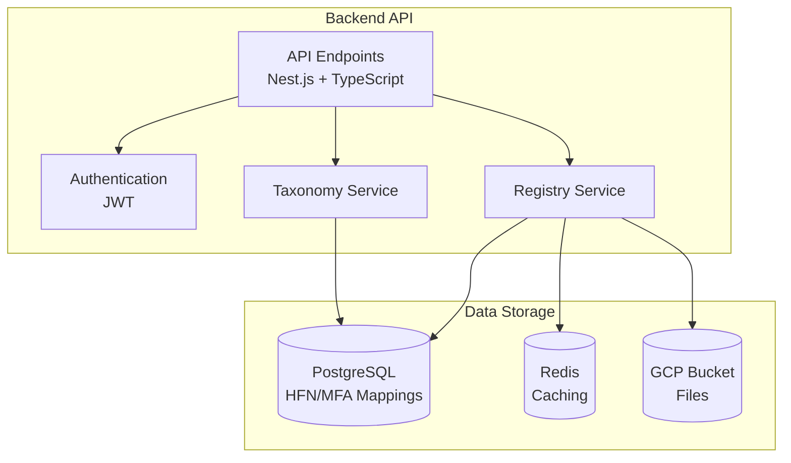
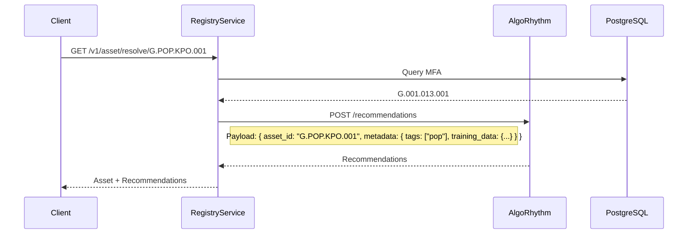
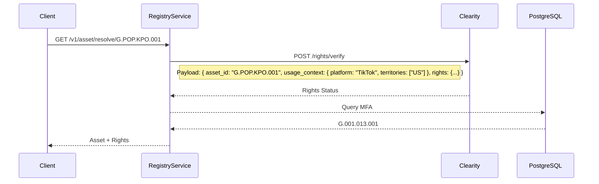

# Comprehensive plan to implement the Backend of the NNA Registry Service with the help of AI Agents


**Document Version**: 1.2.1

**Last Updated**: May 03, 2025

**Previous Update**: May 03, 2025

**Status**: Draft (Pending Review)

## Executive Summary

The **Naming, Numbering, and Addressing (NNA) Registry Service Backend** is a microservice powering ReViz’s AI-powered video remixing platform, managing digital assets with a standardized identification system inspired by ITU-T standards (e.g., E.164, E.212) ([NNA Framework Whitepaper Ver 1.1.2](https://celerity.slab.com/posts/0jsj4gsl#he2l1-2-3-nna-framework-foundation)). Built with Nest.js, PostgreSQL, Redis, and Google Cloud Storage (GCS), it supports asset registration, lookup, and management for 10 MVP layers (Songs [G], Stars [S], Looks [L], Moves [M], Worlds [W], Branded [B], Personalize [P], Training Data [T], Rights [R], Composites [C]) and 5 future layers (Audio Effects [E], Transitions [N], Augmented Reality [A], Filters [F], Text [X]). This updated plan (v1.2.1) aligns with **NNA Implementation Plan v1.0.3**, prioritizing a 2-day MVP (March 3-4, 2025) for core functionality (HFN/MFA registration, upload, browsing, editing, curation) using AI-assisted development with Cursor (code generation) and Claude (validation). It ensures scalability (10M+ users, sub-20ms latency, 95%+ cache hit rate), a constrained dual addressing system (1,000 three-character codes per layer), and integrations with AlgoRhythm (recommendations) and Clearity (rights verification).

## Changelog

- **v1.2.1 (2025-05-03)**:
    - Enhanced **Section 2 - Data Models** to include training data (prompts, images, video URLs) and rights metadata per Taxonomy v1.3.
    - Updated **Section 3 - API Endpoints** to enforce dual addressing with 1,000 three-character code limit per layer, with mapping to three-digit numeric codes.
    - Added AI prompts in **Section 4.1 - Development Phases** for Cursor (controllers, schemas) and Claude (tests, validation), leveraging step-by-step guides.
    - Refined **Section 5 - Integrations** with detailed payloads for training data and rights verification.
    - Incorporated testing strategies from prior prompts in **Section 6 - Testing Strategy**.
    - Removed MongoDB references, standardizing on PostgreSQL per v1.0.3.
- **v1.2.0 (2025-05-03)**: Initial plan with Nest.js, PostgreSQL, Redis, GCS architecture.
- **v1.1.0 (N/A)**: Not applicable.
- **v1.0.0 (N/A)**: Not applicable.

# 1. Architecture Overview

## 1.1 System Components



- **API Endpoints**: RESTful endpoints for asset operations, built with Nest.js.
- **Authentication**: JWT-based with RBAC (user: read/write, admin: delete).
- **Registry Service**: Handles HFN/MFA registration, lookup, and management for G, S, L, M, W, B, P, T, R, C layers.
- **Taxonomy Service**: Validates categories/subcategories against Taxonomy v1.3 (e.g., `KPO` for K-Pop).
- **Storage**: PostgreSQL for HFN/MFA mappings, Redis for caching (95%+ hit rate), GCS for files.

## 1.2 Key Technical Decisions

- **Framework**: Nest.js + TypeScript for modular APIs.
- **Database**: PostgreSQL for structured data; MongoDB as a future alternative for metadata if latency demands.
- **Caching**: Redis with multi-tier strategy (edge, regional, global).
- **Storage**: GCS for durable asset storage.
- **Authentication**: OAuth 2.0, JWT (1-hour lifespan), RBAC.
- **Monitoring**: Sentry for errors, Winston for logging.

# 2. Data Models

The backend uses PostgreSQL for structured HFN/MFA mappings, with training data and rights metadata per Taxonomy v1.3.

## 2.1 Registry Entry (PostgreSQL)

```sql
CREATE TABLE registry_entries (
    id UUID PRIMARY KEY,
    friendly_name VARCHAR(255) NOT NULL UNIQUE, -- e.g., G.POP.KPO.001
    nna_address VARCHAR(255) NOT NULL UNIQUE, -- e.g., G.001.013.001
    layer VARCHAR(10) NOT NULL, -- e.g., G
    category_code VARCHAR(10) NOT NULL, -- e.g., POP
    category_num INTEGER NOT NULL CHECK (category_num BETWEEN 0 AND 999), -- e.g., 001
    subcategory_code VARCHAR(10) NOT NULL, -- e.g., KPO
    subcategory_num INTEGER NOT NULL CHECK (subcategory_num BETWEEN 0 AND 999), -- e.g., 013
    sequential INTEGER NOT NULL CHECK (sequential BETWEEN 0 AND 999), -- e.g., 001
    type VARCHAR(10), -- e.g., mp3
    version VARCHAR(10) DEFAULT 'v1',
    status VARCHAR(20) DEFAULT 'active',
    metadata JSONB, -- e.g., { "source": "ReViz", "tags": ["pop"], "training_data": {...} }
    gcp_storage_url VARCHAR(255),
    created_at TIMESTAMP DEFAULT CURRENT_TIMESTAMP,
    updated_at TIMESTAMP DEFAULT CURRENT_TIMESTAMP
);
CREATE INDEX idx_registry_entries_layer ON registry_entries (layer);
CREATE INDEX idx_registry_entries_category_code ON registry_entries (category_code);
CREATE INDEX idx_registry_entries_subcategory_code ON registry_entries (subcategory_code);
```

## 2.2 Category Mapping (PostgreSQL)

```sql
CREATE TABLE category_mappings (
    id UUID PRIMARY KEY,
    layer VARCHAR(10) NOT NULL,
    category_code VARCHAR(10) NOT NULL CHECK (LENGTH(category_code) = 3), -- e.g., POP
    category_num INTEGER NOT NULL CHECK (category_num BETWEEN 0 AND 999), -- e.g., 001
    category_name VARCHAR(255) NOT NULL, -- e.g., Pop
    is_deprecated BOOLEAN DEFAULT FALSE,
    replacement_category VARCHAR(255),
    CONSTRAINT unique_category_code UNIQUE (layer, category_code),
    CONSTRAINT unique_category_num UNIQUE (layer, category_num)
);
CREATE INDEX idx_category_mappings_layer ON category_mappings (layer);
```

## 2.3 Subcategory Mapping (PostgreSQL)

```sql
CREATE TABLE subcategory_mappings (
    id UUID PRIMARY KEY,
    layer VARCHAR(10) NOT NULL,
    category_code VARCHAR(10) NOT NULL,
    subcategory_code VARCHAR(10) NOT NULL CHECK (LENGTH(subcategory_code) = 3), -- e.g., KPO
    subcategory_num INTEGER NOT NULL CHECK (subcategory_num BETWEEN 0 AND 999), -- e.g., 013
    subcategory_name VARCHAR(255) NOT NULL, -- e.g., K-Pop
    is_deprecated BOOLEAN DEFAULT FALSE,
    replacement_subcategory VARCHAR(255),
    CONSTRAINT unique_subcategory_code UNIQUE (layer, category_code, subcategory_code),
    CONSTRAINT unique_subcategory_num UNIQUE (layer, category_code, subcategory_num)
);
CREATE INDEX idx_subcategory_mappings_layer_category ON subcategory_mappings (layer, category_code);
```

## 2.4 Sequential Counter (PostgreSQL)

```sql
CREATE TABLE sequential_counters (
    id UUID PRIMARY KEY,
    layer VARCHAR(10) NOT NULL,
    category_code VARCHAR(10) NOT NULL,
    subcategory_code VARCHAR(10) NOT NULL,
    next_sequential INTEGER DEFAULT 1 CHECK (next_sequential BETWEEN 1 AND 999),
    CONSTRAINT unique_counter UNIQUE (layer, category_code, subcategory_code)
);
```

## 2.5 Training Data (JSONB in metadata)

```json
{
  "training_data": {
    "prompts": ["Text prompt 1", "Text prompt 2"],
    "images": ["https://storage.googleapis.com/reviz-assets/G/POP/KPO/image1.jpg"],
    "video_urls": ["https://youtube.com/watch?v=example"],
    "metadata": {
      "dataset_id": "T.G.POP.KPO.001",
      "created_by": "user@celerity.studio"
    }
  }
}
```

# 3. API Endpoints

Aligned with API Specification v1.3.2, with a constrained dual addressing system (1,000 three-character codes per layer).

| **Endpoint** | **Method** | **Description** | **Auth** |
| --- | --- | --- | --- |
| `/v1/asset/register` | POST | Register a new asset with HFN/MFA | User |
| `/v1/asset/resolve/{asset_id}` | GET | Resolve HFN to MFA or vice versa | User |
| `/v1/asset/search` | GET | Search assets by taxonomy/tags | User |
| `/v1/asset/{id}` | PUT | Update asset metadata | User |
| `/v1/asset/{id}` | DELETE | Delete asset | Admin |
| `/v1/rights/verify/{asset_id}` | POST | Verify rights via Clearity | User |
| `/v1/auth/register` | POST | Register a new user | None |
| `/v1/auth/login` | POST | Login and get JWT | None |

## 3.1 Example: Register Asset

```typescript
@Post('register')
@UseInterceptors(FileInterceptor('file'))
async registerAsset(@Body() body: RegisterAssetDto, @UploadedFile() file: Express.Multer.File) {
  const { layer, categoryCode, subcategoryCode, type, metadata } = body;
  await this.taxonomyService.validate(layer, categoryCode, subcategoryCode);
  const counter = await this.sequentialCounterModel.findOneAndUpdate(
    { layer, categoryCode, subcategoryCode },
    { $inc: { next_sequential: 1 } },
    { upsert: true, new: true }
  );
  const category = await this.categoryMappingModel.findOne({ layer, categoryCode });
  const subcategory = await this.subcategoryMappingModel.findOne({ layer, categoryCode, subcategoryCode });
  const sequential = counter.next_sequential.toString().padStart(3, '0');
  const friendlyName = `${layer}.${categoryCode}.${subcategoryCode}.${sequential}.${type}`;
  const nnaAddress = `${layer}.${category.category_num.toString().padStart(3, '0')}.${subcategory.subcategory_num.toString().padStart(3, '0')}.${sequential}.${type}`;
  const gcpUrl = await this.gcpService.upload(file, friendlyName);
  return this.registryEntryModel.create({
    friendly_name: friendlyName,
    nna_address: nnaAddress,
    layer,
    category_code: categoryCode,
    category_num: category.category_num,
    subcategory_code: subcategoryCode,
    subcategory_num: subcategory.subcategory_num,
    sequential: counter.next_sequential,
    type,
    metadata,
    gcp_storage_url: gcpUrl
  });
}
```

# 4. Implementation Strategy

## 4.1 Development Phases

| **Phase** | **Duration** | **Tasks** | **Deliverables** | **AI Tool Support** |
| --- | --- | --- | --- | --- |
| Setup (Day 1) | 4 hours | Configure Nest.js, PostgreSQL, Redis, GCS | Auth endpoints, schemas | Cursor: Setup scripts |
| Core (Day 1) | 8 hours | Implement `/v1/asset/register`, `/v1/asset/resolve`, `/v1/asset/search` | Core endpoints, taxonomy validation | Cursor: Controllers; Claude: Tests |
| Management (Day 2) | 8 hours | Add `/v1/asset/{id}` (PUT/DELETE), RBAC | Update/delete endpoints, admin UI | Cursor: Admin endpoints; Claude: RBAC |
| Testing (Day 2) | 4 hours | Write Jest tests, deploy to GCP | 80%+ test coverage, deployed MVP | Claude: Jest tests |

**AI Prompts**:

- **Cursor**: “Generate a Nest.js controller for `/v1/asset/register` with TypeScript, PostgreSQL integration via TypeORM, and class-validator for input validation.”
- **Claude**: “Write Jest unit tests for a Nest.js controller handling HFN generation, covering valid inputs, duplicate HFNs, and invalid taxonomy.”

## 4.2 Performance and Security

- **Caching**: Redis for HFN/MFA lookups (95%+ hit rate).
- **Latency**: Sub-20ms via indexed PostgreSQL queries and Redis.
- **Uptime**: Multi-region GCP deployment (99.999%).
- **Security**: OAuth 2.0, JWT (1-hour lifespan), RBAC (user: read/write, admin: delete).

# 5. Integrations

## 5.1 AlgoRhythm Integration



- **Payload**:

```json
{
  "asset_id": "G.POP.KPO.001",
  "metadata": {
    "tags": ["pop", "kpop"],
    "popularity_score": 85,
    "training_data": {
      "prompts": ["K-Pop dance track"],
      "images": ["https://storage.googleapis.com/reviz-assets/G/POP/KPO/cover.jpg"]
    }
  }
}
```

## 5.2 Clearity Integration



- **Payload**:

```json
{
  "asset_id": "G.POP.KPO.001",
  "usage_context": {
    "publication_platform": "TikTok",
    "territories": ["US"],
    "usage_type": "non_commercial"
  },
  "rights": {
    "source": "ReViz",
    "rights_split": "50/50"
  }
}
```

# 6. Testing Strategy

- **Unit Tests**: Jest for controllers, services (80%+ coverage).
- **Integration Tests**: Validate API endpoints, database queries, and GCS uploads using Supertest and Dockerized PostgreSQL/Redis.
- **Performance Tests**: Measure latency and cache hit rate via `https://api.reviz.dev/explorer`.
- **E2E Tests**: Simulate asset registration, search, and curation workflows.

# 7. Conclusion

This backend plan ensures the NNA Registry Service is deployable in 2 days (March 3-4, 2025) using AI-assisted development. It aligns with **NNA Implementation Plan v1.0.3**, Taxonomy v1.3, and API Specification v1.3.2, enabling scalable asset management with robust integrations for ReViz’s platform.

---
