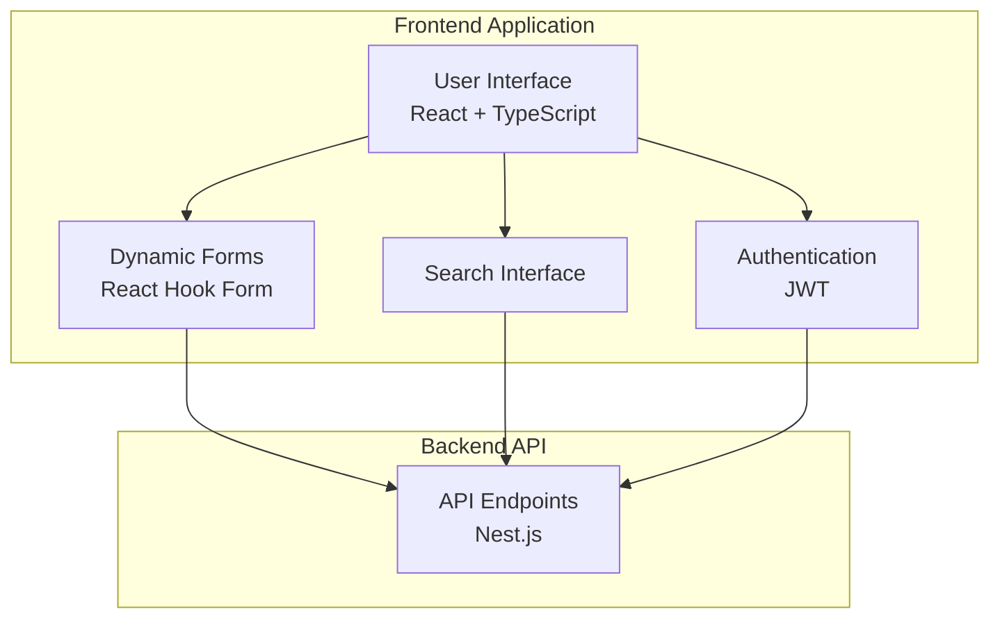
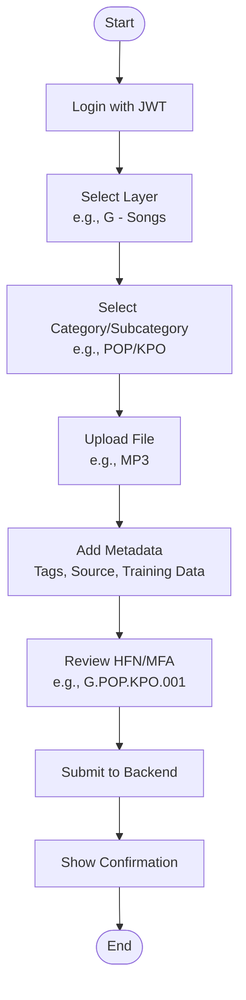

# Comprehensive plan to implement the Frontend of the NNA Registry Service with the help of AI Agents

**Document Version**: 1.2.2

**Last Updated**: May 03, 2025

**Previous Update**: May 03, 2025

**Status**: Draft (Pending Review)

## Executive Summary

The **Naming, Numbering, and Addressing (NNA) Registry Service Frontend** is a React-based interface for ReViz’s AI-powered video remixing platform, enabling creators to register, browse, edit, and curate assets using a standardized identification system inspired by ITU-T standards (e.g., E.164, E.212) ([NNA Framework Whitepaper Ver 1.1.2](https://celerity.slab.com/posts/0jsj4gsl#he2l1-2-3-nna-framework-foundation)). It is a foundational component of the broader NNA Framework, which includes additional services like Asset Resolution, Composition, and Rights Management. Built with React, TypeScript, and Material-UI, it supports 10 MVP layers (Songs [G], Stars [S], Looks [L], Moves [M], Worlds [W], Branded [B], Personalize [P], Training Data [T], Rights [R], Composites [C]) and 5 future layers (Audio Effects [E], Transitions [N], Augmented Reality [A], Filters [F], Text [X]). This updated plan (v1.2.2) aligns with **NNA Implementation Plan v1.0.3**  for core UI functionality (registration, browsing, curation) using AI-assisted development with Cursor (components) and Claude (validation). The overall implementation spans March 3 - July 4, 2025, ensuring usability, scalability, and integrations with AlgoRhythm and Clearity via backend APIs.

## Changelog

- **v1.2.2 (2025-05-03)**:
    - Enhanced **Section 3.1 - Asset Registration Flow** with training data collection (prompts, images, video URLs) and real-time HFN/MFA previews, incorporating journey maps from prior prompts.
    - Updated **Section 2.2 - Data Models** with training data interfaces per Taxonomy v1.3.
    - Added AI prompts in **Section 4.1 - Development Phases** for Cursor (React components) and Claude (UX tests), leveraging step-by-step guides.
    - Refined **Section 5 - Integrations** with UI handling for training data and rights metadata.
    - Incorporated UI mockups and user experience considerations from temporary content.
    - Removed MongoDB and Google Drive references, aligning with PostgreSQL and GCS.
- **v1.2.1 (2025-05-03)**: Updated taxonomy to v1.3, added 2-day MVP timeline.
- **v1.2.0 (2025-04-15)**: Initial requirements with React + TypeScript + Material-UI.
- **v1.1.0 (2025-03-01)**: Added taxonomy-driven forms.
- **v1.0.0 (2025-02-01)**: Initial draft.

# 1. Introduction

## 1.1 Purpose

This document outlines the frontend implementation plan for the NNA Registry Service, providing an intuitive UI for creators to manage assets in ReViz’s platform.

## 1.2 Scope

The frontend supports:

- **Asset Registration**: Upload and categorize assets with training data for G, S, L, M, W, B, P, T, R, C layers.
- **Asset Browsing**: Search and filter assets using Taxonomy v1.3.
- **Asset Management**: Edit, curate, and delete assets with RBAC.
- **Integrations**: Consume backend APIs for AlgoRhythm recommendations and Clearity rights verification.

## 1.3 Objectives

- Deploy a 2-day MVP (March 3-4, 2025) for core UI functionality.
- Ensure usability for non-technical creators.
- Achieve responsive UI with sub-20ms API response times.

## 1.4 Taxonomy Structure Overview

The frontend leverages the NNA Framework’s **Naming, Numbering, and Addressing** principles ([NNA Framework Whitepaper Ver 1.1.2](https://celerity.slab.com/posts/0jsj4gsl#he2l1-2-3-nna-framework-foundation)). The MVP focuses on 10 layers, with 5 future layers, per **enriched_nna_layer_taxonomy_v1.3.json**.

| **Layer Code** | **Name** | **Purpose** | **Dependencies** |
| --- | --- | --- | --- |
| G | Songs | Music tracks & audio | None |
| S | Stars | Performance avatars | Song |
| L | Looks | Costumes & styling | Star |
| M | Moves | Choreography | Star |
| W | Worlds | Environments | Independent |
| B | Branded | Branded content | Independent |
| P | Personalize | User-uploaded customizations | Star, Look, Moves, World |
| T | Training_Data | Datasets for AI training | All layers |
| R | Rights | Provenance and rights tracking | All layers |
| C | Composites | Aggregated multi-layer assets | All layers |
| E | Audio Effects* | Audio enhancements | Song |
| N | Transitions* | Scene transitions | Independent |
| A | Augmented Reality* | AR elements | Independent |
| F | Filters* | Visual filters | Independent |
| X | Text* | Text overlays | Song |

_*Future layers included for extensibility, not part of the MVP._


**Dual Addressing System**:

- **Human-Friendly Names (HFN)**: `[Layer].[CategoryCode].[SubCategoryCode].[Sequential].[Type]` (e.g., `G.POP.KPO.001.mp3`).
- **Machine-Friendly Addresses (MFA)**: `[Layer].[CategoryNum].[SubCategoryNum].[Sequential].[Type]` (e.g., `G.001.013.001.mp3`).
- **Constraint**: Maximum 1,000 three-character codes per layer, mapped to three-digit numeric codes (000-999).

# 2. Architecture

## 2.1 System Components



- **User Interface**: React + Material-UI for responsive design.
- **Dynamic Forms**: React Hook Form for taxonomy-driven registration.
- **Search Interface**: Taxonomy-based filtering and full-text search.
- **Authentication**: JWT-based login/registration.

## 2.2 Data Models

### 2.2.1 Asset (Frontend Interface)

```typescript
## 2.2 Data Models

### 2.2.1 Asset (Frontend Interface)

```typescript
interface Asset {
  id: string;
  friendlyName: string; // e.g., G.POP.KPO.001
  nnaAddress: string; // e.g., G.001.013.001
  layer: string; // e.g., G
  categoryCode: string; // e.g., POP
  subcategoryCode: string; // e.g., KPO
  type: string; // e.g., mp3
  metadata: {
    Source: string; // e.g., ReViz
    Tags: string[]; // e.g., ["pop", "kpop"]
    Engagement_Metrics?: { [key: string]: string }; // e.g., {"TikTok_Views": "1.2M"}
    Accessibility_Tags?: string[]; // e.g., ["Audio", "Music"]
    Popularity_Score?: number; // e.g., 85
    training_data?: {
      prompts: string[];
      images: string[];
      video_urls: string[];
      dataset_id: string;
    };
    rights?: {
      Source: string;
      Rights_Split: string;
    };
    [key: string]: any; // Dynamic fields from Taxonomy v1.3
  };
  gcpStorageUrl: string;
  createdAt: string;
  updatedAt: string;
}
```

### 2.2.2 Taxonomy (JSON File)

```typescript
interface Taxonomy {
  [layer: string]: {
    categories: {
      [categoryNum: string]: {
        name: string; // e.g., Pop
        code: string; // e.g., POP
        subcategories: {
          [subcategoryNum: string]: {
            name: string; // e.g., K-Pop
            code: string; // e.g., KPO
          };
        };
      };
    };
  };
}
```

# 3. User Interfaces

## 3.1 Asset Registration Flow



**UI Example**:

```
┌───────────────────────────────┐
│ Register Asset                │
│ Layer: [G - Songs ▼]          │
│ Category: [POP ▼]             │
│ Subcategory: [KPO ▼]          │
│ HFN Preview: G.POP.KPO.001    │
│ MFA Preview: G.001.013.001    │
│ File: [Choose File]           │
│ Tags: [pop, kpop            ] │
│ Source: [ReViz ▼]             │
│ Training Data:                │
│   Prompts: [Enter prompts...] │
│   Images: [Choose Files]      │
│   Video URLs: [Enter URLs...] │
│ [Upload]                      │
└───────────────────────────────┘
```

**AI Prompts**:

- **Cursor**: “Generate a React component for asset registration with Material-UI, React Hook Form, and Axios for POST `/v1/asset/register`, including training data inputs.”
- **Claude**: “Validate this React form against Taxonomy v1.3, ensuring HFN/MFA previews and training data fields, and write Jest tests.”

## 3.2 Asset Search

```
┌───────────────────────────────┐
│ Search Assets                 │
│ Search: [kpop               ] │
│ Layer: [G - Songs ▼]          │
│ Category: [POP ▼]             │
│ Subcategory: [KPO ▼]          │
│ [Search]                      │
└───────────────────────────────┐
```

## 3.3 Asset Management

```
┌───────────────────────────────┐
│ Manage Asset: G.POP.KPO.001   │
│ HFN: [G.POP.KPO.001         ] │
│ Description: [K-Pop song... ] │
│ [Update] [Delete]             │
└───────────────────────────────┐
```

# 4. Implementation Strategy

## 4.1 Development Phases

| **Phase** | **Duration** | **Tasks** | **Deliverables** | **AI Tool Support** |
| --- | --- | --- | --- | --- |
| Setup (Day 1) | 4 hours | Configure React, Material-UI, Axios | Login page, API client | Cursor: Setup scripts |
| Core (Day 1) | 8 hours | Build registration, search UI | Registration form, search interface | Cursor: Components; Claude: Tests |
| Management (Day 2) | 8 hours | Add editing, curation UI, RBAC | Update/delete UI, admin access | Cursor: Admin UI; Claude: RBAC |
| Testing (Day 2) | 4 hours | Write UI tests, deploy to Netlify | 80%+ test coverage, deployed MVP | Claude: Jest tests |

**AI Prompts**:

- **Cursor**: “Generate a React component for taxonomy selection with Material-UI, showing real-time HFN/MFA previews.”
- **Claude**: “Write Jest tests for a React search component, covering taxonomy filters and pagination.”

## 4.2 Performance and Security

- **Performance**: Lazy loading, debounced search (300ms), memoized components.
- **Security**: JWT-based authentication, role-based UI access (user: read/write, admin: delete).

# 5. Integrations

## 5.1 AlgoRhythm Integration

- **UI Integration**: Display recommended assets (e.g., “Similar: G.POP.KPO.002”).
- **API Call Example**:

```typescript
const fetchAsset = async (assetId: string) => {
  try {
    const response = await axios.get(`/v1/asset/resolve/${assetId}`, {
      headers: { Authorization: `Bearer ${jwtToken}` }
    });
    return response.data;
  } catch (error) {
    if (error.response?.status === 404) alert('Asset not found');
    else if (error.response?.status === 403) redirectToLogin();
  }
};
```

## 5.2 Clearity Integration

- **UI Integration**: Show rights status (e.g., “Approved for TikTok in US”).
- **API Call Example**:

```typescript
const verifyRights = async (assetId: string, usageContext: any) => {
  try {
    const response = await axios.post(`/v1/rights/verify/${assetId}`, usageContext, {
      headers: { Authorization: `Bearer ${jwtToken}` }
    });
    return response.data;
  } catch (error) {
    if (error.response?.status === 409) alert('Rights conflict: Usage restricted');
  }
};
```

# 6. Testing Strategy

- **Unit Tests**: Jest and React Testing Library for components (80%+ coverage).
- **Integration Tests**: Validate API consumption and UI flows.
- **UI Tests**: Test forms and search interface using `https://api.reviz.dev/explorer`.

# 7. Conclusion

This frontend plan ensures a user-friendly, scalable interface deployable in 2 days (March 3-4, 2025). It aligns with **NNA Implementation Plan v1.0.3**, backend plan v1.2.1, and Taxonomy v1.3, enabling creators to manage assets efficiently.


---

# 
