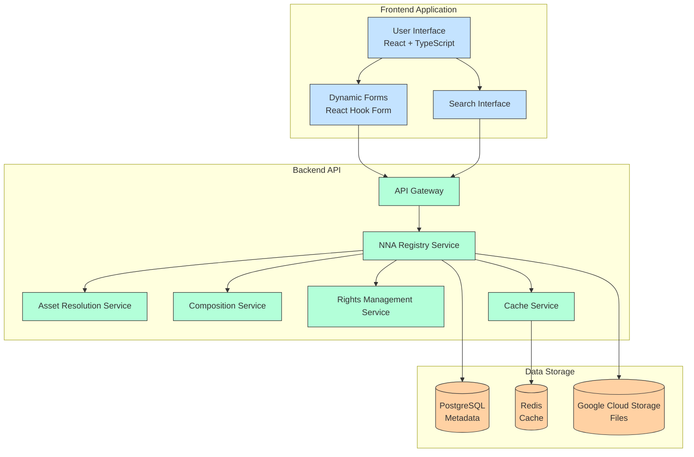
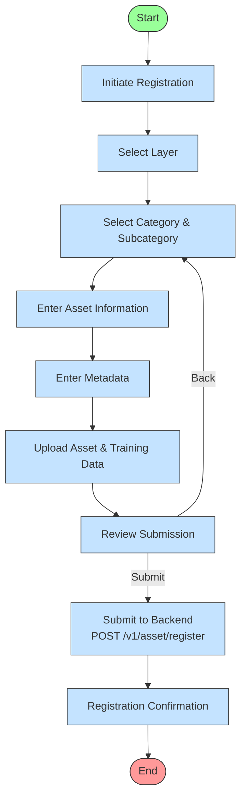
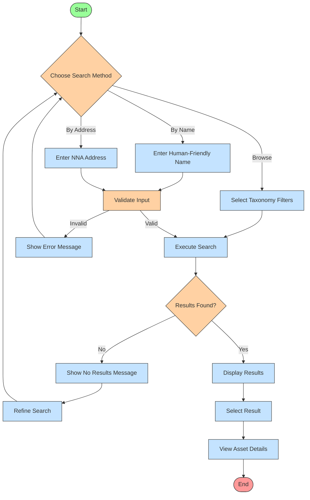
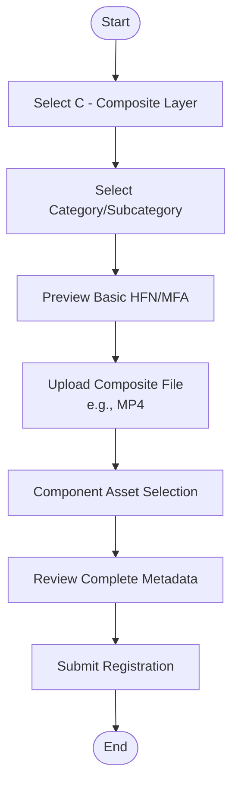

**Version**: 1.2.2

**Last Updated**: May 5, 2025

Previous Update: April 10, 2025

**Status**: Updated Draft

## Executive Summary


The NNA Registry Service is a core component of the NNA Framework, designed to manage digital assets for ReViz's AI-powered video remixing platform. It leverages the enhanced NNA Layer Taxonomy v1.3 (using `enriched_nna_layer_taxonomy_v1.3.json`) to register, categorize, and retrieve assets, supporting seamless integration with AlgoRhythm (AI recommendations) and Clearity (rights management). This document outlines the requirements, user experience, use cases, architecture, and implementation plan for the Registry Service MVP, focusing on front-end and back-end development by a lean team (one full-stack engineer [FSE] and one back-end engineers [BE1]) over 4 weeks (April 10 - May 10, 2025) as part of the overall NNA Implementation Plan V 1.0.3

As of May 2025, the front-end implementation is nearly complete, using React, Nest.js, PostgreSQL for metadata, Redis for caching, and Google Cloud Storage (GCS) for files, with real backend APIs available at `https://registry.reviz.dev/api/docs`. The next steps involve enhancing both the frontend and  back-end, improving their integration, testing, and production deployment.

# 1. Registry Service Product Overview

## 1.1 Purpose

The NNA Registry Service, a core component of the broader NNA Framework, enables content creators to register digital assets (e.g., songs, dance moves, looks) using a hierarchical taxonomy, store them securely in Google Cloud Storage (GCS), and retrieve them via real backend APIs for use in video remixing. The NNA Framework provides additional services like Asset Resolution, Composition, and Rights Management, while the Registry Service focuses on foundational asset management. For the MVP, the implementation provides an intuitive front-end interface for asset registration, taxonomy selection, and preview generation, integrated with a Nest.js backend exposing RESTful endpoints at `https://registry.reviz.dev/api/docs`. It provides a dual addressing system (Human-Friendly Names and Machine-Friendly Addresses) and integrates with PostgreSQL for metadata management, Redis for caching, and external services like AlgoRhythm and Clearity for recommendations and rights management.

## 1.2 Target Users

- **Content Creators**: Register and manage assets for video remixing (primary focus for the MVP).
- **System Administrators**: Manage taxonomy and oversee asset registration (to be implemented in future phases).
- **Integration Developers**: Use APIs at `https://registry.reviz.dev/api/docs` to integrate with other systems (e.g., AlgoRhythm, Clearity) (to be fully implemented in future phases).

## 1.3 Business Goals

- Streamline asset registration and management through an intuitive interface.
- Ensure consistent taxonomy application using `enriched_nna_layer_taxonomy_v1.3.json`.
- Enable efficient asset discovery with search functionality via real backend APIs.
- Support AI/ML training data organization through training data upload.
- Facilitate integration with other systems (e.g., AlgoRhythm, Clearity) using real APIs at `https://registry.reviz.dev/api/docs`.

## 1.4 MVP Scope (April 10 - May 10, 2025):

- Proof-of-Concept (April 10- 14, 2025): Deploy NNA Registry Service with basic asset registration, lookup, and management.
- Implement asset registration with taxonomy selection (layer, category, subcategory).
- Support file uploads to Google Cloud Storage (GCS).
- Generate and preview Human-Friendly Names (HFN) and Machine-Friendly Addresses (MFA).
- Provide a review and submission flow for assets, integrated with real backend APIs.
- Complete back-end integration, testing, and production deployment within the overall scope of NNA Framework by July 4, 2025. See NNA Implementation Plan Ver 1.0.3

## 1.5 Taxonomy Structure Overview

The NNA Layer Taxonomy v1.3 (defined in `enriched_nna_layer_taxonomy_v1.3.json`) supports the diverse needs of ReViz's platform with the following layers. The MVP focuses on 10 layers—Songs (G), Stars (S), Looks (L), Moves (M), Worlds (W), Branded (B), Personalize (P), Training_Data (T), Composites (C), and Rights (R). Future layers (Audio Effects [E], Transitions [N], Augmented Reality [A], Filters [F], Text [X]) are planned for extensibility but are not part of the MVP.

| **Layer** | **Code** | **Purpose** | **Primary Dependencies** |
| --- | --- | --- | --- |
| Song | G | Licensed music tracks, forming the foundation for remixes with metadata supporting social media trends. | None |
| Star | S | Virtual avatars (e.g., dancers, singers), customizable via personalization for user-driven remixes. | Song |
| Look | L | Wardrobe and styling assets (e.g., dresses, accessories) applied to Stars, supporting branded integrations. | Star |
| Moves | M | Choreography assets with biomechanical and cultural metadata (e.g., `Movement_Speed`, `Cultural_Origin`) for dance synchronization and trending content. | Star |
| World | W | Environmental backdrops (e.g., stages, beaches) providing context, with accessibility support. | Independent |
| Branded | B | Premium virtual product placements (e.g., Gucci bags, Coke banners) integrated into Star, Look, Moves, World, marked with a crown icon in the ReViz UX. | Star, Look, Moves, World |
| Personalize | P | User-uploaded customizations (e.g., voice, face, dress, dance, stage), processed on-device for enhanced privacy. | Song, Star, Look, Moves, World |
| Training_Data | T | Datasets (e.g., prompts, images, videos) for AI training, linked to all layers via `.set` assets for asset generation. | All layers |
| Composites | C | Aggregated multi-layer assets (e.g., Song + Star + Look) for complete remixes, with social engagement tracking. | All layers |
| Rights | R | Provenance and rights tracking for all assets, ensuring compliance with Clearity’s automated monetization. | All layers |
| Audio Effects* | E | Audio enhancements (e.g., voice modulation) for advanced remixing. | Song, Star, Personalize |
| Transitions* | N | Visual and audio transitions for seamless asset blending. | All layers |
| Augmented Reality* | A | AR elements (e.g., face filters) for interactive enhancements. | Star, Look, World, Personalize |
| Filters* | F | Visual filters (e.g., color grading) for stylistic adjustments. | Star, Look, World |
| Text* | X | Text overlays (e.g., lyrics, captions) for added context. | All layers |

_*Future layers included for extensibility, not part of the MVP._

### 1.5.1 Dual Addressing System

The Registry Service implements a dual addressing approach:

1. **Human-Friendly Names (HFN)**:
    - Format: `[Layer].[CategoryCode].[SubCategoryCode].[Sequential]` (standard layers); variations for B, P, T, C, R (e.g., `P.[Layer].[Category].[Sequential].[Type]`).
    - Example: `S.POP.KPO.001` (Star layer, Pop category, K-Pop subcategory, first asset).
1. **Machine-Friendly Addresses (MFA)**:
    - Format: `[Layer].[CategoryNum].[SubCategoryNum].[Sequential]` (standard layers); variations for B, P, T, C, R.
    - Example: `S.001.013.001` (Same asset in numeric format).

**Note**: For the Personalize layer (P), the format includes an additional type field: `P.[Layer].[Category].[Sequential].[Type]` (e.g., `P.S.FAC.001.png` for a face swap on a Star).

### 1.5.2 Enhanced Metadata Fields

The enhanced taxonomy includes comprehensive metadata for AI integration and user experience. They are out-of-scope for this MVP.

- **Analytics & Recommendations**: Popularity_Score, Trending_Factor, Engagement_Rate
- **Content Management**: Version, Deprecated, Replacement, License_Expiration
- **Cultural Context**: Cultural_Context, Regional_Popularity, Demographic_Appeal
- **Technical**: Cache_Priority, File_Size, Duration, Resolution
- **Platform Integration**: Social_Media_Format, Export_Settings, Hashtags_Suggested

## 1.6 Key Features for the MVP

### 1.6.1 Asset Registration

- **Taxonomy Selection**: Select layer, category, and subcategory from the taxonomy (`enriched_nna_layer_taxonomy_v1.3.json`) for 10 MVP layers (G, S, L, M, W, B, P, T, C, R).
- **Asset Upload**: Upload a file (e.g., MP3 for songs, MP4 for moves) to Google Cloud Storage (GCS) via real backend APIs.
- **Training Data Upload**: Upload prompts, images, and videos used to generate the asset, stored in GCS.
- **Metadata**: Capture metadata (e.g., `Source`, `Tags`, `Engagement_Metrics`, `Accessibility_Tags`) in the front-end form, stored in PostgreSQL.
- **HFN/MFA Generation**: Generate and preview Human-Friendly Names (e.g., `S.POP.KPO.001`) and Machine-Friendly Addresses (e.g., `S.001.013.001`).

### 1.6.2 Asset Retrieval

- **Search by HFN**: Retrieve an asset by its Human-Friendly Name using `/v1/asset/resolve/{asset_id}` at `https://registry.reviz.dev/api/docs`.
- **Filter by Taxonomy**: Filter by layer, category, and subcategory using `/v1/asset/search`.
- **Pagination**: Support pagination for large result sets via query parameters (e.g., `limit`, `offset`).

### 1.6.3 Asset Management

- **Search and Discovery**: Full-text search based on metadata (e.g., `Tags`, `Engagement_Metrics`), filter by taxonomy, and sort using `/v1/asset/search`.
- **Curate Asset**: Review and validate asset’s HFN, MFA, and metadata in the front-end review step.
- **Update Asset**: Update assets using `PUT /v1/asset/{id}` (to be fully implemented post-MVP).
- **Delete Asset**: Delete assets using `DELETE /v1/asset/{id}` (to be fully implemented post-MVP).

### 1.6.4 Authentication

- **User Registration/Login**: JWT-based authentication using `AuthContext`, integrated with Keycloak via `/v1/auth/*` endpoints.
- **Role-Based Access**: Role-based access control (RBAC) for asset management (to be fully implemented post-MVP).

### 1.6.5 Integration

- **Google Cloud Storage (GCS)**: Store files in GCS buckets under `/reviz-assets/` (e.g., `/reviz-assets/G/POP/TSW`).
- **APIs**: Real RESTful endpoints exposed via Swagger at `https://registry.reviz.dev/api/docs` (e.g., `/v1/asset/register`, `/v1/asset/resolve/{asset_id}`).

# 2. Architecture

## 2.1 System Components



The Registry Service MVP implementation includes the following components:

1. **Frontend Application**: React-based interface for asset registration and search, using React Hook Form for dynamic forms.
1. **Backend API**: Nest.js-based NNA Registry Service with real RESTful endpoints exposed via Swagger at https://registry.reviz.dev/api/docs, including Asset Resolution, Composition, and Rights Management Services, supported by a Cache Service using Redis.
1. **Data Storage**: PostgreSQL for metadata, Redis for caching (95%+ hit rate), and Google Cloud Storage (GCS) for files under /reviz-assets/.
1. **API Gateway**: Routes requests with OAuth 2.0 and JWT authentication, ensuring secure access to backend services.

## 2.2 Data Models

### 2.2.1 Asset (PostgreSQL/MongoDB)

```typescript
interface Asset {
  id: string;
  layer: string;               // e.g., "S"
  category: string;            // e.g., "POP"
  subcategory: string;         // e.g., "KPO"
  name: string;                // e.g., "Component Asset"
  description: string;         // e.g., ""
  tags: string[];              // e.g., ["Pop", "K-Pop"]
  files: File[];               // Array of uploaded files (stored in GCS)
  metadata: Record<string, any>; // e.g., { "Source": "User", "Engagement_Metrics": {"TikTok_Views": "1.2M"}, "Accessibility_Tags": ["Visual", "Avatar"] }
  createdAt: string;           // e.g., ISO date string
  versionHistory: Version[];   // e.g., [{ number: 1, changes: [], timestamp: ISO date string }]
}
```

### 2.2.2 User (PostgreSQL/MongoDB)

```typescript
interface User {
  id: string;
  role: string; // e.g., "user"
}
```

### 2.2.3 Taxonomy (`enriched_nna_layer_taxonomy_v1.3.json`)

```typescript
{
  "S": {
    "POP": ["KPO", "JPO"],
    "RCK": ["CLS", "ALT"]
  },
  "L": {
    "ENV": ["ENV", "URB"],
    "CST": ["MOD", "RET"]
  }
  // ... other layers
}
```

### 2.2.4 Registry Entry

This core model maps between human-friendly names and NNA addresses:

```typescript
interface RegistryEntry {
  id: string;
  friendly_name: string;       // G.POP.TSW.001
  nna_address: string;         // G.003.042.001
  layer: string;               // G
  category_code: string;       // POP
  category_num: number;        // 003
  subcategory_code: string;    // TSW
  subcategory_num: number;     // 042
  sequential: number;          // 001
  type: string;                // mp3
  version: string;             // v1
  status: 'active' | 'deprecated';
  metadata: AssetMetadata;
  created_at: Date;
  updated_at: Date;
}
```

### 2.2.5 Category Mapping

Maps between human-readable category codes and numeric IDs:

```typescript
interface CategoryMapping {
  id: string;
  layer: string;               // G
  category_code: string;       // POP
  category_num: number;        // 003
  category_name: string;       // "Pop"
  is_deprecated: boolean;
  replacement_category?: string;
}
```

### 2.2.6 Subcategory Mapping

Maps between human-readable subcategory codes and numeric IDs:

```typescript
interface SubcategoryMapping {
  id: string;
  layer: string;               // G
  category_code: string;       // POP
  subcategory_code: string;    // TSW
  subcategory_num: number;     // 042
  subcategory_name: string;    // "Taylor Swift Works"
  is_deprecated: boolean;
  replacement_subcategory?: string;
}
```

### 2.2.7 Sequential Counter

Manages the sequential numbering for assets:

```typescript
interface SequentialCounter {
  id: string;
  layer: string;
  category_code: string;
  subcategory_code: string;
  next_sequential: number;
}
```

### 2.2.8 Asset Metadata

Stores the enhanced metadata for each asset:

```typescript
interface AssetMetadata {
  // Standard fields
  training_set_id?: string;
  source: string;
  target_asset?: string;
  premium: boolean;
  tags: string[];
  provenance: string;
  rights_split: string;
  
  // Enhanced fields
  popularity_score: number;
  trending_factor: number;
  engagement_rate: number;
  creator_boost?: number;
  
  // Content management
  version: string;
  deprecated: boolean;
  replacement?: string;
  license_expiration?: Date;
  seasonal_relevance?: string[];
  content_rating: string;
  
  // Cultural context
  cultural_context?: string;
  regional_popularity?: Record<string, number>;
  demographic_appeal?: string[];
  festival_relevance?: string[];
  locale?: string;
  
  // Technical
  cache_priority: 'High' | 'Medium' | 'Low';
  file_size?: number;
  duration?: number;
  resolution?: string;
  
  // Layer-specific fields
  // (Dynamically included based on layer type)
  
  // For Moves layer (M)
  movement_speed?: 'Slow' | 'Medium' | 'Fast';
  energy_level?: 'Low' | 'Medium' | 'High';
  movement_plane?: string[];
  complexity_level?: 'Beginner' | 'Intermediate' | 'Advanced';
  primary_body_parts?: string[];
  movement_quality?: string[];
  learning_difficulty?: number;
  
  // Social media integration
  social_media_format?: Record<string, any>;
  export_settings?: Record<string, any>;
  hashtags_suggested?: string[];
}
```

## 2.3 Tech Stack

### 2.3.1 Frontend

- **React + TypeScript**: For building a dynamic UI.
- **React Hook Form**: For form management.
- **@hookform/resolvers/yup**: For form validation.
- **Axios**: For API requests to `https://registry.reviz.dev/api/docs`.
- **Material-UI (MUI)**: For UI components.
- **React Router**: For navigation.

### 2.3.2 Backend

- **Nest.js + TypeScript**: For the NNA Registry Service, exposing RESTful APIs via Swagger at `https://registry.reviz.dev/api/docs`.
- **PostgreSQL or MongoDB(TypeORM)**: For storing metadata (e.g., HFN/MFA mappings).
- **Redis**: For multi-tier caching (95%+ hit rate).
- **Google Cloud Storage (GCS)**: For secure file storage under `/reviz-assets/`.
- **Keycloak**: For JWT-based authentication.
- **MongoDB (Mongoose)**: For storing metadata.
- **JWT (jsonwebtoken)**: For authentication.
- **class-validator & class-transformer**: For input validation and transformation.
- **@nestjs/swagger**: For API documentation.
- **@sentry/node**: For error tracking and monitoring.
- **Winston**: For logging.

## 3. User Interfaces and Workflows

## 3.1 Asset Registration Flow

The asset registration flow guides users through selecting a taxonomy, uploading an asset, and submitting it for registration. The MVP implementation uses real backend APIs at `https://registry.reviz.dev/api/docs`.



## 3.2 Asset Registration Interface

### Use Case 1: Register a New Asset

**Primary Actor**: Content Creator/AI Engineer

1. **Login**:
1. User logs in with email and password to obtain a JWT token.

```
┌───────────────────────────────┐
│ Login                         │
│ Email: [user@example.com    ] │
│ Password: [********         ] │
│ [Login]                       │
└───────────────────────────────┘
```

1. **Layer Selection**
1. Users first select the appropriate layer, with contextual help explaining the purpose of each layer:

```
┌─────────────────────────────────────┐
│ Select Asset Layer                  │
├─────────────────────────────────────┤
│ [G] Songs        [S] Stars          │
│ [L] Looks        [M] Moves          │
│ [W] Worlds       [B] Branded        │
│ [T] Training     [P] Personalize    │
│ [C] Composites   [R] Rights         │
└─────────────────────────────────────┘
```

1. **Category & Subcategory Selection**
1. Dynamic dropdown lists populated based on the selected layer:

```
┌─────────────────────────────────────┐
│ Selected Layer: Moves (M)           │
├─────────────────────────────────────┤
│ Category:                           │
│ ┌─────────────────────────┐        │
│ │ Hip_Hop_Dance          ▼│        │
│ └─────────────────────────┘        │
│                                     │
│ Subcategory:                        │
│ ┌─────────────────────────┐        │
│ │ Breakdance             ▼│        │
│ └─────────────────────────┘        │
└─────────────────────────────────────┘
```

1. **Metadata Input**
1. Layer-specific metadata fields are dynamically presented based on the selected layer:

```
Visual: Form with rich text capabilities
┌─────────────────────────────────────┐
│ [✓] > [2] > [3] > [4]              │
│ Asset Details                       │
├─────────────────────────────────────┤
│ Description                         │
│ ┌─────────────────────────┐        │
│ │                         │        │
│ └─────────────────────────┘        │
│ Source                             │
│ ┌─────────────────────────┐        │
│ │                         │        │
│ └─────────────────────────┘        │
│ Tags                               │
│ ┌─────────────────────────┐        │
│ │ [Tag 1] [Tag 2] [+]    │        │
│ └─────────────────────────┘        │
└─────────────────────────────────────┘
```

```
┌─────────────────────────────────────┐
│ Metadata for: M.003.002 (Hip-Hop Dance - Breakdance) │
├─────────────────────────────────────┤
│ Basic Information:                  │
│ ◉ Source: ○ ReViz ● User ○ Brand   │
│ □ Premium Asset                     │
│                                     │
│ Dance-Specific Metadata:            │
│ Movement Speed: ○ Slow ● Medium ○ Fast │
│ Energy Level: ○ Low ○ Medium ● High │
│ Primary Body Parts:                 │
│ ☑ Arms ☑ Legs ☐ Torso ☑ Full Body  │
└─────────────────────────────────────┘
```

1. **Training Data Upload**

```
Visual: Drag-and-drop upload area
┌─────────────────────────────────────┐
│ [✓] > [✓] > [3] > [4]              │
│ Training Data                       │
├─────────────────────────────────────┤
│ ┌─────────────────────────┐        │
│ │  Drag & Drop Files Here │        │
│ │         or              │        │
│ │     [Browse Files]      │        │
│ └─────────────────────────┘        │
│                                     │
│ Uploaded Files:                     │
│ [File 1] [✓] █████████ 100%        │
│ [File 2] [...] ███░░░░░ 60%        │
└─────────────────────────────────────┘
```

1. **Review and Confirmation**

User reviews the registered asset details.

```
Visual: Summary view with edit options
┌───────────────────────────────┐
│ Asset Registered              │
│ Name: G-POP-TSW-001           │
│ URL: [Google Drive Link]      │
│ [Review Asset] [Register Another] │
└───────────────────────────────┘
┌─────────────────────────────────────┐
│ [✓] > [✓] > [✓] > [4]              │
│ Review                              │
├─────────────────────────────────────┤
│ Taxonomy                   [Edit]    │
│ Layer: Moves                        │
│ Category: Dance                     │
│ Subcategory: Hip-Hop               │
│                                     │
│ Details                    [Edit]    │
│ Description: ...                    │
│ Source: ...                         │
│ Tags: [Tag 1] [Tag 2]              │
│                                     │
│ Files                      [Edit]    │
│ 3 files uploaded                    │
└─────────────────────────────────────┘
```

## 3.2 Asset Lookup Interface

The Registry Service provides intuitive search capabilities:



### Use Case 2: Search and Browse Assets

**Primary Actor**: Content Creator/Content Curator

**User Experience Flow**:

1. **Asset Dashboard**
1. User searches, filters assets by taxonomy, sorts by name, date

```
Visual: Grid/List view with sorts and filters
┌─────────────────────────────────────┐
│ Search Assets                       │
│ ┌─────────────────────────┐ [Filter]│
│ │Search...                │        │
│ └─────────────────────────┘        │
├─────────────────────────────────────┤
┌───────────────────────────────┐
│ Layer: [G - Songs ▼]          │
│ Category: [Pop ▼]             │
│ Subcategory: [TSW ▼]          │
│ Page: [1] Limit: [10]         │
│ [Search]                      │
└───────────────────────────────┘
│ Filters Applied:                    │
│ [Layer: Moves ⨯] [Category: Dance ⨯]│
└─────────────────────────────────────┘
```

1. **Asset Detail View**

```
Visual: Detailed asset information
┌─────────────────────────────────────┐
│ Asset: 1. G-POP-TSW-001 [View]      │
│ ┌─────────────┐                     │
│ │             │ Status: Active      │
│ │  Preview    │ Version: 1.0        │
│ │             │ Created: 2024-03-20 │
│ └─────────────┘       
[Previous] [1] [2] [Next]             │
└─────────────────────────────────────┘
```

## 3.3 Asset Management

### Use Case 3: Asset Administration

**Primary Actor**: Content Curator

**User Experience Flow**:

1. **Management Dashboard**

```
Visual: Management dashboard
┌─────────────────────────────────────┐
│ Asset Management                    │
├─────────────────────────────────────┤
│ Statistics                          │
│ Total Assets: 1,234                 │
│ Storage Used: 45.6 GB               │
│ Active Users: 12                    │
└─────────────────────────────────────┘
```

1. **Version Control**

```
Visual: Version history interface
┌─────────────────────────────────────┐
│ Version History: G-POP-TSW-001      │
├─────────────────────────────────────┤
│ v1.2 (Current) - 2024-03-20        │
│ Changed: Description, Tags          │
│ [View] [Restore] [Compare]          │
└─────────────────────────────────────┘
```

1. **Update Asset**:
1. Curator updates an asset’s taxonomy.

```
┌───────────────────────────────┐
│ Update Asset: G-POP-TSW-001   │
│ Layer: [G - Songs ▼]          │
│ Category: [Rock ▼]            │
│ Subcategory: [Classic_Rock ▼] │
│ [Update]                      │
└───────────────────────────────┘
```

1. **Delete Asset**:
1. Curator delets an asset.

```
┌───────────────────────────────┐
│ Delete Asset: G-POP-TSW-001   │
│                               │
│ [Confirm Delete]              │
└───────────────────────────────┘
```

## 3.4 Integration Access

### Use Case 4: API Integration

**Primary Actor**: Integration Developer

1. **API Dashboard**

```
Visual: Developer portal
┌─────────────────────────────────────┐
│ API Access                          │
├─────────────────────────────────────┤
│ Your API Keys                       │
│ [Generate New Key]                  │
│                                     │
│ Active Key: ****************        │
│ Status: Active                      │
└─────────────────────────────────────┘
```

# 3.5 Registering Composite Assets

**Composite assets** (C layer) represent aggregated multi-layer assets with references to their component assets. They represent the Aggregated remixes (e.g., `C.001.001.001:G.POP.TSW.001+...mp4`)  combining layers of component assets. The key is to make registration intuitive without unnecessary back-and-forth.

- **Composites (C)**:
    - `Components`: Lists component HFNs (e.g., `["G.POP.TSW.001.mp3", "S.POP.PNK.001.png"]`).
    - Example: `C.001.001.001` → `{ "Components": ["G.POP.TSW.001.mp3", "B.L.GUC.BAG.001.png"], "Engagement_Metrics": {"TikTok_Shares": "300K"}, "Accessibility_Tags": ["Video", "Remix"] }`.

### 3.5.1 Simplified Workflow



### 3.5.2 User Persona: Remix Creator

**Name:** James

**Role:** Video Remix Creator

**Goal:** Create a composite asset by combining existing songs, stars, and moves into a cohesive video remix

###   System Process:

-  Validate component assets for compatibility
- Generate temporary composite ID
- Prepare metadata merge from component assets
- Validate rights clearances across all components  

### 3.5.2 Detailed UI Specification

1.   **Initial Form (Steps 1-3)**
-   Start with standard layer selection (already implemented)
-   -User selects "C - Composites" layer
-   Select category/subcategory as normal
-   Basic HFN/MFA preview shows (incomplete without components)
1.  **Component Asset Selection Interface**

```
┌───────────────────────────────────────────────────────────────┐
│ Composite Asset Registration                                  │
│                                                               │
│ Layer:        [C - Composites ▼]                              │
│ Category:     [MUS ▼]                                         │
│ Subcategory:  [VID ▼]                                         │
│                                                               │
│ HFN Preview:  C.MUS.VID.001                                   │
│ MFA Preview:  C.044.086.001                                   │
│                                                               │
│ Upload File:  [Choose File] my_music_video.mp4                │
│                                                               │
│ ┌───────────────────────────────────────────────────────────┐ │
│ │ Component Assets                                          │ │
│ │                                                           │ │
│ │ Search:       [pop song         ]   Layer: [G ▼]          │ │
│ │ [Search]  [Add New Component]                             │ │
│ │                                                           │ │
│ │ Selected Components (2):                                  │ │
│ │  • G.POP.KPO.001.mp3 • ReViz • 05/01/2025      [X]         │ │
│ │  • S.POP.PNK.001.png • ReViz • 05/02/2025      [X]         │ │
│ │                                                           │ │
│ │ Search Results:                                           │ │
│ │  [ G.POP...  [Add] ]  [ G.POP...  [Add] ]  [ G.RCK... [Add]]│
│ └───────────────────────────────────────────────────────────┘ │
│                                                               │
│ Tags:              [music video, remix                      ] │
│ Source:            [ReViz ▼]                                  │
│ Engagement Metrics: TikTok Views: 300K, Instagram: 150K      │
│                                                               │
│ [Back]                                     [Continue to Review]│
└───────────────────────────────────────────────────────────────┘
```

1. **This is the key new component needed:**

```typescript
// CompositeAssetSelection.tsx
  const CompositeAssetSelection: React.FC<{
    onComponentsSelected: (components: Asset[]) => void;
    initialComponents?: Asset[];
  }> = ({ onComponentsSelected, initialComponents = [] }) => {
    const [searchParams, setSearchParams] = useState({
      query: '',
      layer: '',
      category: '',
      subcategory: ''
    });
    const [selectedComponents, setSelectedComponents] = useState<Asset[]>(initialComponents);
    const [searchResults, setSearchResults] = useState<Asset[]>([]);
    const [loading, setLoading] = useState(false);
    const [showRegisterModal, setShowRegisterModal] = useState(false);

    // Search functionality
    const handleSearch = async () => {
      setLoading(true);
      try {
        const results = await assetService.searchAssets(searchParams);
        setSearchResults(results);
      } catch (error) {
        console.error('Error searching assets:', error);
      } finally {
        setLoading(false);
      }
    };

    // Handle component selection/deselection
    const toggleComponent = (asset: Asset) => {
      const exists = selectedComponents.some(comp => comp.id === asset.id);
      if (exists) {
        setSelectedComponents(selectedComponents.filter(comp => comp.id !== asset.id));
      } else {
        setSelectedComponents([...selectedComponents, asset]);
      }
    };

    // Update parent component when selection changes
    useEffect(() => {
      onComponentsSelected(selectedComponents);
    }, [selectedComponents, onComponentsSelected]);

    return (
      <Box sx={{ mt: 3 }}>
        <Typography variant="h6" gutterBottom>
          Component Assets
        </Typography>
        <Typography variant="body2" color="text.secondary" paragraph>
          Select the assets that make up this composite.
        </Typography>

        {/* Search interface */}
        <Paper sx={{ p: 2, mb: 3 }}>
          <Grid container spacing={2} alignItems="flex-end">
            <Grid item xs={12} sm={4}>
              <TextField
                fullWidth
                label="Search Assets"
                value={searchParams.query}
                onChange={e => setSearchParams({...searchParams, query: e.target.value})}
              />
            </Grid>
            <Grid item xs={12} sm={2}>
              <FormControl fullWidth>
                <InputLabel>Layer</InputLabel>
                <Select
                  value={searchParams.layer}
                  onChange={e => setSearchParams({...searchParams, layer: e.target.value})}
                >
                  <MenuItem value="">All Layers</MenuItem>
                  <MenuItem value="G">G - Songs</MenuItem>
                  <MenuItem value="S">S - Stars</MenuItem>
                  {/* Add other layers except C */}
                </Select>
              </FormControl>
            </Grid>
            <Grid item xs={12} sm={4}>
              <Button
                variant="contained"
                onClick={handleSearch}
                startIcon={<SearchIcon />}
              >
                Search
              </Button>
            </Grid>
            <Grid item xs={12} sm={2}>
              <Button
                variant="outlined"
                onClick={() => setShowRegisterModal(true)}
                startIcon={<AddIcon />}
              >
                New Asset
              </Button>
            </Grid>
          </Grid>
        </Paper>

        {/* Selected Components list */}
        <Paper sx={{ p: 2, mb: 3, bgcolor: 'background.default' }}>
          <Typography variant="subtitle1" gutterBottom>
            Selected Components ({selectedComponents.length})
          </Typography>

          {selectedComponents.length === 0 ? (
            <Alert severity="info">
              No components selected. Search and select component assets above.
            </Alert>
          ) : (
            <List>
              {selectedComponents.map(asset => (
                <ListItem
                  key={asset.id}
                  secondaryAction={
                    <IconButton edge="end" onClick={() => toggleComponent(asset)}>
                      <RemoveCircleIcon color="error" />
                    </IconButton>
                  }
                >
                  <ListItemIcon>
                    <Avatar sx={{ bgcolor: getLayerColor(asset.layer) }}>
                      {asset.layer}
                    </Avatar>
                  </ListItemIcon>
                  <ListItemText
                    primary={asset.friendlyName}
                    secondary={`${asset.metadata.Source || 'Unknown source'} •
  ${formatDate(asset.createdAt)}`}
                  />
                </ListItem>
              ))}
            </List>
          )}
        </Paper>

        {/* Search results */}
        {loading ? (
          <Box display="flex" justifyContent="center" p={3}>
            <CircularProgress />
          </Box>
        ) : searchResults.length > 0 ? (
          <Grid container spacing={2}>
            {searchResults.map(asset => (
              <Grid item xs={12} sm={6} md={4} key={asset.id}>
                <Card
                  sx={{
                    height: '100%',
                    border: selectedComponents.some(comp => comp.id === asset.id) ?
                      '2px solid' : '1px solid',
                    borderColor: selectedComponents.some(comp => comp.id === asset.id) ?
                      'primary.main' : 'divider'
                  }}
                >
                  <CardHeader
                    avatar={
                      <Avatar sx={{ bgcolor: getLayerColor(asset.layer) }}>
                        {asset.layer}
                      </Avatar>
                    }
                    title={asset.friendlyName}
                    subheader={asset.metadata.Source || 'Unknown source'}
                  />
                  <CardContent>
                    <Typography variant="body2" color="text.secondary">
                      {asset.metadata.Tags?.join(', ') || 'No tags'}
                    </Typography>
                  </CardContent>
                  <CardActions>
                    <Button
                      size="small"
                      startIcon={
                        selectedComponents.some(comp => comp.id === asset.id) ?
                        <RemoveIcon /> : <AddIcon />
                      }
                      color={
                        selectedComponents.some(comp => comp.id === asset.id) ?
                        'error' : 'primary'
                      }
                      onClick={() => toggleComponent(asset)}
                    >
                      {selectedComponents.some(comp => comp.id === asset.id) ?
                        'Remove' : 'Add'}
                    </Button>
                    <Button size="small" startIcon={<VisibilityIcon />}>
                      Preview
                    </Button>
                  </CardActions>
                </Card>
              </Grid>
            ))}
          </Grid>
        ) : searchParams.query && !loading && (
          <Alert severity="info">
            No assets found matching your search criteria.
          </Alert>
        )}

        {/* Quick register modal */}
        <Dialog
          open={showRegisterModal}
          onClose={() => setShowRegisterModal(false)}
          fullWidth
          maxWidth="md"
        >
          <DialogTitle>Quick Register Component Asset</DialogTitle>
          <DialogContent>
            <QuickAssetRegister
              onAssetRegistered={(newAsset) => {
                setSelectedComponents([...selectedComponents, newAsset]);
                setShowRegisterModal(false);
              }}
            />
          </DialogContent>
          <DialogActions>
            <Button onClick={() => setShowRegisterModal(false)}>Cancel</Button>
          </DialogActions>
        </Dialog>
      </Box>
    );
  };
```

1. **Integration into RegisterAssetPage**

```
┌───────────────────────────────────────────────┐
│ Quick Register Component Asset                │
│                                               │
│ Layer:        [G - Songs ▼]                   │
│ Category:     [POP ▼]                         │
│ Subcategory:  [KPO ▼]                         │
│                                               │
│ File:         [Choose File] new_track.mp3     │
│ Name:         [New K-Pop Track              ] │
│ Tags:         [kpop, beat                   ] │
│                                               │
│ [Cancel]                            [Register Asset] │
└───────────────────────────────────────────────┘

```

```
┌───────────────────────────────────────────────────────────────┐
│ Review Composite Asset                                        │
│                                                               │
│ HFN: C.MUS.VID.001.mp4                                        │
│ MFA: C.044.086.001.mp4                                        │
│                                                               │
│ File: my_music_video.mp4 (12.5 MB)                            │
│                                                               │
│ Components:                                                   │
│  • G.POP.KPO.001.mp3  (Song)                                  │
│  • S.POP.PNK.001.png  (Star)                                  │
│                                                               │
│ Metadata:                                                     │
│  Tags: music video, remix                                     │
│  Source: ReViz                                                │
│  Engagement_Metrics: {"TikTok_Views": "300K"}                 │
│                                                               │
│ [Back]                                         [Submit Asset] │
└───────────────────────────────────────────────────────────────┘
```

1. **RegisterAssetPage Component**

```typescript
// In RegisterAssetPage.tsx
  const RegisterAssetPage: React.FC = () => {
    // ... existing state and form setup

    const [activeStep, setActiveStep] = useState(0);
    const [componentAssets, setComponentAssets] = useState<Asset[]>([]);

    const handleNext = () => setActiveStep(prev => prev + 1);
    const handleBack = () => setActiveStep(prev => prev - 1);

    // Handle componentAssets updates
    const handleComponentsSelected = (components: Asset[]) => {
      setComponentAssets(components);

      // Update the composite asset metadata with component references
      const componentRefs = components.map(c => c.friendlyName);
      setValue('metadata.Components', componentRefs);

      // Update NNA address preview if needed
      // This would trigger the preview update in the UI
    };

    // Enhanced step content function
    const stepContent = (step: number) => {
      switch (step) {
        case 0:
          return <LayerSelection onLayerSelect={handleLayerSelect}
  selectedLayerCode={watch('layer')} />;
        case 1:
          return <TaxonomySelection
                   layerCode={watch('layer')}
                   onCategorySelect={handleCategorySelect}
                   onSubcategorySelect={handleSubcategorySelect}
                   selectedCategoryCode={watch('categoryCode')}
                   selectedSubcategoryCode={watch('subcategoryCode')}
                   // Add other required props
                 />;
        case 2:
          return <FileUpload onFileSelected={handleFileSelected} />;
        case 3:
          // Only show component selection for Composite layer
          return watch('layer') === 'C' ? (
            <CompositeAssetSelection
              onComponentsSelected={handleComponentsSelected}
              initialComponents={componentAssets}
            />
          ) : (
            <MetadataForm />
          );
        case 4:
          return <ReviewSubmit
                   assetData={getValues()}
                   componentAssets={componentAssets}
                   onSubmit={handleSubmit(onSubmit)}
                 />;
        default:
          return null;
      }
    };

    // Updated submit function
    const onSubmit = async (data: FormData) => {
      try {
        // Create the composite asset
        const assetData = {
          ...data,
          metadata: {
            ...data.metadata,
            // For C layer, add component references
            ...(data.layer === 'C' && {
              Components: componentAssets.map(c => c.friendlyName),
              Component_IDs: componentAssets.map(c => c.id),
            }),
          },
        };

        const result = await assetService.createAsset(assetData);

        // Show success notification
        setSuccess(true);

        // Reset form
        reset();
        setActiveStep(0);
      } catch (error) {
        console.error('Error creating asset:', error);
        setError('Failed to create the asset. Please try again.');
      }
    };

    return (
      // Render stepper, active step content, and navigation buttons
    );
  };

  4. Quick Asset Registration Modal

  For convenience, add a minimal form to register component assets without leaving the workflow:

  // QuickAssetRegister.tsx
  const QuickAssetRegister: React.FC<{
    onAssetRegistered: (asset: Asset) => void;
  }> = ({ onAssetRegistered }) => {
    const { register, handleSubmit, formState: { errors }, watch } = useForm();
    const [loading, setLoading] = useState(false);

    const onQuickSubmit = async (data: any) => {
      setLoading(true);
      try {
        // Simplified asset creation
        const asset = await assetService.createAsset(data);
        onAssetRegistered(asset);
      } catch (error) {
        console.error('Error registering asset:', error);
      } finally {
        setLoading(false);
      }
    };

    return (
      <Box component="form" onSubmit={handleSubmit(onQuickSubmit)}>
        <Grid container spacing={2}>
          <Grid item xs={12} sm={6}>
            <FormControl fullWidth>
              <InputLabel>Layer</InputLabel>
              <Select {...register('layer', { required: true })}>
                <MenuItem value="G">G - Songs</MenuItem>
                <MenuItem value="S">S - Stars</MenuItem>
                {/* Add other component layers */}
              </Select>
            </FormControl>
          </Grid>

          {/* Add other required fields (category, subcategory, file upload) */}

          <Grid item xs={12}>
            <Button
              type="submit"
              variant="contained"
              fullWidth
              disabled={loading}
            >
              {loading ? <CircularProgress size={24} /> : 'Register Asset'}
            </Button>
          </Grid>
        </Grid>
      </Box>
    );
  };
```

1. **Example of component relationship handling** 

```typescript
// Example of component relationship handling
  interface CompositeRelationship {
    compositeId: string;
    componentIds: string[];
    relationshipType: 'contains' | 'derived_from';
    metadata: {
      contribution: Record<string, number>; // percentage contribution to composite
    }
  }

```

### 3.5.3 Benefits of This Approach

1. Streamlined Workflow:

- Single, linear path through the registration process

- Clear step-by-step progression without backtracking

2. Integrated Component Management:

- Search existing assets directly within the workflow

- Quick-register missing components without leaving the page

- Visual selection UI shows what's been added

3. Real-time Address Preview:

- HFN/MFA preview updates as components are added

- User sees the complete structure before submitting

4. UX Improvements:

- Familiar card/list interface for component selection

- Visual indicators for selected components

- Search filters to quickly find assets


###   3.5.4 Implementation Recommendations

1. Phase the Implementation:

- First implement the core CompositeAssetSelection component

- Then integrate into the multi-step form

- Finally add the quick-register functionality

2. Handle Edge Cases:

- Implement validation to prevent circular references (composite assets containing

themselves)

- Add warning when a component asset is deleted or modified

- Save draft state to localStorage to prevent data loss

3. Optimize for Performance:

- Use pagination for search results

- Implement infinite scrolling for large asset libraries

- Cache recent searches for faster repeat access

## 3.6 Registering NNA Assets with Training Data Journey Map

### 3.6.1 Overview

This journey map details the step-by-step process for content creators registering new assets in the NNA Framework, including the simultaneous creation of training data sets with automatic naming and addressing.

### 3.6.2 User Persona: Content Creator

**Name:** Alex

**Role:** Video Content Creator for ReViz

**Goal:** Register a new dance move asset and its training data set to enable AI recommendations

### 3.6.3 Asset Registration Journey Map Steps

### Step 1: Initiate Asset Registration

**Interface:**

```
┌─────────────────────────────────────────────────┐
│                                                 │
│  Register New Asset                             │
│                                                 │
│  ◯ Single Asset Registration                    │
│  ● Asset with Training Data Registration        │
│                                                 │
│  [ Continue → ]                                 │
│                                                 │
└─────────────────────────────────────────────────┘
```

**System Process:**

- System prepares registration flow for both primary asset and training data
- Tracking session started to link related assets
- Preliminary validation of user permissions

### Step 2: Layer and Taxonomy Selection

**Interface:**

```
┌─────────────────────────────────────────────────┐
│                                                 │
│  Select Asset Layer                             │
│                                                 │
│  ○ G - Songs     ○ S - Stars    ○ L - Looks    │
│  ● M - Moves     ○ W - Worlds   ○ V - Vibes    │
│  ○ B - Branded   ○ P - Person.  ○ Other...     │
│                                                 │
│  [ ← Back ]                     [ Continue → ]  │
│                                                 │
└─────────────────────────────────────────────────┘
```

**After selecting Moves (M):**

```
┌─────────────────────────────────────────────────┐
│                                                 │
│  Select Category & Subcategory                  │
│                                                 │
│  Category:                                      │
│  ┌───────────────────────────────┐              │
│  │ Hip_Hop_Dance                ▼│              │
│  └───────────────────────────────┘              │
│                                                 │
│  Subcategory:                                   │
│  ┌───────────────────────────────┐              │
│  │ Top_Rock                     ▼│              │
│  └───────────────────────────────┘              │
│                                                 │
│  [ ← Back ]                     [ Continue → ]  │
│                                                 │
└─────────────────────────────────────────────────┘
```

**System Process:**

- Dynamic loading of categories based on selected layer
- Dynamic loading of subcategories based on selected category
- Validation that selection is active and not deprecated
- Preparation of layer-specific metadata fields for next step

### Step 3: Primary Asset Information

**Interface:**

```
┌─────────────────────────────────────────────────┐
│                                                 │
│  Asset Information: Hip-Hop Dance - Top Rock    │
│                                                 │
│  Asset Name: Urban Top Rock Sequence            │
│                                                 │
│  Description:                                   │
│  ┌───────────────────────────────────────────┐  │
│  │ Classic hip-hop top rock sequence with    │  │
│  │ contemporary urban styling. Features      │  │
│  │ cross-step and shuffle variations.        │  │
│  └───────────────────────────────────────────┘  │
│                                                 │
│  Tags: hip-hop, breakdance, urban, top-rock    │
│                                [ + Add Tag ]    │
│                                                 │
│  Source: ● ReViz  ○ User  ○ Brand              │
│                                                 │
│  Asset Type: ● Video  ○ Image  ○ Audio         │
│                                                 │
│  [ ← Back ]                     [ Continue → ]  │
│                                                 │
└─────────────────────────────────────────────────┘
```

**System Process:**

- Validation of required fields
- Tag suggestions based on taxonomy selection
- Asset name uniqueness check
- Preparation of temporary IDs for both primary asset and training data set

### Step 4: Movement-Specific Metadata

**Interface:**

```
┌─────────────────────────────────────────────────┐
│                                                 │
│  Dance Movement Metadata                        │
│                                                 │
│  Movement Speed:  ○ Slow  ● Medium  ○ Fast     │
│                                                 │
│  Energy Level:    ○ Low   ● Medium  ○ High     │
│                                                 │
│  Primary Body Parts:                            │
│  ☑ Arms  ☑ Legs  ☐ Torso  ☑ Full Body          │
│                                                 │
│  Movement Quality:                              │
│  ☑ Sharp  ☐ Fluid  ☑ Percussive  ☐ Sustained   │
│                                                 │
│  Complexity Level:                              │
│  ○ Beginner  ● Intermediate  ○ Advanced        │
│                                                 │
│  Learning Difficulty: ●●●○○  (3/5)             │
│                                                 │
│  [ ← Back ]                     [ Continue → ]  │
│                                                 │
└─────────────────────────────────────────────────┘
```

**System Process:**

- Capture of layer-specific metadata
- Metadata validation according to layer rules
- Suggestions for AlgoRhythm compatibility based on metadata
- Preparation for training data association

### Step 5: Asset Upload & Training Data Preparation

**Interface:**

```
┌─────────────────────────────────────────────────┐
│                                                 │
│  Asset Upload                                   │
│                                                 │
│  Primary Asset:                                 │
│  ┌───────────────────────────────────────────┐  │
│  │  Drag & Drop Video File Here              │  │
│  │            or                             │  │
│  │        [ Browse Files ]                   │  │
│  └───────────────────────────────────────────┘  │
│                                                 │
│  ✓ Automatically create training data set       │
│                                                 │
│  Temporary Asset ID Preview:                    │
│  Primary: M.HIP.TPR.xxx                         │
│  Training: T.M.HIP.TPR.xxx.set                  │
│                                                 │
│  [ ← Back ]                     [ Continue → ]  │
│                                                 │
└─────────────────────────────────────────────────┘
```

**After uploading:**

```
┌─────────────────────────────────────────────────┐
│                                                 │
│  Training Data Assets                           │
│                                                 │
│  Video Segments (min. 3 recommended):           │
│  ┌───────────────────────────────────────────┐  │
│  │  Drag & Drop Video Segments Here          │  │
│  │            or                             │  │
│  │        [ Browse Files ]                   │  │
│  └───────────────────────────────────────────┘  │
│                                                 │
│  Uploaded:                                      │
│  • segment_01.mp4 ✓ [Preview] [Remove]          │
│  • segment_02.mp4 ✓ [Preview] [Remove]          │
│  • segment_03.mp4 ⟳ Uploading...                │
│                                                 │
│  Tutorial Guidance (optional):                  │
│  ┌───────────────────────────────────────────┐  │
│  │ Start with feet shoulder-width apart...   │  │
│  └───────────────────────────────────────────┘  │
│                                                 │
│  [ ← Back ]                     [ Continue → ]  │
│                                                 │
└─────────────────────────────────────────────────┘
```

**System Process:**

- Upload handling for primary asset
- Creation of asset preview
- Preparation of training data container
- Collection of training data segments
- Validation of training data completeness
- Temporary ID generation to show relationship

### Step 6: Final Review and Submission

**Interface:**

```
┌─────────────────────────────────────────────────┐
│                                                 │
│  Review and Submit                              │
│                                                 │
│  ┌─────────────────────────────────────┐        │
│  │ Primary Asset: M.HIP.TPR.xxx        │ [Edit] │
│  │ • Name: Urban Top Rock Sequence     │        │
│  │ • Layer: Moves (M)                  │        │
│  │ • Category: Hip_Hop_Dance           │        │
│  │ • Subcategory: Top_Rock             │        │
│  └─────────────────────────────────────┘        │
│                                                 │
│  ┌─────────────────────────────────────┐        │
│  │ Training Data: T.M.HIP.TPR.xxx.set  │ [Edit] │
│  │ • 3 video segments                  │        │
│  │ • Tutorial guidance included        │        │
│  └─────────────────────────────────────┘        │
│                                                 │
│  ┌─────────────────────────────────────┐        │
│  │ Preview:                            │ [Play] │
│  │ [Video Thumbnail]                   │        │
│  └─────────────────────────────────────┘        │
│                                                 │
│  [ ← Back ]                     [ Register ✓ ]  │
│                                                 │
└─────────────────────────────────────────────────┘
```

**System Process:**

- Final validation of all required fields
- Generation of permanent Human-Friendly Names and NNA Addresses
- Preview generation
- Preparation of database entries

### Step 7: Registration Confirmation

**Interface:**

```
┌─────────────────────────────────────────────────┐
│                                                 │
│  ✅ Registration Complete                        │
│                                                 │
│  Assets have been successfully registered!      │
│                                                 │
│  Primary Asset:                                 │
│  • Human-Friendly Name: M.HIP.TPR.001           │
│  • NNA Address: M.003.007.001                   │
│                                                 │
│  Training Data:                                 │
│  • Human-Friendly Name: T.M.HIP.TPR.001.set     │
│  • NNA Address: T.M.003.007.001.set             │
│                                                 │
│  [ View Asset Details ]   [ Register Another ]  │
│                                                 │
└─────────────────────────────────────────────────┘
```

**System Process:**

- Database storage of asset metadata
- Google Drive storage of asset files
- Training data linkage to primary asset
- Notification to AlgoRhythm of new training data
- Confirmation message with permanent IDs

### 3.6.4 Simplified User Experience Recommendations

1. **Progressive Asset Creation**
    - Guide creators through a logical flow from general to specific
    - Show only relevant options at each step
    - Provide contextual help and tooltips
1. **Smart Defaults**
    - Pre-populate metadata fields based on taxonomy selection
    - Suggest tags based on category and previous assets
    - Use AI to auto-detect some metadata from uploaded files
1. **Parallel Creation**
    - Create training data in parallel with primary asset
    - Maintain visual connection between primary and training assets
    - Auto-generate matching names and addresses
1. **Immediate Feedback**
    - Show generated IDs in real-time as selections are made
    - Provide preview of assets at each step
    - Validate entries immediately to prevent submission errors
1. **Guided Assistance**
    - Include tooltips and examples for complex fields
    - Provide guidance for training data preparation
    - Show best practices for each asset type

## 3.7 Taxonomy Curation: Curator Journey Map

### 3.7.1 Overview

This use case details how administrators manage and extend the NNA taxonomy structure, including adding new categories, subcategories, and reviewing system-generated codes.

### 3.7.2 User Persona: Taxonomy Curator

**Name:** Taylor

**Role:** Content Taxonomy Administrator

**Goal:** Manage and extend the taxonomy structure to support new content types and trends

### 3.7.3 Curation Journey Map Steps

### Step 1: Access Taxonomy Management

### Interface:

```
┌─────────────────────────────────────────────────┐
│                                                 │
│  NNA Registry Admin Panel                       │
│                                                 │
│  [ Asset Management ]    [ User Management ]    │
│                                                 │
│  [ ★ Taxonomy Management ]                      │
│                                                 │
│  [ Rights Management ]   [ System Settings ]    │
│                                                 │
└─────────────────────────────────────────────────┘
```

**System Process:**

- Verify admin credentials and permissions
- Load current taxonomy structure
- Prepare audit logging for any changes

### Step 2: Select Layer to Manage

**Interface:**

```
┌─────────────────────────────────────────────────┐
│                                                 │
│  Taxonomy Management                            │
│                                                 │
│  Select a layer to manage:                      │
│                                                 │
│  G - Songs (124 categories)                     │
│  S - Stars (87 categories)                      │
│  M - Moves (32 categories) ← Trending           │
│  W - Worlds (17 categories)                     │
│  ...                                            │
│                                                 │
│  [ + Create New Layer ]                         │
│                                                 │
└─────────────────────────────────────────────────┘
```

**System Process:**

- Load layer statistics (counts, recent additions)
- Highlight trending or recently modified layers
- Check for pending review items

### Step 3: View Layer Categories

**Interface:**

```
┌─────────────────────────────────────────────────┐
│                                                 │
│  Layer: Moves (M)                               │
│                                                 │
│  Categories:                                    │
│  ┌───────────────────────────────────────────┐  │
│  │ ID │ Code │ Name            │ Subcats │   │  │
│  │----│------│-----------------│---------│---│  │
│  │ 001│ POP  │ Pop_Dance       │ 6       │ ▼ │  │
│  │ 002│ JAZ  │ Jazz_Dance      │ 5       │ ▼ │  │
│  │ 003│ HIP  │ Hip_Hop_Dance   │ 6       │ ▼ │  │
│  │ ... │     │                 │         │   │  │
│  └───────────────────────────────────────────┘  │
│                                                 │
│  [ Filter ]  [ Sort ]  [ + Add Category ]       │
│                                                 │
└─────────────────────────────────────────────────┘
```

**System Process:**

- Load categories with their associated subcategories
- Calculate usage statistics for each category
- Check for deprecated or pending categories

### Step 4: Add New Category

**Interface:**

```
┌─────────────────────────────────────────────────┐
│                                                 │
│  Add New Category to Moves (M)                  │
│                                                 │
│  Category Name:                                 │
│  [TikTok_Trending_Moves                      ]  │
│                                                 │
│  Description:                                   │
│  ┌───────────────────────────────────────────┐  │
│  │ Trending dance moves and challenges       │  │
│  │ popularized on TikTok and similar         │  │
│  │ short-form video platforms.               │  │
│  └───────────────────────────────────────────┘  │
│                                                 │
│  Suggested Code: TIK                            │
│                                                 │
│  Custom Code (optional): [   ]                  │
│                                                 │
│  Next Numeric ID: 033                           │
│                                                 │
│  [ Cancel ]                       [ Create ✓ ]  │
│                                                 │
└─────────────────────────────────────────────────┘
```

**System Process:**

- Auto-generate suggested three-letter code from name
- Check code uniqueness within layer
- Reserve next available numeric ID
- Validate against naming conventions

### Step 5: Category Creation Confirmation

**Interface:**

```
┌─────────────────────────────────────────────────┐
│                                                 │
│  ✅ Category Created Successfully               │
│                                                 │
│  Layer: Moves (M)                               │
│  Category: TikTok_Trending_Moves                │
│  Code: TIK                                      │
│  Numeric ID: 033                                │
│                                                 │
│  Would you like to add subcategories now?       │
│                                                 │
│  [ Skip for Now ]          [ Add Subcategories ]│
│                                                 │
└─────────────────────────────────────────────────┘
```

**System Process:**

- Create category in database
- Update category mappings
- Log action in audit trail
- Prepare for subcategory creation

### Step 6: Add Subcategories

**Interface:**

```
┌─────────────────────────────────────────────────┐
│                                                 │
│  Add Subcategories: TikTok_Trending_Moves       │
│                                                 │
│  ┌───────────────────────────────────────────┐  │
│  │ Name                | Code | Status       │  │
│  │--------------------│------│--------------│  │
│  │ Renegade           | REN  | ✓ Valid      │  │
│  │ Savage             | SAV  | ✓ Valid      │  │
│  │ Woah               | WOA  | ✓ Valid      │  │
│  │ Say_So             | SAY  | ⚠ Similar to │  │
│  │                    |      | SAV          │  │
│  │ [+ Add Row]        |      |              │  │
│  └───────────────────────────────────────────┘  │
│                                                 │
│  [ Regenerate Codes ]    [ Custom Codes ↓ ]     │
│                                                 │
│  [ Cancel ]                       [ Create ✓ ]  │
│                                                 │
└─────────────────────────────────────────────────┘
```

**System Process:**

- Batch validation of subcategory names and codes
- Check for code conflicts
- Suggest alternative codes for conflicts
- Prepare subcategory mappings

### Step 7: Edit Subcategory Codes

**:**

```
┌─────────────────────────────────────────────────┐
│                                                 │
│  Edit Code: Say_So                              │
│                                                 │
│  Current Code: SAY                              │
│  Conflict: Similar to SAV (Savage)              │
│                                                 │
│  Suggestions:                                   │
│  ○ SSO                                          │
│  ○ SYS                                          │
│  ● Custom: [SOS]                                │
│                                                 │
│  [ Cancel ]                         [ Save ✓ ]  │
│                                                 │
└─────────────────────────────────────────────────┘
```

**System Process:**

- Generate alternative code suggestions
- Validate custom code against system rules
- Check updated code for conflicts
- Prepare to update database

### Step 8: Review and Deploy Taxonomy Updates

**Interface:**

```
┌─────────────────────────────────────────────────┐
│                                                 │
│  Review and Deploy                              │
│                                                 │
│  New Category:                                  │
│  • M.TIK (033) - TikTok_Trending_Moves          │
│                                                 │
│  New Subcategories:                             │
│  • M.TIK.REN (033.001) - Renegade               │
│  • M.TIK.SAV (033.002) - Savage                 │
│  • M.TIK.WOA (033.003) - Woah                   │
│  • M.TIK.SOS (033.004) - Say_So                 │
│                                                 │
│  Impact:                                        │
│  • No conflicts with existing assets            │
│  • AlgoRhythm needs reindexing                  │
│                                                 │
│  [ Cancel ]     [ Save as Draft ]   [ Deploy ✓ ]│
│                                                 │
└─────────────────────────────────────────────────┘
```

**System Process:**

- Final validation of complete taxonomy set
- Impact analysis for existing systems
- Preparation of database transaction
- Notification preparation for affected systems

### Step 9: Deployment Confirmation

**Interface:**

```
┌─────────────────────────────────────────────────┐
│                                                 │
│  ✅ Taxonomy Updated Successfully               │
│                                                 │
│  New taxonomy elements have been deployed.      │
│                                                 │
│  System notifications sent to:                  │
│  • AlgoRhythm Team                              │
│  • Content Creation Team                        │
│  • Rights Management Team                       │
│                                                 │
│  The new categories are now available for       │
│  asset registration.                            │
│                                                 │
│  [ Back to Taxonomy Management ]                │
│                                                 │
└─────────────────────────────────────────────────┘
```

**System Process:**

- Commit changes to production database
- Update search indices
- Send notifications to dependent systems
- Log deployment in audit trail
- Update caching layers

## 3.7.4 Curation Best Practices

1. **Controlled Expansion**
    - Limit taxonomy growth to maintain usability
    - Ensure new additions follow naming conventions
    - Consider deprecating unused categories instead of deletion
1. **Code Generation Rules**
    - Prioritize recognizable abbreviations
    - Avoid ambiguous or similar-sounding codes
    - Maintain consistent code generation logic
1. **Change Management**
    - Document rationale for taxonomy changes
    - Provide migration paths for deprecated elements
    - Communicate changes to affected teams
1. **Governance**
    - Implement review process for new additions
    - Maintain versioning for taxonomy changes
    - Schedule regular reviews of taxonomy usage
1. **Documentation**
    - Maintain detailed descriptions for all taxonomy elements
    - Create usage guidelines for each category
    - Document relationships between taxonomy elements

This use case provides administrators with the tools to manage and extend the taxonomy structure in a controlled, consistent manner, ensuring the NNA Framework remains organized and usable as it grows to support 10M+ users and billions of assets.

# 4. Implementation Strategy

This high-level overview and implementation strategy is detailed as a comprehensive, step-by-step implementation guide is in the NNA Registry Service implementation plan.

## 4.1 Development Phases 

The NNA Registry Service implementation spans 4 weeks (April 10 - May 10, 2025), executed by a lean team (one full-stack engineer [FSE], and one back-end engineer [BE1], supported by AI tools (Cursor for code generation, Claude for validation). A early MVP for the Registry Service was deployed on April 21, 2025, enabling early asset registration and lookup.

### Phase 1: Foundation (Week 1)

**Goal**: Set up the project structure, database, and authentication.

- **Backend Engineer**:
    - Set up Express.js + TypeScript project.
    - Configure MongoDB with Mongoose (Asset and User models).
    - Implement JWT authentication (register/login endpoints).
    - Set up Google Drive API integration.
    - Create basic logging with Winston.
    - **Deliverables**:
        - /api/auth/register and /api/auth/login endpoints.
        - MongoDB connection and models.
        - Google Drive upload functionality.
- **Frontend Engineer**:
    - Set up React + TypeScript project with Material-UI.
    - Configure React Hook Form and Axios.
    - Create a basic login page.
    - **Deliverables**:
        - Login page UI.
        - API client setup for authentication.

### Phase 2: Core Functionality (Week 2)

**Goal**: Implement asset registration and retrieval.

- **Backend Engineer**:
    - Implement POST /api/assets endpoint with taxonomy validation and Google Drive upload.
    - Implement GET /api/assets endpoint with filtering and pagination.
    - Implement GET /api/assets/:id endpoint.
    - Add authentication middleware to protect endpoints.
    - **Deliverables**:
        - Asset registration and retrieval endpoints.
        - Taxonomy validation logic.
- **Frontend Engineer**:
    - Create asset registration form with taxonomy dropdowns.
    - Create asset search page with filters and pagination.
    - Integrate with backend APIs.
    - **Deliverables**:
        - Asset registration UI.
        - Asset search UI.

### Phase 3: Asset Management (Week 3)

**Goal**: Add update and delete functionality.

- **Backend Engineer**:
    - Implement PUT /api/assets/:id endpoint.
    - Implement DELETE /api/assets/:id endpoint (admin-only).
    - Add role-based access control (admin middleware).
    - **Deliverables**:
        - Update and delete endpoints.
- **Frontend Engineer**:
    - Create asset detail page with update and delete options.
    - Add admin-only UI for deletion.
    - **Deliverables**:
        - Asset detail page with update/delete UI.

### Phase 4: Testing and Deployment (Week 4)

**Goal**: Test and deploy the application.

- **Backend Engineer**:
    - Write unit tests for endpoints.
    - Perform integration tests with MongoDB and Google Drive.
    - Deploy backend to a hosting service (e.g., Heroku).
    - **Deliverables**:
        - Test coverage for backend.
        - Deployed backend.
- **Frontend Engineer**:
    - Write UI tests for forms and search.
    - Deploy frontend to a hosting service (e.g., Netlify).
    - **Deliverables**:
        - Test coverage for frontend.
        - Deployed frontend.

## 4.2 Testing Strategy

The Registry Service will be tested using:

1. **Unit Tests**: Verify individual component functionality
1. **Integration Tests**: Test interaction between components
1. **API Tests**: Validate API functionality and security
1. **Performance Tests**: Ensure scalability and speed
1. **UI Tests**: Validate user interface functionality

# 5. Next Steps After MVP

- **Full NNA Integration**: Complete integration with full NNA,  by July 4, 2025, as detailed in the NNA Implementation Plan Ver 1.0.3.
- **Enhance Metadata**: Include fields like `Engagement_Metrics`, `Social_Media_URL`, and `Accessibility_Tags` for better recommendations and accessibility.
- **Integrate with AlgoRhythm and Clearity**: Finalize API integrations for recommendations (`/v1/recommendations`) and rights verification (`/v1/rights/verify/{asset_id}`).
- **Add Advanced Features**: Implement versioning, batch uploads, and advanced search post-MVP.
- **Improve Accessibility**: Add ARIA labels and keyboard navigation support 
- **Add Unit Tests**: Create comprehensive unit tests for taxonomy selection and address generation.

## 5.1 AlgoRhythm Integration

The Registry Service provides asset metadata to AlgoRhythm for AI recommendations using Nest.js HTTP module:

```typescript
// Example integration with AlgoRhythm API
import { Injectable } from '@nestjs/common';
import { HttpService } from '@nestjs/axios';
import { ConfigService } from '@nestjs/config';
import { catchError, firstValueFrom } from 'rxjs';

@Injectable()
export class AlgoRhythmService {
  constructor(
    private readonly httpService: HttpService,
    private readonly configService: ConfigService
  ) {}

  async getRecommendations(assetId: string, userContext: any) {
    const url = this.configService.get<string>('ALGORHYTHM_API_URL') + '/recommendations';
    
    const payload = {
      asset_id: assetId,
      user_context: userContext,
      compatibility_check: {
        current_selection: userContext.recent_interactions || []
      }
    };
    
    const { data } = await firstValueFrom(
      this.httpService.post(url, payload, {
        headers: {
          'Content-Type': 'application/json',
          'X-API-Key': this.configService.get<string>('ALGORHYTHM_API_KEY'),
        }
      }).pipe(
        catchError((error) => {
          throw new Error(`AlgoRhythm API error: ${error.message}`);
        }),
      ),
    );
    
    return data;
  }
}
```

## 5.2 Clearity Integration

```
## 5.2 Clearity Integration

The Registry Service integrates with Clearity for rights management using Nest.js modules:
```

// Example integration with Clearity API import { Injectable } from '@nestjs/common'; import { HttpService } from '@nestjs/axios'; import { ConfigService } from '@nestjs/config'; import { catchError, firstValueFrom } from 'rxjs';

@Injectable() export class ClearityService { constructor(

```
private readonly httpService: HttpService,
private readonly configService: ConfigService
```

) {}

async verifyRights(assetId: string, usageContext: any) {

```
const url = this.configService.get<string>('CLEARITY_API_URL') + '/rights/verify';

const payload = {
  asset_id: assetId,
  usage_context: {
    publication_platform: usageContext.platform,
    territories: usageContext.territories,
    usage_type: usageContext.usage_type,
    duration: usageContext.duration
  }
};

const { data } = await firstValueFrom(
  this.httpService.post(url, payload, {
    headers: {
      'Content-Type': 'application/json',
      'X-API-Key': this.configService.get<string>('CLEARITY_API_KEY'),
    }
  }).pipe(
    catchError((error) => {
      throw new Error(`Clearity API error: ${error.message}`);
    }),
  ),
);

return data;
```

} }

## 5.3 GCP Bucket Integration

Assets are stored in Google Cloud Storage (GCP Bucket) with a structured folder hierarchy:

**/ReViz-Assets/ /Songs/**

```
/Pop/
  /Taylor_Swift_Works/
    G.POP.TSW.001.mp3
```

/Moves/

```
/Hip_Hop_Dance/
  /Breakdance/
    M.HIP.BRK.001.mp4
```

This structure provides several advantages:

1. **Organization**: Assets are neatly organized by taxonomy.
1. **Security**: Fine-grained access control at folder and file levels.
1. **Performance**: Fast, global access with Google's CDN.
1. **Scalability**: Handles billions of files and exabytes of data.
1. **Durability**: 99.999999999% durability for stored objects.
1. **Integration**: Seamless integration with other Google Cloud services.

# 6. User Experience Considerations

## 6.1 Taxonomy Presentation

The complex taxonomy will be presented to users in an intuitive manner:

- **Visual Hierarchy:** Visual representation of taxonomy relationships
- **Progressive Disclosure**: Show only relevant options based on context
- S**earch-First Approach**: Allow users to search across the taxonomy
- **Recent Selections**: Show recently used categories for quick access

## 6.2 Performance Optimizations

To ensure responsive user experience with Nest.js:

**6.2.1 Caching with Nest.js Cache Manager**

```typescript
import { CacheModule, Module } from '@nestjs/common';
import { redisStore } from 'cache-manager-redis-store';

@Module({
  imports: [
    CacheModule.registerAsync({
      useFactory: () => ({
        store: redisStore,
        host: 'localhost',
        port: 6379,
        ttl: 300, // 5 minutes cache duration
      }),
    }),
  ],
})
export class AppModule {}
```

### 6.2.1 Pagination with Efficient Queries

- Use PostgresSQL/ MongoDB's skip/limit functionality with optimized queries
- Implement cursor-based pagination for large datasets
1. **Lazy Loading**
- Implement NestJS lazy module loading for optimized startup
- Use dynamic imports for optional functionality
1. **Typeahead Search with Debouncing**
- Implement server-side debouncing for search endpoints
- Use MongoDB text indexes for efficient full-text search
1. **Response Streaming**
- - Use Nest.js StreamableFile for efficient file transfers
- - Implement compression for API responses

# 7. Implementation Code Samples

## 7.1 Registry Lookup Operation

```typescript
// Example Registry Service lookup method
async function lookupByFriendlyName(friendlyName: string): Promise<RegistryEntry> {
  // Parse friendly name components
  const [layer, categoryCode, subcategoryCode, sequential, type] = friendlyName.split('.');

  // Look up in database
  const entry = await RegistryEntryModel.findOne({
    layer,
    category_code: categoryCode,
    subcategory_code: subcategoryCode,
    sequential: parseInt(sequential, 10),
    type
  });

  if (!entry) {
    // Handle not found case as needed
    throw new Error(`No registry entry found for ${friendlyName}`);
  }

  return entry;
}
```

## 7.2 Registration Operation

```typescript
// Example registration method using PostgreSQL (TypeORM)
import { Repository } from 'typeorm';
import { InjectRepository } from '@nestjs/typeorm';
import { Injectable } from '@nestjs/common';

@Injectable()
export class RegistryService {
  constructor(
    @InjectRepository(SequentialCounter)
    private sequentialCounterRepository: Repository<SequentialCounter>,
    @InjectRepository(CategoryMapping)
    private categoryMappingRepository: Repository<CategoryMapping>,
    @InjectRepository(SubcategoryMapping)
    private subcategoryMappingRepository: Repository<SubcategoryMapping>,
    @InjectRepository(RegistryEntry)
    private registryEntryRepository: Repository<RegistryEntry>,
  ) {}

  async registerNewAsset(
    layer: string,
    categoryCode: string,
    subcategoryCode: string,
    type: string,
    metadata: AssetMetadata,
  ): Promise<RegistryEntry> {
    // Validate layer, category, subcategory
    await this.validateTaxonomyStructure(layer, categoryCode, subcategoryCode);

    // Get next sequential number
    let sequentialCounter = await this.sequentialCounterRepository.findOne({
      where: { layer, categoryCode, subcategoryCode },
    });
    if (!sequentialCounter) {
      sequentialCounter = this.sequentialCounterRepository.create({
        layer,
        categoryCode,
        subcategoryCode,
        next_sequential: 1,
      });
    } else {
      sequentialCounter.next_sequential += 1;
    }
    await this.sequentialCounterRepository.save(sequentialCounter);

    // Look up numeric codes
    const categoryMapping = await this.categoryMappingRepository.findOneOrFail({
      where: { layer, category_code: categoryCode },
    });
    const subcategoryMapping = await this.subcategoryMappingRepository.findOneOrFail({
      where: { layer, category_code: categoryCode, subcategory_code: subcategoryCode },
    });

    // Format sequential as 3-digit string
    const sequentialFormatted = sequentialCounter.next_sequential.toString().padStart(3, '0');

    // Create friendly name and NNA address
    const friendlyName = `${layer}.${categoryCode}.${subcategoryCode}.${sequentialFormatted}${type ? '.' + type : ''}`;
    const nnaAddress = `${layer}.${categoryMapping.category_num.toString().padStart(3, '0')}.${subcategoryMapping.subcategory_num.toString().padStart(3, '0')}.${sequentialFormatted}${type ? '.' + type : ''}`;

    // Create new registry entry
    const registryEntry = this.registryEntryRepository.create({
      layer,
      category_code: categoryCode,
      category_num: categoryMapping.category_num,
      subcategory_code: subcategoryCode,
      subcategory_num: subcategoryMapping.subcategory_num,
      sequential: sequentialCounter.next_sequential,
      type,
      friendly_name: friendlyName,
      nna_address: nnaAddress,
      metadata,
      created_at: new Date(),
      updated_at: new Date(),
    });

    return this.registryEntryRepository.save(registryEntry);
  }

  private async validateTaxonomyStructure(layer: string, categoryCode: string, subcategoryCode: string) {
    // Validation logic (e.g., check if layer, category, subcategory exist and are not deprecated)
    // Implementation details depend on taxonomy structure
  }
}
```

# 8. Conclusion

The NNA Registry Service implementation leverages the enhanced taxonomy to provide a robust, scalable system for managing digital assets in the ReViz platform. By implementing the dual addressing system and comprehensive metadata model, the service will enable efficient asset discovery, AI-powered recommendations, and seamless rights management.

The development approach focuses on building a service that is:

- **Flexible:** Accommodates future expansion of the taxonomy
- **Performant:** Provides sub-20ms lookup times
- **Intuitive:** Makes the complex taxonomy accessible to users
- **Integrated:** Works seamlessly with AlgoRhythm and Clearity
- **Secure:** Protects valuable digital assets with proper authentication

This requirements document provides a blueprint for developing the Registry Service to support ReViz's vision of transforming casual viewers into creators through AI-powered video remixing.
