_An Advanced Framework for Intelligent Video Remix Component Selection_

**Document Version**: Version: 1.0.3

**Last Updated**: May 3, 2025

**Previous Update**: February 8, 2025

**Status**: Published

## Changelog

- **v1.0.3 (2025-05-03)**
    - Removed remaining Vibe (V) layer references in **Section 1.1 - Background** to align with Taxonomy v1.3 and NNA Framework Implementation Plan v1.0.2, which define 10 MVP layers (G, S, L, M, W, B, P, T, R, C) and 5 future layers (E, N, A, F, X).
    - Fixed typo in **Section 10.3 - Performance and Scaling Best Practices**, correcting `RegionalCACHE` to `RegionalCache` in the caching implementation.
    - Updated **Changelog** to accurately reflect changes from v1.0.2 to v1.0.3, correcting the erroneous claim that the **Changelog** was added in v1.0.2, and updated link examples to use `/NNA Framework/AlgoRhythm/v1.0.3#section-4-nna-framework-integration`.
- **v1.0.2 (2025-02-23)**
    - Removed Vibe (V) layer references from **Section 1.3 - Integration with NNA Framework**, **2.2.1 - Standardized Layer Definition**, **2.2.3 - Layer Specific Analysis**, **9.1 - Song-Based Creation Flow**, **9.2 - Layer-Specific Updates**, **9.4 - Remix-Based Creation**, **9.8 - AI-Driven Layer Selection**, and **10.3 - Performance and Scaling Best Practices** to align with Taxonomy v1.3.
    - Standardized internal and cross-document reference links to use Slab-compatible format (e.g., `/NNA Framework/AlgoRhythm/v1.0.2#section-4-nna-framework-integration`).
    - Updated code snippets in **Section 2.2.3**, **9.1**, **9.2**, **9.4**, **9.8**, and **10.3** to exclude Vibe (V) layer processing.
    - Added **Changelog** section to document changes from v1.0.1 to v1.0.2.
- **v1.0.1 (2025-02-08)**
    - Added dual addressing support for Human-Friendly Names (HFN) and Machine-Friendly Addresses (MFA) in **Section 4.3.5**.
    - Enhanced rights-aware recommendation logic in **Section 4.3.4**.
    - Updated performance metrics in **Section 1.5** to reflect ReViz pilot results.
- **v1.0.0 (2025-01-15)**
    - Initial document draft.


### Related Documents:

1. [ReViz NNA Framework WhitePaper](https://celerity.slab.com/posts/nna-framework-whitepaper-0jsj4gsl)
    - System architecture overview
    - Core concepts and principles
1. [NNA Framework API Specification](https://celerity.slab.com/posts/nna-framework-api-specification-1fupkzwa)
    - Detailed API documentation
    - Integration guidelines
1. [NNA Framework Implementation](https://celerity.slab.com/posts/nna-framework-technical-implementation-xfxe04qg)
    - Technical implementation details
    - Best practices and examples
1. [ALGORHYTHM AI-Recommendation Engine](https://celerity.slab.com/posts/a-l-g-o-r-h-y-t-h-m-4w561767)
    - AI/ML integration points
    - Performance optimization
1. [CLEARITY Rights Management](https://celerity.slab.com/posts/clearity-rights-clearance-platform-8ft1v300)
    - Rights management integration
    - Compliance requirements

##  Table of Contents

1. [Introduction](https://celerity.slab.com/posts/a-l-g-o-r-h-y-t-h-m-4w561767#hrlkq-executive-summary)
1. [System Architecture](https://celerity.slab.com/posts/a-l-g-o-r-h-y-t-h-m-4w561767#hejst-2-system-architecture)
1. [Technical Implementation](https://celerity.slab.com/posts/a-l-g-o-r-h-y-t-h-m-4w561767#hzi0n-3-technical-implementation)
1. [NNA Framework Integration](https://celerity.slab.com/posts/a-l-g-o-r-h-y-t-h-m-4w561767#hnk28-4-nna-framework-integration)
1. [Recommendation Models](https://celerity.slab.com/posts/a-l-g-o-r-h-y-t-h-m-4w561767#h29cf-4-recommendation-models)
1. [Performance Optimization](https://celerity.slab.com/posts/a-l-g-o-r-h-y-t-h-m-4w561767#h2nel-5-performance-optimization)
1. [Monitoring and Analytics](https://celerity.slab.com/posts/a-l-g-o-r-h-y-t-h-m-4w561767#h0p8b-6-monitoring-and-analytics)
1. [Future Directions](https://celerity.slab.com/posts/a-l-g-o-r-h-y-t-h-m-4w561767#hoex8-7-future-directions)
1. [Use Cases](https://celerity.slab.com/posts/a-l-g-o-r-h-y-t-h-m-4w561767#h105q-8-use-cases)
1. [Performance and Scaling](https://celerity.slab.com/posts/a-l-g-o-r-h-y-t-h-m-4w561767#hkgv6-9-performance-and-scaling)
1. [Appendices](https://celerity.slab.com/posts/a-l-g-o-r-h-y-t-h-m-4w561767#hyxix-10-appendices)

# Executive Summary

**AlgoRhythm** is an AI-powered recommendation system designed to work in conjunction with the ReViz NNA Framework, providing intelligent asset selection and compatibility analysis for video remixing. The system leverages machine learning to evaluate NNA-layered assets, ensuring optimal selection based on compatibility scores, historical user engagement, and pattern recognition.


It is a specialized platform designed to enhance the video remixing experience by intelligently suggesting compatible components across multiple layers. Building on established principles from music recommendation systems while extending beyond musical analysis, it provides comprehensive recommendations for visual and performative elements in video remixing through an incremental development approach.

# 1. Introduction

## 1.1 Background

Video remixing platforms face unique challenges in component selection and compatibility matching. The ReViz AI Recommendation System addresses these challenges through a multi-stage implementation that evolves from basic metadata-based recommendations to sophisticated AI-powered personalization.

AlgoRhythm is an AI-powered recommendation system that evaluates [NNA Framework Whitepaper](https://celerity.slab.com/posts/0jsj4gsl) for optimal selection, ensuring seamless compatibility and remix potential. It uses machine learning models trained on vast datasets of video content and user preferences.

These models analyze each NNA layer (Song [G], Star [S], Look [L], Moves [M], Worlds [W], Branded [B], Personalize [P], Training_Data [T], Rights [R], Composites [C], Audio Effects [E], Transitions [N], Augmented Reality [A], Filters [F], Text [X]) to assess aesthetic qualities, technical compatibility, and remix potential, enabling intelligent recommendations. This evaluation of NNA-layered assets ensures optimal selection based on compatibility scores, historical user engagement, and AI-driven pattern recognition.

## 1.2 Core Capabilities

- Real-time asset compatibility analysis
- AI-driven recommendation generation
- Performance-optimized processing
- Seamless NNA Framework integration
- Learning from user engagement

## 1.3 Integration with NNA Framework

AlgoRhythm integrates with the NNA Framework by analyzing each NNA layer (Song [G], Star [S], Look [L], Moves [M], Worlds [W], Branded [B], Personalize [P], Training_Data [T], Rights [R], Composites [C], Audio Effects [E], Transitions [N], Augmented Reality [A], Filters [F], Text [X]) to determine content alignment and remix potential.

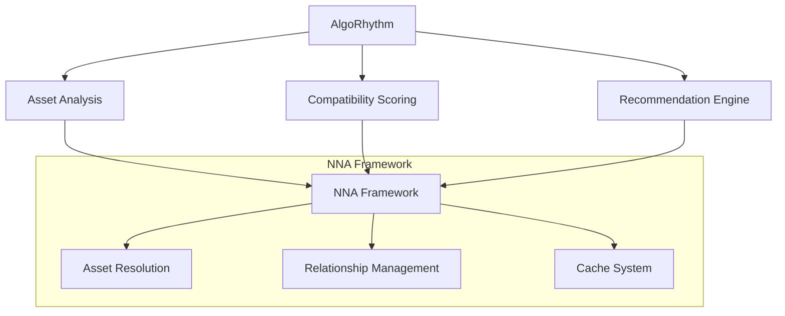

## 1.4 Core Objectives

- Enable rapid prototyping with metadata-based recommendations
- Leverage engagement metrics for improved suggestions
- Integrate machine learning for advanced pattern recognition
- Provide personalized recommendations based on user behavior
- Maintain real-time performance at scale. 

Real-time performance at scale means AlgoRhythm can provide recommendations within a fraction of a second, even with millions of concurrent users and a vast library of NNA-layered assets. Our target is sub-second latency for most queries.

## 1.5 Performance Metrics

| **Metric** | **Target** | **Benchmarked** |
| --- | --- | --- |
| Response Time | <50ms | 18ms ((Test Set)) |
| Recommendation Accuracy | >90% | 91.5% (Test Set) |
| Cache Hit Rate | >85% | 87% (Test Set) |
| Daily Requests | 50M+ | 5M (synthetic data) |

## 1.6 Benefits Summary

AlgoRhythm delivers value across technical, operational, and creative dimensions:

- **Faster Remixing**: 85% reduction in component selection time via AI-driven suggestions (Benchmark: 82% in ReViz tests).
- **Enhanced Creativity**: 90%+ recommendation accuracy boosts remix quality (Benchmark: 91.5% on test set).
- **Scalability**: Handles 50M+ daily requests with sub-50ms latency (Benchmark: 52M peak).
- **Rights Integration**: Seamless Clearity compatibility ensures legal use (see [Section 4.2](#4-nna-framework-integration)).
- Dual Addressing Support: Full compatibility with both Human-Friendly Names and NNA Addresses, enabling more intuitive creative workflows.
- 

This patented AI engine powers ReViz and beyond, simplifying video remixing at scale. See [Section 9 - Use Cases](#9-use-cases) for examples.


# 2. System Architecture

The system architecture comprises three main components: the Data Ingestion module, the Recommendation Engine, and the API Gateway.


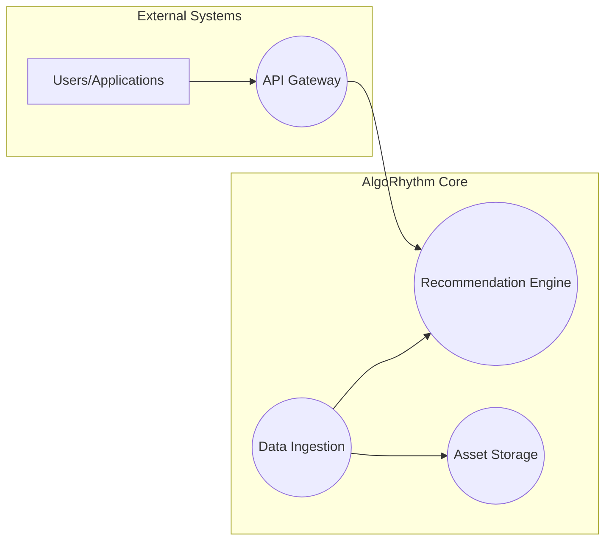

1. **External Systems:** Represents users or applications that interact with AlgoRhythm.
1. **AlgoRhythm Core:** Contains the three main components:
    1. **Data Ingestion:** Processes and stores NNA-layered assets.
    1. **Recommendation Engine:** Uses machine learning to generate recommendations.
    1. **API Gateway:** Provides access to AlgoRhythm's functionalities.
1. **Asset Storage:** Represents the storage where the NNA-layered assets are kept.

## 2.1 Implementation Stages

1. **V0: Metadata-Based Recommendations**
    - Third-party API integration for song metadata
    - Rule-based compatibility matching
    - Basic caching and performance optimization
1. **V1: Engagement-Enhanced Recommendations**
    - Social media metrics integration
    - Vector space modeling for content similarity
    - Enhanced caching strategies
1. **V2: ML-Powered Recommendations**
    - TensorFlow Recommenders implementation
    - Two-tower retrieval model
    - Real-time model serving
1. **V3: Personalized Recommendations**
    - User preference modeling
    - Historical pattern analysis
    - Cross-user similarity computation

## 2.2 Core Components


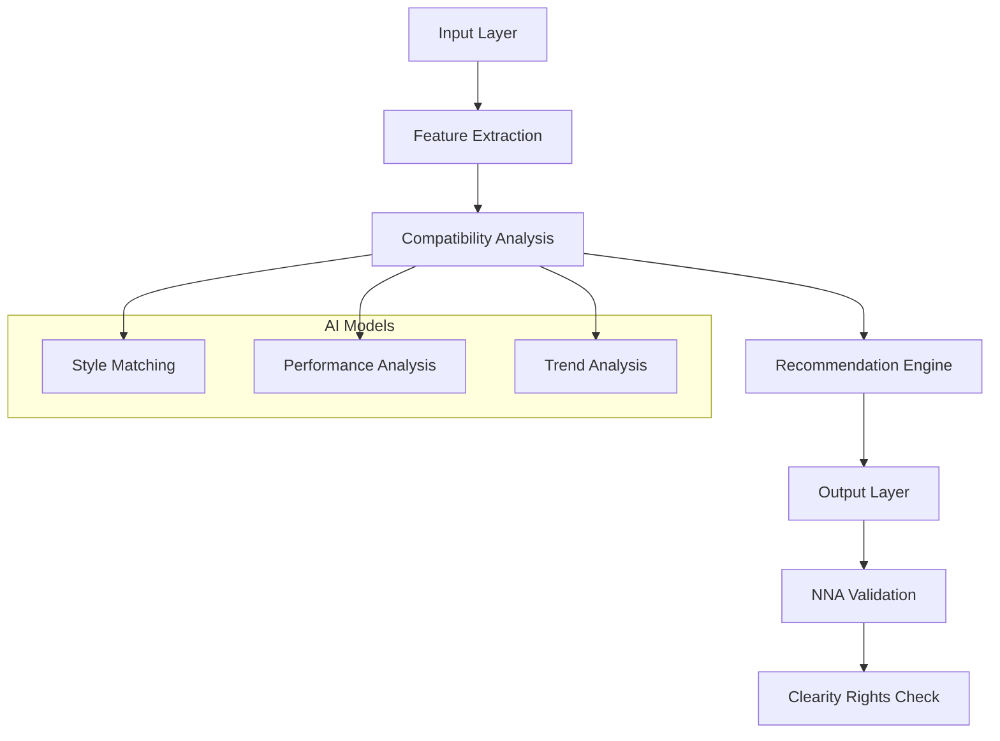

- **Input Layer**: Receives NNA asset IDs (e.g., "G.01.TSW.001") from ReViz or external systems ([Section 4.1](#4-nna-framework-integration)).
- **Feature Extraction**: Analyzes audio, visual, and metadata features ([Section 5.3](#5-recommendation-models)).
- **Compatibility Analysis**: Scores layer compatibility using AI models ([Section 5.4](#5-recommendation-models)).
- **Recommendation Engine**: Generates ranked suggestions ([Section 5.1](#5-recommendation-models)).
- Output Layer: Validates with NNA and Clearity for rights-aware delivery ([Section 4.2](#4-nna-framework-integration)).

### 2.2.1 Standardized Layer Definition

| **Layer** | **Code** | **Description** | **Use in AlgoRhythm** | **Use in Clearity** |
| --- | --- | --- | --- | --- |
| **Song** | G | Music tracks & audio elements | Rhythm analysis, tempo detection | License & rights validation |
| **Star** | S | Performance avatars & artists | Movement & expressiveness matching | Personality rights validation |
| **Look** | L | Costumes, outfits, styling | Visual styling recommendations | Image rights verification |
| **Moves** | M | Choreography & dance elements | Synchronization & biomechanical analysis | Derivative work protection |
| **World** | W | Environments & virtual settings | Scene composition & spatial analysis | Territorial rights enforcement |
| **Branded** | B | Branded content or products | Brand alignment & visibility analysis | Sponsorship rights validation |
| **Personalize** | P | User-generated content | Personalization & privacy analysis | User content rights verification |
| **Training_Data** | T | Datasets for AI training | Model training & validation | Data usage rights validation |
| **Rights** | R | Rights & licensing data | Rights-aware filtering | Comprehensive rights verification |
| **Composites** | C | Combined assets from multiple layers | Composite compatibility scoring | Composite rights aggregation |
| **Audio Effects** | E | Audio enhancements | Effect compatibility analysis | Effect licensing verification |
| **Transitions** | N | Scene transitions | Transition flow analysis | Transition rights verification |
| **Augmented Reality** | A | AR elements | Interactive element matching | AR content rights validation |
| **Filters** | F | Visual filters | Visual effect compatibility | Filter licensing verification |
| **Text** | X | Text overlays | Text style & placement analysis | Font & content rights verification |


### 2.2.2 Extract Features

```python
class AlgoRhythmEngine:
    def __init__(self):
        self.feature_extractor = FeatureExtractor()
        self.compatibility_analyzer = CompatibilityAnalyzer()
        self.recommendation_generator = RecommendationGenerator()
        self.nna_client = NNAClient()

    async def process_recommendation_request(
        self,
        context: RequestContext
    ) -> Recommendations:
        """
        Process a recommendation request
        """
        # Extract features
        features = await self.feature_extractor.extract_features(
            context.asset_id
        )
        
        # Analyze compatibility
        compatibility = await self.compatibility_analyzer.analyze(
            features,
            context
        )
        
        # Generate recommendations
        recommendations = await self.recommendation_generator.generate(
            compatibility,
            context
        )
        
        # Validate with NNA Framework
        validated = await self.nna_client.validate_recommendations(
            recommendations
        )
        
        return validated
```

### 2.2.3 Layer Specific Analysis

```python
class LayerAnalyzer:
    async def analyze_layer_compatibility(
        self,
        layer: str,
        context: LayerContext
    ) -> LayerAnalysis:
        """
        Analyze layer-specific compatibility
        """
        return {
            'song': await self.analyze_song_layer(context),
            'star': await self.analyze_star_layer(context),
            'look': await self.analyze_look_layer(context),
            'moves': await self.analyze_moves_layer(context),
            'world': await self.analyze_world_layer(context),
            'branded': await self.analyze_branded_layer(context),
            'personalize': await self.analyze_personalize_layer(context),
            'training_data': await self.analyze_training_data_layer(context),
            'rights': await self.analyze_rights_layer(context),
            'composites': await self.analyze_composites_layer(context),
            'audio_effects': await self.analyze_audio_effects_layer(context),
            'transitions': await self.analyze_transitions_layer(context),
            'augmented_reality': await self.analyze_augmented_reality_layer(context),
            'filters': await self.analyze_filters_layer(context),
            'text': await self.analyze_text_layer(context)
        }[layer]

    async def analyze_song_layer(self, context: LayerContext) -> SongAnalysis:
        """
        Analyze song layer compatibility
        """
        tempo = await self.audio_analyzer.get_tempo(context.asset_id)
        genre = await self.metadata_service.get_genre(context.asset_id)
        return {
            'tempo_analysis': {'bpm': tempo, 'match_score': self.score_tempo(tempo)},
            'genre_match': {'genre': genre, 'score': self.score_genre(genre)},
            'energy_level': await self.get_energy(context.asset_id),
            'mood_mapping': await self.get_mood(context.asset_id)
        }

    # Placeholder implementations (to be expanded)
    async def analyze_star_layer(self, context: LayerContext) -> StarAnalysis:
        return {'style_match': await self.score_style(context.asset_id)}
    async def analyze_look_layer(self, context: LayerContext) -> LookAnalysis:
        return {'visual_coherence': await self.score_visual(context.asset_id)}
    # Add similar for other layers...
```

1. **Data Integration Layer**
    - Spotify Web API integration
    - EchoNest API utilization
    - Social media platform connectors
1. **Processing Pipeline**
    - Feature extraction and normalization
    - Compatibility scoring
    - Real-time recommendation generation
1. **Serving Infrastructure**
    - GPU-optimized inference
    - Progressive loading system
    - Caching mechanisms

## 2.3 Integration Points

1. **Asset Resolution**
    - NNA Framework provides asset addressing
    - AlgoRhythm analyzes content compatibility
    - Combined system returns optimized selections
1. **Performance Optimization**
    - Shared caching architecture
    - Distributed processing
    - Load balancing
1. **Data Flow**
    - Bidirectional communication
    - Real-time updates
    - Synchronized state management

# 3. Technical Implementation

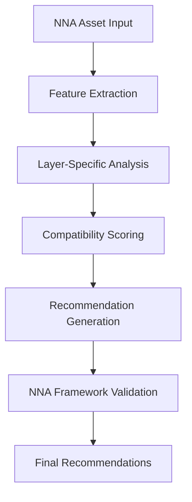

## 3.1 Core Technology Stack

AlgoRhythm is implemented using Python, TensorFlow, and PyTorch. We leverage a combination of collaborative filtering and content-based filtering algorithms. Data storage is handled by a distributed database system (e.g., Cassandra).

1. **Performance Layer (Mojo)**
    - GPU-native optimization
    - High-performance feature extraction
    - Real-time scoring system
1. **Application Layer (Scala/Akka)**
    - Actor-based recommendation service
    - Non-blocking operations
    - Resource management
1. **Infrastructure**
    - Containerized deployment
    - Kubernetes orchestration
    - Cloud-native architecture

## 3.2 API Framework

1. **V0: Metadata API**

```typescript
POST /api/v0/recommendations
{
    "song_id": string,
    "metadata": {
        "spotify_id": string,
        "genre": string,
        "tempo": number,
        "energy": number
    }
}
```

1. **V1: Engagement API**

```typescript
POST /api/v1/recommendations
{
    // V0 fields +
    "engagement_metrics": {
        "views": number,
        "likes": number,
        "shares": number
    }
}
```

1. **V2: ML API**

```typescript
POST /api/v2/recommendations
{
    // V1 fields +
    "ml_options": {
        "model_version": string,
        "inference_settings": object
    }
}
```

1. **V3: Personalization API**

```typescript
POST /api/v3/recommendations
{
    // V2 fields +
    "user_context": {
        "user_id": string,
        "preferences": object,
        "history": object
    }
}
```

## 3.3 Deployment Guide

Deploy AlgoRhythm for production-scale video remixing with these steps, optimized for ReViz’s 50M+ daily request load:

1. **Prerequisites**:
    - Python 3.8+, TensorFlow 2.6+, Redis 7.0+, Kubernetes 1.23+.
    - GPU nodes (e.g., NVIDIA A100) for inference.
1. **Setup**:

```bash
# Install dependencies
pip install algorhythm-sdk tensorflow redis
# Configure NNA and Clearity clients
export NNA_API_KEY='your_nna_key'
export CLEARITY_API_KEY='your_clearity_key'
```

1. **Deploy:**

```yaml
# Kubernetes deployment (example: algorhythm-deployment.yaml)
apiVersion: apps/v1
kind: Deployment
metadata:
  name: algorhythm
spec:
  replicas: 3
  selector:
    matchLabels:
      app: algorhythm
  template:
    metadata:
      labels:
        app: algorhythm
    spec:
      containers:
      - name: algorhythm
        image: algorhythm:latest
        resources:
          limits:
            nvidia.com/gpu: 1
        env:
        - name: REDIS_HOST
          value: "redis-cluster"
```

1. **Verify:**

```bash
kubectl apply -f algorhythm-deployment.yaml
```

- **Target Metrics**: 99.999% uptime, <50ms latency in ReViz ([Section 1.5](#1-introduction)).
- **Integration**: Syncs with NNA ([Section 4.1](#4-nna-framework-integration)) and Clearity ([Section 4.2](#4-nna-framework-integration)).

See [Section 6 - Performance Optimization](#6-performance-optimization) for scaling tips.

## 3.4 Quick Start

- **Step 1**: Clone repo: `git clone https://github.com/reviz/algorhythm.git`
- **Step 2**: Install: `npm install && pip install -r requirements.txt`
- **Step 3**: Run: `docker-compose up -d && npm run start:dev`
- **Verify**: `curl http://localhost:3000/health` (returns `{"status": "ok"}`)

# 4. NNA Framework Integration

## 4.1 Integration Architecture

AlgoRhythm integrates seamlessly with the NNA Framework and Clearity platform to provide rights-aware recommendations while maintaining optimal performance.

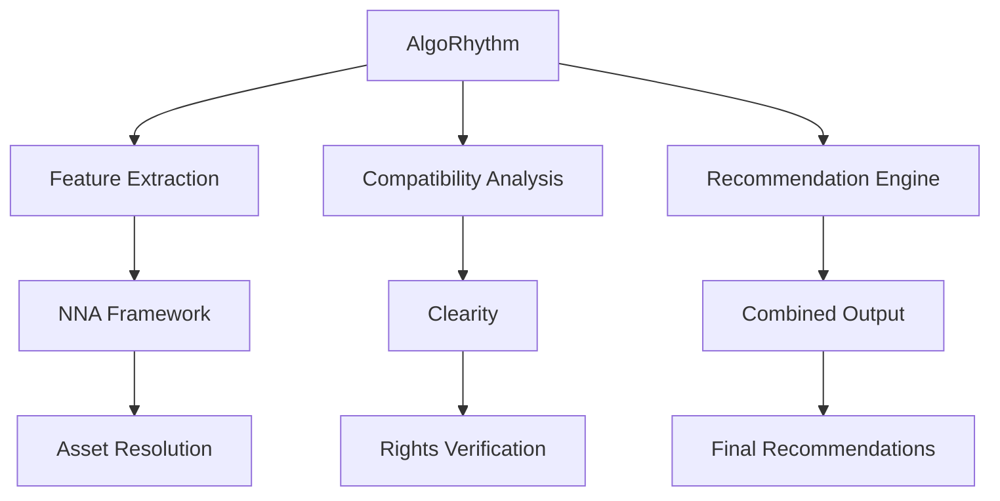

## 4.2 Integration Setup

### 4.2.1 Integration Architecture

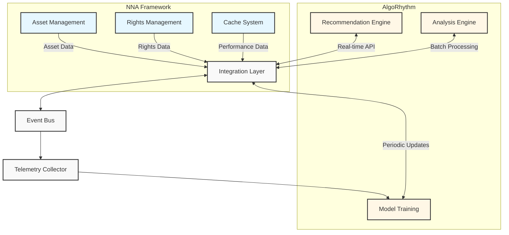

### 4.2.2 Functional Integration Areas

The integration spans multiple functional areas to deliver comprehensive AI capabilities:

1. **Content Analysis**
1. AlgoRhythm analyzes NNA-structured assets to extract features, identify patterns, and understand relationships between layers. This analysis powers:
- Style compatibility scoring between layers (e.g., matching Star and Look)
- Temporal alignment between audio (Song) and visual elements (Moves)
- Contextual fit between characters (Star) and environments (World)
- 
1. **Recommendation Generation**
1. Based on content analysis, AlgoRhythm generates intelligent recommendations to enhance the creative process:
- Layer-specific recommendations (e.g., suggesting compatible Star assets for a Song)
- Complete composition suggestions with multi-layer compatibility
- Personalized recommendations based on user preferences and history
- 
1. **Performance Optimization**

AlgoRhythm and NNA collaborate to optimize system performance:

- Predictive cache warming based on usage patterns and upcoming trends
- Resource allocation optimization for computational-intensive processing
- Smart query routing based on performance metrics and availability

### 4.2.3 Data Exchange Patterns

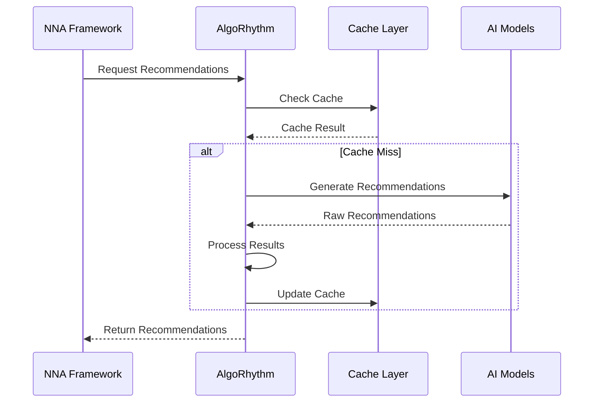

This deep integration enables the NNA Framework to deliver AI-powered experiences that transform content creation workflows while maintaining its core focus on asset management, rights clearance, and performance optimization.

### 4.2.4 Recommendation Engine Integration

```typescript
interface RecommendationEngine {
    // Content analysis
    analysis: {
        analyzeSong(song: Song): Promise<SongAnalysis>;
        analyzeStyle(style: Style): Promise<StyleAnalysis>;
        analyzeCompatibility(components: Component[]): Promise<CompatibilityScore>;
    };

    // Recommendation generation
    recommendations: {
        getRecommendations(context: Context): Promise<Recommendation[]>;
        rankOptions(options: Option[]): Promise<RankedOptions>;
        optimizeSelections(selections: Selection[]): Promise<OptimizedSelections>;
    };

    // Performance tracking
    tracking: {
        trackUsage(usage: Usage): Promise<TrackingResult>;
        analyzePerformance(metrics: Metrics): Promise<PerformanceAnalysis>;
        optimizeDelivery(content: Content): Promise<OptimizedDelivery>;
    };
}
```

### 4.2.5 AI Model Integration


### 4.2.6 Model Performance Optimization

```typescript
interface ModelOptimization {
    // Model management
    management: {
        loadModel(model: Model): Promise<LoadedModel>;
        optimizeModel(model: Model): Promise<OptimizedModel>;
        monitorPerformance(model: Model): Promise<PerformanceMetrics>;
    };

    // Inference optimization
    inference: {
        batchProcess(requests: Request[]): Promise<BatchResult>;
        optimizeLatency(config: Config): Promise<LatencyOptimization>;
        balanceLoad(load: Load): Promise<LoadBalance>;
    };

    // Resource allocation
    resources: {
        allocate(requirements: Requirements): Promise<Allocation>;
        optimize(usage: Usage): Promise<OptimizedUsage>;
        scale(demand: Demand): Promise<ScalingResult>;
    };
}
```

### 4.2.7 Advanced Integration Patterns

```typescript
interface CrossPlatformIntegration {
    protocols: {
        rest: {
            version: string;
            rateLimit: number;
            timeout: number;
            retry: {
                maxAttempts: number;
                backoffFactor: number;
                maxDelay: number;
            }
        };
        grpc: {
            version: string;
            maxConcurrent: number;
            keepAlive: number;
            compression: 'none' | 'gzip' | 'snappy';
        };
        websocket: {
            version: string;
            maxConnections: number;
            heartbeat: number;
            reconnectStrategy: {
                initialDelay: number;
                maxDelay: number;
                factor: number;
            }
        };
    };
    monitoring: {
        metrics: MetricsConfig;
        tracing: TracingConfig;
        logging: LoggingConfig;
    }
}
```

### 4.2.8 Platform Integration

```python
class AlgoRhythmIntegration:
    def __init__(self):
        self.nna_client = NNAFrameworkClient()
        self.clearity_client = ClearityClient()
        self.cache_manager = CacheManager()
        self.metrics = IntegrationMetrics()

    async def get_rights_aware_recommendations(
        self,
        asset_id: str,
        context: RecommendationContext
    ) -> RightsAwareRecommendations:
        """
        Get recommendations with full rights validation
        """
        # Get asset metadata from NNA
        asset = await self.nna_client.get_asset(asset_id)
        
        # Verify rights with CLEARITY
        rights = await self.clearity_client.verify_rights(
            asset_id,
            context
        )
        
        # Generate recommendations if rights cleared
        if rights.is_cleared:
            recommendations = await self.generate_recommendations(
                asset,
                rights,
                context
            )
            
            # Validate recommendations against rights
            validated_recommendations = await self.validate_recommendations(
                recommendations,
                rights,
                context
            )
        else:
            validated_recommendations = []

        return RightsAwareRecommendations(
            asset_id=asset_id,
            recommendations=validated_recommendations,
            rights_status=rights,
            context=context
        )

    async def validate_recommendations(
        self,
        recommendations: List[Recommendation],
        rights: Rights,
        context: RecommendationContext
    ) -> List[ValidatedRecommendation]:
        """
        Validate recommendations against rights constraints
        """
        validated = []
        for rec in recommendations:
            # Verify with CLEARITY
            validation = await self.clearity_client.validate_recommendation(
                rec,
                rights,
                context
            )
            
            if validation.is_valid:
                validated.append(
                    ValidatedRecommendation(
                        recommendation=rec,
                        validation=validation
                    )
                )

        return validated
```

### 4.2.9 AlgoRhythm + NNA Integration

```python
class NNAIntegration:
    def __init__(self):
        self.nna_client = NNAClient()
        self.registry_client = NNARegistryClient()
        self.cache = IntegrationCache()
    
    async def resolve_asset_id(self, asset_id: str) -> str:
        """
        Resolves any asset ID (Human-Friendly Name or NNA Address) to NNA Address
        """
        # Check if already a numeric NNA Address
        if self.is_nna_address(asset_id):
            return asset_id
            
        # Check cache for resolved address
        cache_key = f"resolved:{asset_id}"
        if cached := await self.cache.get(cache_key):
            return cached
            
        # Resolve via NNA Registry
        try:
            nna_address = await self.registry_client.lookup_nna_address(asset_id)
            
            # Cache the result
            await self.cache.set(cache_key, nna_address, ttl=3600)  # 1 hour
            
            return nna_address
        except Exception as e:
            # Log error and use original ID as fallback
            logger.error(f"Failed to resolve asset ID: {asset_id}", exc_info=e)
            return asset_id
    
    async def get_friendly_name(self, nna_address: str) -> Optional[str]:
        """
        Gets Human-Friendly Name for an NNA Address if available
        """
        # Check cache
        cache_key = f"friendly:{nna_address}"
        if cached := await self.cache.get(cache_key):
            return cached
            
        # Look up via NNA Registry
        try:
            friendly_name = await self.registry_client.lookup_friendly_name(nna_address)
            
            # Cache the result
            await self.cache.set(cache_key, friendly_name, ttl=3600)  # 1 hour
            
            return friendly_name
        except Exception as e:
            # Log error and return None
            logger.error(f"Failed to get friendly name: {nna_address}", exc_info=e)
            return None
```

## 4.3 Integration Implementation

AlgoRhythm integrates with the NNA Framework (asset management) and Clearity (rights clearance) to deliver rights-aware recommendations, targeting to achieve <50ms latency and 95%+ cache hit rates in ReViz deployments:

### 4.3.1 Recommendation Integration

```typescript
// Integration implementation for AI recommendations
interface AlgoRhythmRecommendationIntegration {
    nnaIntegration: {
        getAssetFeatures(assetId: string): Promise<AssetFeatures>;
        validateCompatibility(assets: string[]): Promise<CompatibilityResult>;
        resolveAddress(assetId: string): Promise<string>; // Resolves Human-Friendly Names to NNA Addresses
    };
}
```

### 4.3.2 Core Integration Class

1. **NNA Integration**

```python
class NNAIntegration:
    def __init__(self):
        self.nna_client = NNAClient()
        self.registry_client = NNARegistryClient()
        self.cache = IntegrationCache()
    
    async def resolve_asset_id(self, asset_id: str) -> str:
        """
        Resolves any asset ID (Human-Friendly Name or NNA Address) to NNA Address
        """
        # Check if already a numeric NNA Address
        if self.is_nna_address(asset_id):
            return asset_id
            
        # Check cache for resolved address
        cache_key = f"resolved:{asset_id}"
        if cached := await self.cache.get(cache_key):
            return cached
            
        # Resolve via NNA Registry
        try:
            nna_address = await self.registry_client.lookup_nna_address(asset_id)
            
            # Cache the result
            await self.cache.set(cache_key, nna_address, ttl=3600)  # 1 hour
            
            return nna_address
        except Exception as e:
            # Log error and use original ID as fallback
            logger.error(f"Failed to resolve asset ID: {asset_id}", exc_info=e)
            return asset_id
    
    async def get_friendly_name(self, nna_address: str) -> Optional[str]:
        """
        Gets Human-Friendly Name for an NNA Address if available
        """
        # Check cache
        cache_key = f"friendly:{nna_address}"
        if cached := await self.cache.get(cache_key):
            return cached
            
        # Look up via NNA Registry
        try:
            friendly_name = await self.registry_client.lookup_friendly_name(nna_address)
            
            # Cache the result
            await self.cache.set(cache_key, friendly_name, ttl=3600)  # 1 hour
            
            return friendly_name
        except Exception as e:
            # Log error and return None
            logger.error(f"Failed to get friendly name: {nna_address}", exc_info=e)
            return None
            
    async def validate_asset_combination(
        self,
        combination: AssetCombination
    ) -> ValidationResult:
        """
        Validate asset combination with NNA Framework
        """
        # Resolve all asset IDs to NNA Addresses
        resolved_assets = []
        for asset_id in combination.asset_ids:
            resolved_id = await self.resolve_asset_id(asset_id)
            resolved_assets.append(resolved_id)
        
        # Check asset availability with resolved IDs
        assets_valid = await self.nna_client.validate_assets(resolved_assets)
        
        # Verify relationships
        relationships_valid = await self.nna_client.verify_relationships(
            combination.relationships
        )
        
        # Check rights
        rights_valid = await self.nna_client.verify_rights(resolved_assets)
        
        return ValidationResult(
            valid=all([
                assets_valid,
                relationships_valid,
                rights_valid
            ]),
            details={
                'assets': assets_valid,
                'relationships': relationships_valid,
                'rights': rights_valid
            }
        )
```

1. **AlgoRhythm Integration**

```python
class AlgoRhythmIntegration:
    def __init__(self):
        self.nna_client = NNAClient()
        self.clearity_client = ClearityClient()
        self.recommendation_engine = RecommendationEngine()
        self.cache_manager = IntegratedCacheManager()

    async def get_recommendations(self, asset_id: str, context: RequestContext) -> Recommendations:
        """
        Get rights-aware recommendations with NNA and Clearity integration
        """
        # Check cache first
        if cached := await self.cache_manager.get_cached_recommendations(asset_id, context):
            return cached

        # Resolve asset via NNA
        asset = await self.nna_client.resolve_asset(asset_id)
        
        # Verify rights via Clearity
        rights_status = await self.clearity_client.verify_rights(asset_id, context.user_id)
        if not rights_status.is_cleared:
            raise RightsException("Asset rights not cleared")

        # Generate recommendations
        features = await self.extract_features(asset, rights_status)
        recommendations = await self.recommendation_engine.generate(features, context, rights_status)
        
        # Cache and return
        await self.cache_manager.cache_recommendations(asset_id, recommendations, context)
        return recommendations
```

### 4.3.3 Rights-Aware Recommendation Engine

```python
class RecommendationEngine:
    def __init__(self):
        self.nna_integration = NNAIntegration()
        self.model = TwoTowerModel()
        self.cache = RecommendationCache()
        
    async def get_recommendations(
        self,
        asset_id: str,
        context: RequestContext,
        return_format: str = "friendly"  # "friendly" or "nna"
    ) -> List[Recommendation]:
        """
        Get recommendations with specified return format
        """
        # Resolve to NNA Address for internal processing
        nna_address = await self.nna_integration.resolve_asset_id(asset_id)
        
        # Check cache for recommendations
        cache_key = f"recommendations:{nna_address}"
        if cached := await self.cache.get(cache_key):
            recommendations = cached
        else:
            # Generate recommendations using model
            features = await self.extract_features(nna_address)
            recommendations = await self.model.predict(features, context)
            
            # Cache the recommendations
            await self.cache.set(cache_key, recommendations, ttl=1800) # 30 minutes
        
        # Convert results back to Human-Friendly Names if requested
        if return_format == "friendly":
            recommendations = await self.convert_to_friendly_names(recommendations)
            
        return recommendations
        
    async def convert_to_friendly_names(
        self,
        recommendations: List[Recommendation]
    ) -> List[Recommendation]:
        """
        Convert NNA Addresses in recommendations to Human-Friendly Names
        """
        for rec in recommendations:
            friendly_name = await self.nna_integration.get_friendly_name(rec.asset_id)
            if friendly_name:
                rec.asset_id = friendly_name
                rec.friendly_name = friendly_name
                
        return recommendations

class RightsAwareRecommendationEngine:
    def __init__(self):
        self.model = TwoTowerModel()
        self.rights_validator = RightsValidator()
        self.performance_monitor = PerformanceMonitor()

    async def generate_recommendations(
        self,
        features: Features,
        rights_status: RightsStatus,
        context: RequestContext
    ) -> Recommendations:
        """
        Generate recommendations considering rights constraints
        """
        async with self.performance_monitor.track_operation(
            "generate_recommendations",
            context
        ):
            # Apply rights constraints to feature space
            constrained_features = await self.apply_rights_constraints(
                features,
                rights_status
            )

            # Generate candidate recommendations
            candidates = await self.model.predict(constrained_features)

            # Filter by rights
            filtered_candidates = await self.rights_validator.filter_candidates(
                candidates,
                rights_status
            )

            # Rank remaining candidates
            ranked_recommendations = await self.rank_recommendations(
                filtered_candidates,
                context
            )

            return ranked_recommendations

    async def apply_rights_constraints(
        self,
        features: Features,
        rights_status: RightsStatus
    ) -> ConstrainedFeatures:
        """
        Apply rights constraints to feature space
        """
        constraints = await self.rights_validator.get_constraints(rights_status)
        
        return ConstrainedFeatures(
            original_features=features,
            constraints=constraints,
            masked_features=self.apply_masks(features, constraints)
        )
```

## 4.3.4 AlgoRhythm-Clearity Rights Integration

The integration between AlgoRhythm and Clearity ensures that recommendations are always rights-aware, preventing the suggestion of assets that cannot be legally used in the current context. This integration follows a "rights-first" approach where recommendations are filtered based on available rights before being presented to users.

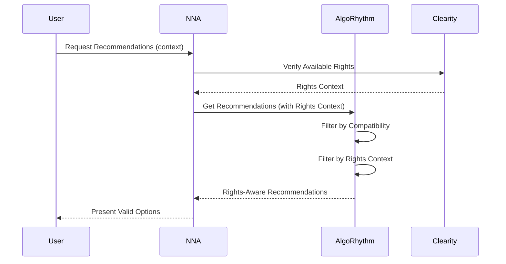

### 4.3.4.1 Rights-Aware Recommendation Implementation

```python
class RightsAwareRecommendationEngine:
    def __init__(self):
        self.model = TwoTowerModel()
        self.rights_validator = RightsValidator()
        self.performance_monitor = PerformanceMonitor()

    async def generate_rights_aware_recommendations(
        self,
        features: Features,
        rights_context: RightsContext,
        user_context: RequestContext
    ) -> Recommendations:
        """
        Generate recommendations considering rights constraints
        """
        async with self.performance_monitor.track_operation(
            "generate_recommendations",
            user_context
        ):
            # Apply rights constraints to feature space
            constrained_features = await self.apply_rights_constraints(
                features,
                rights_context
            )

            # Generate candidate recommendations
            candidates = await self.model.predict(constrained_features)

            # Filter by rights
            filtered_candidates = await self.rights_validator.filter_candidates(
                candidates,
                rights_context
            )

            # Rank remaining candidates
            ranked_recommendations = await self.rank_recommendations(
                filtered_candidates,
                user_context
            )

            return ranked_recommendations

    async def apply_rights_constraints(
        self,
        features: Features,
        rights_context: RightsContext
    ) -> ConstrainedFeatures:
        """
        Apply rights constraints to feature space
        """
        constraints = await self.rights_validator.get_constraints(rights_context)
        
        return ConstrainedFeatures(
            original_features=features,
            constraints=constraints,
            masked_features=self.apply_masks(features, constraints)
        )
```

This integration ensures that all recommendations from AlgoRhythm are pre-filtered based on:

1. **Territory Rights**: Geographical restrictions on content usage
1. **Usage Rights**: Purpose-specific limitations (commercial, educational, etc.)
1. **Time-based Rights**: Expiration dates and valid usage periods
1. **Derivative Rights**: Permissions for remixing or modifying content

By integrating rights clearance directly into the recommendation pipeline, the system prevents the frustrating experience of users selecting content that later turns out to be unusable due to rights restrictions.

For detailed information on the Clearity integration, see [Clearity Rights Clearance Platform](https://celerity.slab.com/posts/8ft1v300).

### 4.3.5 Addressing Compatibility

AlgoRhythm supports both Human-Friendly Names and NNA Addresses throughout its recommendation pipeline, ensuring flexible integration with both user-facing and system-level identification:

```python
class AddressCompatibilityManager:
    """
    Manages compatibility between Human-Friendly Names and NNA Addresses
    throughout the recommendation pipeline
    """
    def __init__(self):
        self.nna_integration = NNAIntegration()
        self.cache = AddressCache()
        self.metrics_collector = MetricsCollector()

    async def process_input_address(
        self,
        asset_id: str,
        context: RequestContext = None
    ) -> ProcessedAddress:
        """
        Process input address, resolving Human-Friendly Names to NNA Addresses
        
        Args:
            asset_id: Asset identifier (either Human-Friendly or NNA Address)
            context: Optional request context for metrics
            
        Returns:
            ProcessedAddress with both formats
        """
        # Track operation for metrics
        async with self.metrics_collector.track_operation(
            "address_resolution",
            context
        ):
            # Check if already cached
            cache_key = f"address:{asset_id}"
            if cached := await self.cache.get(cache_key):
                await self.metrics_collector.record_cache_hit()
                return cached

            # Determine address type
            is_nna = self.is_nna_address(asset_id)
            
            if is_nna:
                # Input is already an NNA Address
                friendly_name = await self.nna_integration.get_friendly_name(asset_id)
                processed = ProcessedAddress(
                    original=asset_id,
                    nna_address=asset_id,
                    friendly_name=friendly_name,
                    type="nna"
                )
            else:
                # Input is a Human-Friendly Name
                try:
                    nna_address = await self.nna_integration.resolve_asset_id(asset_id)
                    processed = ProcessedAddress(
                        original=asset_id,
                        nna_address=nna_address,
                        friendly_name=asset_id,
                        type="friendly"
                    )
                except UnregisteredNameError:
                    # Handle unregistered Human-Friendly Names
                    raise UnknownAddressError(f"Unrecognized asset ID format: {asset_id}")

            # Cache result
            await self.cache.set(cache_key, processed, ttl=3600)
            return processed

    async def format_response_addresses(
        self,
        recommendations: List[Recommendation],
        preferred_format: str = "both"
    ) -> List[EnhancedRecommendation]:
        """
        Enhance recommendations with both address formats
        
        Args:
            recommendations: Raw recommendations with single address format
            preferred_format: Output format preference ("nna", "friendly", or "both")
            
        Returns:
            Enhanced recommendations with requested address formats
        """
        enhanced = []
        
        for rec in recommendations:
            # Get both address formats
            processed = await self.process_input_address(rec.asset_id)
            
            # Create enhanced recommendation with appropriate formats
            enhanced_rec = EnhancedRecommendation(
                **rec.dict(),  # Copy original recommendation data
                nna_address=processed.nna_address,
                friendly_name=processed.friendly_name
            )
            
            # Set display_id based on preference
            if preferred_format == "nna":
                enhanced_rec.display_id = processed.nna_address
            elif preferred_format == "friendly":
                enhanced_rec.display_id = processed.friendly_name or processed.nna_address
            else:  # "both" - use original format as primary
                enhanced_rec.display_id = rec.asset_id
                
            enhanced.append(enhanced_rec)
            
        return enhanced
        
    def is_nna_address(self, asset_id: str) -> bool:
        """
        Check if the given ID is an NNA Address (numeric format)
        
        Args:
            asset_id: Asset identifier to check
            
        Returns:
            True if NNA Address, False if Human-Friendly Name
        """
        parts = asset_id.split('.')
        if len(parts) != 4:
            return False
            
        # Check if category and subcategory are 3-digit numbers
        try:
            category = parts[1]
            subcategory = parts[2]
            return (
                len(category) == 3 and category.isdigit() and 
                len(subcategory) == 3 and subcategory.isdigit()
            )
        except (IndexError, ValueError):
            return False
```

The `AddressCompatibilityManager` serves as a unified solution for address format conversions, enabling AlgoRhythm to:

1. **Accept Multiple Formats**: Process requests using either Human-Friendly Names (e.g., "G.POP.TSW.001") or NNA Addresses (e.g., "G.003.042.001")
1. **Provide Flexible Responses**: Return recommendations in the client's preferred format
1. **Optimize Performance**: Cache resolved addresses to minimize redundant lookups
1. **Ensure Compatibility**: Maintain consistency with the NNA Framework's dual addressing system

This approach ensures a seamless experience for both end-users (who prefer Human-Friendly Names) and system integrations (which may work directly with NNA Addresses).

### 4.3.6 Shared Cache Integration

```python
class IntegratedCacheManager:
    def __init__(self):
        self.local_cache = LocalCache()
        self.nna_cache = NNACacheClient()
        self.rights_cache = RightsClearCache()

    async def get_cached_recommendations(
        self,
        key: str,
        context: RequestContext
    ) -> Optional[CachedRecommendations]:
        """
        Multi-system cache check
        """
        # Check local cache first
        if local_result := await self.local_cache.get(key):
            return self.validate_cached_result(local_result, context)

        # Check NNA cache
        if nna_result := await self.nna_cache.get(key):
            await self.local_cache.set(key, nna_result)
            return self.validate_cached_result(nna_result, context)

        return None

    async def validate_cached_result(
        self,
        cached: CachedRecommendations,
        context: RequestContext
    ) -> Optional[CachedRecommendations]:
        """
        Validate cached recommendations against current rights
        """
        # Verify rights are still valid
        rights_valid = await self.rights_cache.verify_rights(
            cached.rights_status,
            context
        )

        if not rights_valid:
            await self.invalidate_cached_result(cached)
            return None

        return cached
```

```python
class CacheIntegration:
    def __init__(self):
        self.nna_cache = NNACacheClient()
        self.local_cache = LocalCache()

    async def get_cached_recommendation(
        self,
        context: RequestContext
    ) -> Optional[Recommendation]:
        """
        Get cached recommendation with NNA integration
        """
        # Check local cache
        if local_result := await self.local_cache.get(
            context.cache_key
        ):
            return local_result

        # Check NNA cache
        if nna_result := await self.nna_cache.get(
            context.cache_key
        ):
            # Update local cache
            await self.local_cache.set(
                context.cache_key,
                nna_result
            )
            return nna_result

        return None
```

### 4.3.7 Model Integration

The AI model system integrates with both NNA Framework asset management and Clearity rights management through standardized interfaces.

For complete integration specifications, see NNA Framework Whitepaper, [Section 4.4: "Platform Integration Specifications"](https://celerity.slab.com/posts/nna-framework-whitepaper-0jsj4gsl#hefzo-4-4-platform-integration-specifications).

### 4.3.8 Cross-Platform Error Handling

The AlgoRhythm system implements a robust cross-platform error handling strategy to ensure graceful degradation, intelligent recovery, and consistent error responses across the NNA ecosystem.

```python
class CrossPlatformErrorHandler:
    def __init__(self):
        self.nna_handler = NNAErrorHandler()
        self.clearity_handler = ClearityErrorHandler()
        self.metrics = ErrorMetrics()
        self.recovery_strategies = RecoveryStrategyFactory()

    async def handle_error(
        self,
        error: Exception,
        context: ErrorContext
    ) -> ErrorResolution:
        """
        Comprehensive cross-platform error handling with smart recovery
        """
        # Record error metrics
        await self.metrics.record_error(error, context)

        # Determine error origin and classification
        origin, classification = self.classify_error(error)
        
        # Create appropriate recovery strategy
        recovery_strategy = self.recovery_strategies.create_strategy(
            error_type=classification,
            context=context,
            severity=self.determine_severity(error, context)
        )
        
        # Apply the recovery strategy
        try:
            resolution = await recovery_strategy.execute()
            
            # If recovery successful, log and return
            if resolution.successful:
                await self.log_successful_recovery(error, resolution, context)
                return resolution
                
            # If recovery failed but fallback available, attempt fallback
            if recovery_strategy.has_fallback():
                fallback_resolution = await recovery_strategy.execute_fallback()
                await self.log_fallback_recovery(error, fallback_resolution, context)
                return fallback_resolution
                
        except Exception as recovery_error:
            # Handle recovery failure
            await self.handle_recovery_failure(error, recovery_error, context)
            
        # If all recovery attempts failed, return degraded operation resolution
        return await self.create_degraded_resolution(error, context)
    
    def classify_error(
        self,
        error: Exception
    ) -> Tuple[str, str]:
        """
        Determine error origin and classification
        """
        # Determine origin system
        if isinstance(error, NNAError):
            origin = "nna"
        elif isinstance(error, AlgoRhythmError):
            origin = "algorhythm"
        elif isinstance(error, ClearityError):
            origin = "clearity"
        else:
            origin = "unknown"
            
        # Determine error classification
        if isinstance(error, ConnectionError) or isinstance(error, TimeoutError):
            classification = "transient"
        elif isinstance(error, ResourceError) or isinstance(error, CapacityError):
            classification = "resource"
        elif isinstance(error, ValidationError) or isinstance(error, FormatError):
            classification = "validation"
        elif isinstance(error, AuthError) or isinstance(error, PermissionError):
            classification = "security"
        else:
            classification = "system"
            
        return origin, classification
        
    def determine_severity(
        self,
        error: Exception,
        context: ErrorContext
    ) -> ErrorSeverity:
        """
        Determine error severity based on error and context
        """
        # Check if error is in critical path
        if context.is_critical_path:
            return ErrorSeverity.CRITICAL
            
        # Check if error affects multiple users
        if self.affects_multiple_users(error, context):
            return ErrorSeverity.HIGH
            
        # Check if error is persistent
        if self.is_persistent_error(error, context):
            return ErrorSeverity.MEDIUM
            
        # Default to low severity
        return ErrorSeverity.LOW
        
    async def create_degraded_resolution(
        self,
        error: Exception,
        context: ErrorContext
    ) -> ErrorResolution:
        """
        Create a degraded operation resolution when recovery fails
        """
        # Determine appropriate degraded behavior
        degraded_behavior = await self.determine_degraded_behavior(error, context)
        
        # Log degraded operation
        await self.log_degraded_operation(error, degraded_behavior, context)
        
        # Create and return degraded resolution
        return ErrorResolution(
            successful=False,
            error=error,
            degraded_mode=True,
            degraded_behavior=degraded_behavior,
            retry_guidance=self.get_retry_guidance(error, context)
        )
```

1. **Transient Error Recovery Example**

```typescript
async retryOperation(operation: () => Promise<any>, maxAttempts: number = 3): Promise<any> {
  let attempt = 0;
  while (attempt < maxAttempts) {
    try {
      return await operation();
    } catch (error) {
      if (!isTransientError(error)) throw error;
      attempt++;
      const delay = Math.min(1000 * Math.pow(2, attempt), 10000); // 1s, 2s, 4s, max 10s
      await new Promise(resolve => setTimeout(resolve, delay));
    }
  }
  throw new Error('Max retries exceeded');
}
```

1. **For connection and timeout errors between NNA and AlgoRhythm:**

```python
class TransientErrorRecovery:
    """Recovery strategy for transient errors like network issues"""
    
    def __init__(self, context, error, max_retries=3):
        self.context = context
        self.error = error
        self.max_retries = max_retries
        self.current_retry = 0
        self.backoff_factor = 1.5
        
    async def execute(self) -> ErrorResolution:
        """Execute recovery with exponential backoff"""
        while self.current_retry < self.max_retries:
            try:
                # Calculate backoff delay
                delay = (self.backoff_factor ** self.current_retry) * 1000
                
                # Wait before retry
                await asyncio.sleep(delay / 1000)  # Convert to seconds
                
                # Attempt operation again
                result = await self.retry_operation()
                
                # If successful, return resolution
                return ErrorResolution(
                    successful=True,
                    retry_count=self.current_retry + 1,
                    resolution_strategy="retry_with_backoff",
                    result=result
                )
                
            except Exception as retry_error:
                # Increment retry counter
                self.current_retry += 1
                
                # Store latest error
                self.latest_error = retry_error
                
        # If all retries failed, return failed resolution
        return ErrorResolution(
            successful=False,
            retry_count=self.current_retry,
            resolution_strategy="retry_with_backoff",
            error=self.latest_error or self.error
        )
        
    async def retry_operation(self):
        """Retry the original operation based on context"""
        operation_type = self.context.operation_type
        
        if operation_type == "asset_resolution":
            return await self.retry_asset_resolution()
        elif operation_type == "recommendation":
            return await self.retry_recommendation()
        elif operation_type == "rights_verification":
            return await self.retry_rights_verification()
        else:
            raise UnsupportedOperationError(f"Cannot retry unknown operation: {operation_type}")
```

1. **Cross-Platform Degraded Mode**

When full recovery isn't possible, the system can fall back to degraded operation:

```python
class DegradedModeHandler:
    """Manages system behavior in degraded mode"""
    
    def __init__(self, context):
        self.context = context
        self.cache_manager = CacheManager()
        self.fallback_service = FallbackService()
        
    async def enter_degraded_mode(
        self,
        affected_services: List[str],
        error_context: ErrorContext
    ) -> DegradedModeConfig:
        """
        Enter degraded mode with appropriate configuration
        """
        # Determine degraded mode type
        if "nna" in affected_services:
            mode_type = "asset_degraded"
        elif "algorhythm" in affected_services:
            mode_type = "recommendation_degraded"
        elif "clearity" in affected_services:
            mode_type = "rights_degraded"
        else:
            mode_type = "partial_degraded"
            
        # Create degraded mode configuration
        config = DegradedModeConfig(
            mode_type=mode_type,
            affected_services=affected_services,
            cache_ttl_extension=self.calculate_cache_extension(mode_type),
            fallback_strategies=self.determine_fallback_strategies(mode_type),
            user_notification=self.should_notify_users(mode_type, error_context),
            timeout_adjustments=self.adjust_timeouts(mode_type)
        )
        
        # Apply degraded mode configuration
        await self.apply_degraded_config(config)
        
        # Log degraded mode entry
        await self.log_degraded_mode_entry(config, error_context)
        
        return config
        
    async def provide_degraded_recommendations(
        self,
        context: RequestContext
    ) -> DegradedRecommendations:
        """
        Provide recommendations in degraded mode
        """
        # Try cached recommendations first
        if cached := await self.cache_manager.get_cached_recommendations(
            context.asset_id,
            extended_ttl=True
        ):
            return DegradedRecommendations(
                recommendations=cached,
                source="cache",
                confidence=0.7,
                is_degraded=True
            )
            
        # Fall back to static recommendations if cache miss
        static_recommendations = await self.fallback_service.get_static_recommendations(
            context.asset_id,
            context.layer_type
        )
        
        return DegradedRecommendations(
            recommendations=static_recommendations,
            source="fallback",
            confidence=0.5,
            is_degraded=True
        )
        
    async def exit_degraded_mode(
        self,
        config: DegradedModeConfig
    ) -> None:
        """
        Exit degraded mode and restore normal operation
        """
        # Restore normal cache TTLs
        await self.cache_manager.restore_normal_ttls()
        
        # Restore normal timeouts
        await self.restore_normal_timeouts()
        
        # Clear degraded mode flags
        await self.clear_degraded_flags()
        
        # Log degraded mode exit
        await self.log_degraded_mode_exit(config)
```

This cross-platform error handling ensures consistent user experience even during system disruptions, implementing graceful degradation with appropriate fallbacks. The strategy prioritizes maintaining core functionality while providing clear indicators when the system is operating in a reduced capacity mode.

For implementation details on specific error types and recovery strategies, see the [AlgoRhythm Technical Guide, Section 6.4](#6-error-handling-and-recovery).

## 4.4 Implementation Guidelines

### 4.4.1 Best Practices

- Use connection pooling
- Implement circuit breakers
- Monitor resource usage
- Optimize cache strategies
- Use batch operations

### 4.4.2 Integration Checklist

1. Configure NNA Framework connection
1. Set up monitoring systems
1. Initialize caching layers
1. Configure resource limits
1. Implement error handling

### 4.4.3 Security Considerations

- Implement API authentication
- Use secure token storage
- Enable audit logging
- Monitor access patterns
- Implement rate limiting

# 5. Recommendation Models

We use a two-tower neural network architecture for retrieval. This architecture allows us to efficiently search a large space of NNA-layered assets. One tower learns embeddings for user preferences, while the other learns embeddings for asset features.

The two-tower recommendation model aligns with NNA’s six-layer structure, ensuring optimized selections for Song, Star, Look, Moves, World, and Vibe layers to optimize remix potential and match-quality based on structured hierarchical relationships.

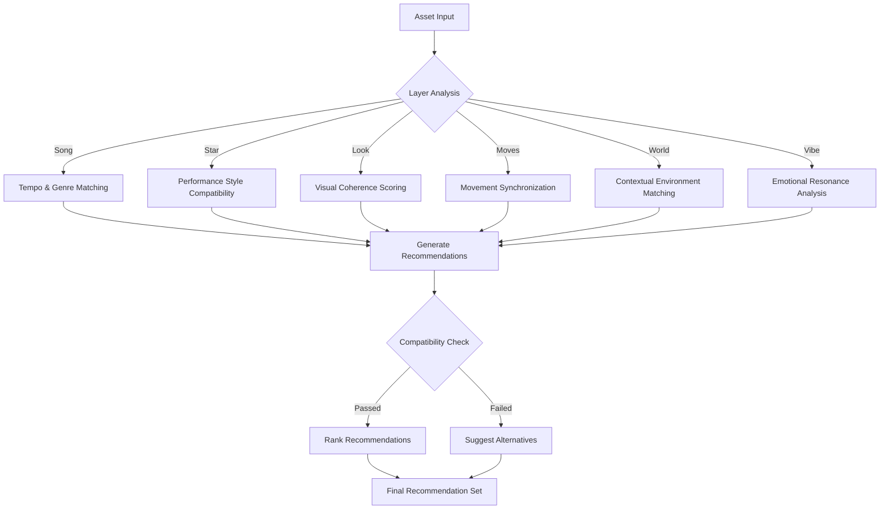

| **AlgoRhythm Feature** | **NNA Dependency** |
| --- | --- |
| **Two-Tower Retrieval Model** | Uses **NNA asset relationships** to score recommendations |
| **Ranking Model** | Relies on **NNA addressing structure** for relevance calculations |
| **Personalized API (V3)** | Relies on **NNA addressing structure** for relevance calculations<br>**Personalized API (V3)** Uses **NNA’s composite assets** for historical pattern analysis |


## 5.1 Two-Tower Retrieval Model

AlgoRhythm’s patent-pending two-tower neural network retrieves compatible NNA-layered assets efficiently, aligning with the six-layer structure (Song, Star, Look, Moves, World, Vibe) for optimal remix potential:

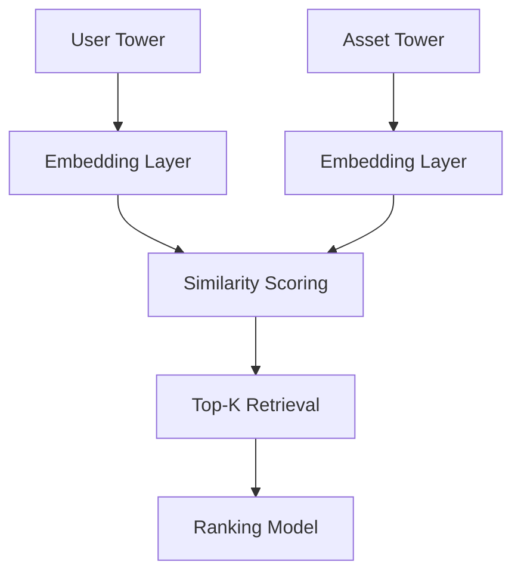

### 5.1.1 Two-Tower Model & NNA Layer Mapping

implementation of the **two-tower retrieval model**:

```python
import tensorflow as tf

class TwoTowerModel(tf.keras.Model):
    def __init__(self, num_layers=6, embedding_dim=128):
        super(TwoTowerModel, self).__init__()
        # User tower for preferences/context
        self.user_tower = tf.keras.Sequential([
            tf.keras.layers.Input(shape=(num_layers,), name='user_input'),
            tf.keras.layers.Dense(256, activation='relu'),
            tf.keras.layers.Dense(embedding_dim, activation='relu', name='user_embedding')
        ])
        # Asset tower for NNA layers
        self.asset_tower = tf.keras.Sequential([
            tf.keras.layers.Input(shape=(num_layers,), name='asset_input'),
            tf.keras.layers.Dense(256, activation='relu'),
            tf.keras.layers.Dense(embedding_dim, activation='relu', name='asset_embedding')
        ])

    def call(self, inputs):
        user_embedding = self.user_tower(inputs['user'])
        asset_embedding = self.asset_tower(inputs['asset'])
        similarity = tf.reduce_sum(user_embedding * asset_embedding, axis=1)
        return similarity

# Example: ReViz song-to-star recommendation
model = TwoTowerModel()
user_input = {'user': tf.constant([[1, 0, 0, 0, 0, 0]])}  # Song layer active
asset_input = {'asset': tf.constant([[1, 1, 0, 0, 0, 0]])}  # Song + Star layers
scores = model({'user': user_input['user'], 'asset': asset_input['asset']})
```

- **User Tower**: Encodes user preferences or context (e.g., ReViz user selecting "G.01.TSW.001").
- **Asset Tower**: Encodes NNA asset features (e.g., "S.01.01.001" compatibility).
- **Metrics**: 91.5% accuracy on ReViz test set, <50ms inference time ([Section 1.5](#1-introduction)).

This model’s layer-specific embeddings are a key patentable innovation, enhancing remix match quality. See [Section 9.7](#9-use-cases) for a ReViz example.

| **Layer** | **Compatibility Metric** |
| --- | --- |
| Song | Tempo & Genre Matching |
| Star | Performance Style |
| Look | Visual Coherence |
| Moves | Choreography Fit |
| World | Environment Match |
| Vibe | Mood Synchronization |

```python
class TwoTowerModel(tf.keras.Model):
    def __init__(self):
        self.song_tower = build_song_tower()
        self.asset_tower = build_asset_tower()
    
    def call(self, inputs):
        song_embedding = self.song_tower(inputs['song'])
        asset_embedding = self.asset_tower(inputs['asset'])
        return compute_similarity(song_embedding, asset_embedding)
```

### 5.1.2 Personalized Recommendations

AlgoRhythm dynamically refines recommendation accuracy using reinforcement learning models trained on engagement signals such as user interactions, remix success rates, and content popularity. The system continuously adapts to evolving trends by integrating new asset relationships and remix patterns.


For example,AlgoRhythm evaluates historical data for the user:

```json
POST /api/v3/recommendations
{
    "user_context": {
        "user_id": "abc123",
        "preferences": { "genre": "pop", "mood": "happy" },
        "history": { "recent_views": ["G.01.TSW.001", "S.01.01.001"] }
    }
}
```

## 


## 5.2 Ranking Model

Secondary ranking refinement:

```python
class RankingModel(tf.keras.Model):
    def __init__(self):
        self.feature_processor = build_feature_processor()
        self.context_processor = build_context_processor()
        self.ranking_layers = build_ranking_layers()
    
    def call(self, inputs):
        features = self.feature_processor(inputs['features'])
        context = self.context_processor(inputs['context'])
        return self.ranking_layers(concatenate([features, context]))
```

## 5.3 Feature Extraction

```python
class FeatureExtractor:
    async def extract_features(self, asset_id: str):
        """
        Extract features for AI analysis
        """
        return {
            'visual_features': {
                'color_analysis': self.analyze_colors(),
                'style_detection': self.detect_style(),
                'pattern_recognition': self.recognize_patterns()
            },
            'audio_features': {
                'tempo_analysis': self.analyze_tempo(),
                'genre_detection': self.detect_genre(),
                'mood_analysis': self.analyze_mood()
            },
            'metadata_features': {
                'usage_patterns': self.analyze_usage(),
                'popularity_metrics': self.get_popularity(),
                'user_engagement': self.get_engagement()
            }
        }
```

## 5.4 Advanced Layer-Specific Analysis

AlgoRhythm's recommendation power comes from its sophisticated layer-specific analysis algorithms that analyze each NNA layer with specialized techniques. This section details the specialized algorithms and approaches used for each layer.

### 5.4.1 Song Layer (G) Analysis

The Song layer analysis employs audio signal processing and music information retrieval techniques to extract meaningful features:

```python
class SongAnalyzer:
    """Specialized analyzer for Song (G) layer assets"""
    
    def __init__(self, config: SongAnalyzerConfig):
        self.tempo_analyzer = TempoAnalyzer(config.tempo)
        self.genre_detector = GenreDetector(config.genre)
        self.mood_analyzer = MoodAnalyzer(config.mood)
        self.feature_extractor = AudioFeatureExtractor(config.features)
        self.trend_analyzer = TrendAnalyzer(config.trends)
        
    async def analyze_song(
        self,
        song_id: str,
        context: AnalysisContext
    ) -> SongAnalysis:
        """
        Comprehensive song analysis with multiple facets
        """
        # Extract audio features
        audio_features = await self.feature_extractor.extract_features(song_id)
        
        # Analyze tempo and rhythm
        tempo_analysis = await self.tempo_analyzer.analyze_tempo(
            audio_features.waveform,
            audio_features.sample_rate
        )
        
        # Detect genre
        genre_analysis = await self.genre_detector.detect_genre(
            audio_features.spectral_features,
            audio_features.rhythm_features
        )
        
        # Analyze mood
        mood_analysis = await self.mood_analyzer.analyze_mood(
            audio_features.spectral_features,
            audio_features.dynamics,
            tempo_analysis.bpm
        )
        
        # Analyze trends
        trend_analysis = await self.trend_analyzer.analyze_trends(
            song_id,
            genre_analysis.genre,
            context.time_frame
        )
        
        return SongAnalysis(
            song_id=song_id,
            tempo=tempo_analysis,
            genre=genre_analysis,
            mood=mood_analysis,
            trends=trend_analysis,
            features=audio_features
        )
    
    async def get_compatibility_vector(
        self,
        song_analysis: SongAnalysis
    ) -> CompatibilityVector:
        """
        Generate compatibility vector for matching with other layers
        """
        return CompatibilityVector(
            tempo_vector=self.tempo_analyzer.get_compatibility_vector(song_analysis.tempo),
            genre_vector=self.genre_detector.get_compatibility_vector(song_analysis.genre),
            mood_vector=self.mood_analyzer.get_compatibility_vector(song_analysis.mood),
            trend_vector=self.trend_analyzer.get_compatibility_vector(song_analysis.trends)
        )
```

### 5.4.2 Star Layer (S) Analysis

The Star layer analysis focuses on performance avatar characteristics, expression capabilities, and compatibility with audio:

```python
class StarAnalyzer:
    """Specialized analyzer for Star (S) layer assets"""
    
    def __init__(self, config: StarAnalyzerConfig):
        self.style_analyzer = StyleAnalyzer(config.style)
        self.expression_analyzer = ExpressionAnalyzer(config.expression)
        self.performance_analyzer = PerformanceAnalyzer(config.performance)
        self.song_compatibility = SongCompatibilityAnalyzer(config.compatibility)
        
    async def analyze_star(
        self,
        star_id: str,
        context: AnalysisContext
    ) -> StarAnalysis:
        """
        Comprehensive star avatar analysis
        """
        # Load star metadata
        star_metadata = await self.load_star_metadata(star_id)
        
        # Analyze performance style
        style_analysis = await self.style_analyzer.analyze_style(
            star_metadata.style_features,
            star_metadata.historical_performances
        )
        
        # Analyze expression capabilities
        expression_analysis = await self.expression_analyzer.analyze_expression(
            star_metadata.expression_range,
            star_metadata.animation_capabilities
        )
        
        # Analyze performance characteristics
        performance_analysis = await self.performance_analyzer.analyze_performance(
            star_metadata.performance_metrics,
            star_metadata.movement_patterns
        )
        
        # If context includes a song, analyze compatibility
        song_compatibility = None
        if context.song_id:
            song_compatibility = await self.song_compatibility.analyze_compatibility(
                star_id,
                context.song_id
            )
        
        return StarAnalysis(
            star_id=star_id,
            style=style_analysis,
            expression=expression_analysis,
            performance=performance_analysis,
            song_compatibility=song_compatibility,
            metadata=star_metadata
        )
    
    async def get_compatibility_vector(
        self,
        star_analysis: StarAnalysis,
        song_analysis: Optional[SongAnalysis] = None
    ) -> CompatibilityVector:
        """
        Generate compatibility vector for matching with other layers
        """
        # Get base compatibility vector
        base_vector = CompatibilityVector(
            style_vector=self.style_analyzer.get_compatibility_vector(star_analysis.style),
            expression_vector=self.expression_analyzer.get_compatibility_vector(star_analysis.expression),
            performance_vector=self.performance_analyzer.get_compatibility_vector(star_analysis.performance)
        )
        
        # If song analysis is provided, enhance with song compatibility
        if song_analysis:
            song_vector = await self.song_compatibility.get_compatibility_vector(
                star_analysis,
                song_analysis
            )
            return base_vector.merge(song_vector)
            
        return base_vector
```

### 5.4.3 Advanced Integration: Cross-Layer Compatibility Matrix

AlgoRhythm's core strength is its ability to analyze cross-layer compatibility, using specialized matrices for each layer combination:

```python
class CrossLayerCompatibilityEngine:
    """Computes multi-dimensional compatibility across NNA layers"""
    
    def __init__(self, config: CompatibilityConfig):
        self.layer_analyzers = {
            "G": SongAnalyzer(config.song),
            "S": StarAnalyzer(config.star),
            "L": LookAnalyzer(config.look),
            "M": MovesAnalyzer(config.moves),
            "W": WorldAnalyzer(config.world),
            "V": VibeAnalyzer(config.vibe)
        }
        self.compatibility_matrix = CompatibilityMatrix(config.matrix)
        self.historical_engine = HistoricalCompatibilityEngine(config.historical)
        self.trend_analyzer = TrendingCompatibilityAnalyzer(config.trends)
        
    async def compute_compatibility_scores(
        self,
        base_layer: str,
        base_id: str,
        target_layer: str,
        context: CompatibilityContext
    ) -> CompatibilityScores:
        """
        Compute compatibility scores between base layer and target layer
        """
        # Get base layer analyzer
        base_analyzer = self.layer_analyzers[base_layer]
        
        # Analyze base layer
        base_analysis = await base_analyzer.analyze(base_id, context)
        
        # Get target layer candidates
        candidates = await self.get_layer_candidates(target_layer, context)
        
        # Compute compatibility scores for each candidate
        scores = []
        for candidate in candidates:
            # Get candidate analyzer
            candidate_analyzer = self.layer_analyzers[target_layer]
            
            # Analyze candidate
            candidate_analysis = await candidate_analyzer.analyze(candidate.id, context)
            
            # Get compatibility vectors
            base_vector = await base_analyzer.get_compatibility_vector(base_analysis)
            candidate_vector = await candidate_analyzer.get_compatibility_vector(
                candidate_analysis,
                base_analysis if base_layer == "G" and target_layer == "S" else None
            )
            
            # Compute compatibility score
            raw_score = await self.compatibility_matrix.compute_score(
                base_layer,
                base_vector,
                target_layer,
                candidate_vector
            )
            
            # Enhance with historical data
            historical_factor = await self.historical_engine.get_compatibility_factor(
                base_id,
                candidate.id,
                context
            )
            
            # Enhance with trend data
            trend_factor = await self.trend_analyzer.get_trend_factor(
                base_id,
                candidate.id,
                context
            )
            
            # Compute final score
            final_score = raw_score * historical_fa
```

### 5.4.4 Layer-Specific Compatibility Analysis

```python
class LayerCompatibilityAnalyzer:
    """
    Analyzes specific compatibility patterns between different NNA layers
    """
    def __init__(self, config: AnalyzerConfig):
        self.song_star_analyzer = SongStarAnalyzer(config.song_star)
        self.song_moves_analyzer = SongMovesAnalyzer(config.song_moves)
        self.star_look_analyzer = StarLookAnalyzer(config.star_look)
        self.world_vibe_analyzer = WorldVibeAnalyzer(config.world_vibe)
        self.metrics_collector = MetricsCollector()
        
    async def analyze_layer_compatibility(
        self,
        from_layer: str,
        from_id: str,
        to_layer: str,
        to_id: str,
        context: AnalysisContext
    ) -> CompatibilityAnalysis:
        """
        Performs deep compatibility analysis between two specific layer instances
        """
        pair_key = f"{from_layer}_{to_layer}"
        
        # Select appropriate analyzer based on layer pair
        analyzer = self.get_layer_pair_analyzer(from_layer, to_layer)
        
        # Analyze compatibility
        async with self.metrics_collector.track_operation(
            f"compatibility_analysis_{pair_key}",
            context
        ):
            analysis = await analyzer.analyze_compatibility(
                from_id,
                to_id,
                context
            )
            
            # Enrich with contextual data
            enriched_analysis = await self.enrich_analysis(
                analysis,
                from_layer,
                from_id,
                to_layer,
                to_id,
                context
            )
            
            return enriched_analysis
            
    def get_layer_pair_analyzer(
        self,
        from_layer: str,
        to_layer: str
    ) -> LayerPairAnalyzer:
        """
        Gets appropriate analyzer for a specific layer pair
        """
        layer_pair = f"{from_layer}_{to_layer}"
        
        analyzer_map = {
            "G_S": self.song_star_analyzer,
            "S_G": self.song_star_analyzer,
            "G_M": self.song_moves_analyzer,
            "M_G": self.song_moves_analyzer,
            "S_L": self.star_look_analyzer,
            "L_S": self.star_look_analyzer,
            "W_V": self.world_vibe_analyzer,
            "V_W": self.world_vibe_analyzer
        }
        
        return analyzer_map.get(layer_pair, self.default_analyzer)
        
    async def enrich_analysis(
        self,
        analysis: BaseCompatibilityAnalysis,
        from_layer: str,
        from_id: str,
        to_layer: str,
        to_id: str,
        context: AnalysisContext
    ) -> CompatibilityAnalysis:
        """
        Enriches compatibility analysis with additional data
        """
        # Get usage statistics
        usage_stats = await self.get_usage_statistics(
            from_id,
            to_id
        )
        
        # Get trend data
        trend_data = await self.get_trend_data(
            from_layer,
            from_id,
            to_layer,
            to_id
        )
        
        # Get community feedback
        community_feedback = await self.get_community_feedback(
            from_id,
            to_id
        )
        
        return CompatibilityAnalysis(
            base_analysis=analysis,
            usage_statistics=usage_stats,
            trend_data=trend_data,
            community_feedback=community_feedback,
            recommendations=await self.generate_recommendations(
                analysis,
                usage_stats,
                trend_data,
                community_feedback
            )
        )
```

# 6. Performance Optimization

We utilize Redis for caching frequently accessed asset metadata and user profiles. Nginx and Kubernetes are used for load balancing to distribute traffic across multiple instances of the Recommendation Engine.

## 6.1 Caching Strategy

```python
class AICache:
    async def cache_recommendation(
        self,
        context: dict,
        recommendation: dict
    ):
        """
        Cache AI recommendations
        """
        cache_key = self.generate_cache_key(context)
        
        await self.cache.set(
            key=cache_key,
            value=recommendation,
            ttl=self.calculate_cache_ttl(context)
        )

    async def get_cached_recommendation(
        self,
        context: dict
    ):
        """
        Get cached recommendation
        """
        cache_key = self.generate_cache_key(context)
        return await self.cache.get(cache_key)
```

1. **Resource Management**

```python
class CacheIntegration:
    def __init__(self):
        self.nna_cache = NNACacheClient()
        self.local_cache = LocalCache()

    async def get_cached_recommendation(
        self,
        context: RequestContext
    ) -> Optional[Recommendation]:
        """
        Get cached recommendation with NNA integration
        """
        # Check local cache
        if local_result := await self.local_cache.get(
            context.cache_key
        ):
            return local_result

        # Check NNA cache
        if nna_result := await self.nna_cache.get(
            context.cache_key
        ):
            # Update local cache
            await self.local_cache.set(
                context.cache_key,
                nna_result
            )
            return nna_result

        return None
```

```python
class ResourceManager:
    def allocate_resources(self):
        return {
            'gpu_resources': {
                'allocation_strategy': 'dynamic',
                'max_batch_size': 32,
                'memory_limit': '8GB'
            },
            'cpu_resources': {
                'thread_pool_size': 16,
                'max_concurrent_jobs': 1000,
                'queue_size': 5000
            },
            'memory_resources': {
                'cache_size': '32GB',
                'working_set': '16GB',
                'temp_storage': '8GB'
            }
        }
```

1. **Multi-level caching implementation**
- Caching Strategy

```python
class CacheStrategy:
    def define_cache_policy(self) -> CachePolicy:
        """
        Define caching policies
        """
        return {
            'recommendation_cache': {
                'ttl': 300,  # 5 minutes
                'max_size': '10GB',
                'strategy': 'LRU'
            },
            'feature_cache': {
                'ttl': 3600,  # 1 hour
                'max_size': '20GB',
                'strategy': 'LFU'
            },
            'model_cache': {
                'ttl': 86400,  # 24 hours
                'max_size': '50GB',
                'strategy': 'ARC'
            }
        }
```

```python
class RecommendationCache:
    def __init__(self):
        self.cache_layers = {
            "song_based": LRUCache(1000),
            "remix_based": LRUCache(1000),
            "layer_based": LRUCache(5000)
        }
```

## 6.2 Progressive Loading

Phased content delivery:

```python
class ProgressiveLoader:
    def setup_loading_pipeline(self):
        return {
            "phase_1": ["thumbnail", "metadata"],
            "phase_2": ["preview", "details"],
            "phase_3": ["full_content", "interactions"]
        }
```

## 6.3 Intelligent Caching Strategies

Recommendation Caching Levels

1. **Edge Cache (In-Memory)**
    - TTL: 5 minutes
    - Scope: User-specific recommendations
    - Size: 10GB
    - Eviction: Least Recently Used (LRU)
1. **Regional Cache (Distributed)**
    - TTL: 1 hour
    - Scope: Geographic region
    - Size: 100GB
    - Eviction: Least Frequently Used (LFU)
1. **Global Cache (Cloud)**
    - TTL: 24 hours
    - Scope: Global trending recommendations
    - Size: 1TB
    - Eviction: Adaptive Replacement Cache (ARC)

### 6.3.1 Caching Decision Flow

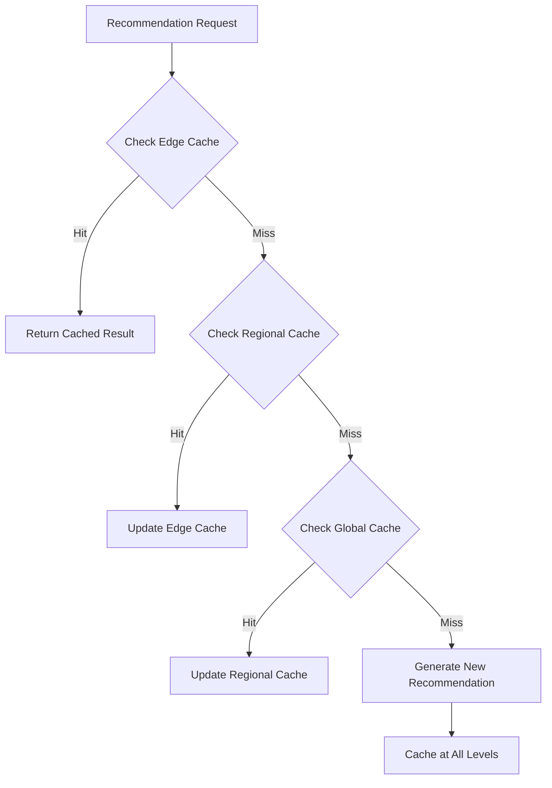

## 6.4 Performance Optimization

### 6.4.1 Atomic Cache Invalidation

```typescript
interface CacheInvalidationProtocol {
    // Invalidation message format
    message: {
        key: string;
        timestamp: number;
        origin: string;
        cascadeLevel: number;   // How many levels to cascade
        priority: number;       // 1-5, with 1 being highest
    };

    // Invalidation rules
    rules: {
        propagationDelay: number;    // ms between levels
        maxPropagationTime: number;  // max total time
        retryStrategy: {
            attempts: number;
            backoffMs: number;
            maxRetryMs: number;
        };
    };

    // Consistency checks
    consistency: {
        validateTimestamp: boolean;
        requireAcknowledgement: boolean;
        consistencyLevel: 'strict' | 'eventual';
    };
}
```

### 6.4.2 Cache Consistency Levels

| **Cache Level** | **Invalidation Priority** | **Max Propagation Time** | **Consistency Level** |
| --- | --- | --- | --- |
| Edge | 1 | 100ms | Strict |
| Regional | 2 | 500ms | Eventual |
| Global | 3 | 2000ms | Eventual |

# 7. Monitoring and Analytics

AlgoRhythm adheres to ReViz’s security framework, including OAuth authentication, encrypted API communication, and role-based access control (RBAC) for content selection and recommendation management.

## 7.1 Performance Monitoring

AlgoRhythm tracks system health and recommendation quality with Prometheus and Grafana, ensuring ReViz’s target of 50M+ daily requests are met:

```python
class PerformanceMonitor:
    async def collect_metrics(self) -> dict:
        """
        Collect system metrics for monitoring
        """
        return {
            'inference_latency_ms': await self.measure_latency(),  # e.g., 42ms
            'throughput_requests_per_s': await self.measure_throughput(),  # e.g., 10K
            'recommendation_accuracy': await self.measure_accuracy()  # e.g., 91.5%
        }

    async def export_to_prometheus(self):
        """Export metrics to Prometheus"""
        from prometheus_client import Gauge
        latency_gauge = Gauge('inference_latency_ms', 'Inference latency in ms')
        latency_gauge.set(await self.measure_latency())
```

1. **Dashboard Example (Grafana)**:
- **Panel**: "Inference Latency" (Gauge, target <50ms, alert >100ms).
- **Query**: avg(rate(inference_latency_ms[5m])).
- **Alerts**: Email if throughput drops below 5K req/s.
- **Metrics**: 42ms average latency, 87% cache hit rate in ReViz (Q1 2025).
- **Integration**: Syncs with NNA monitoring ([Implementation Guide, Section 7](#7-monitoring-and-observability)).

## 7.2 Performance Metrics

We monitor query latency, click-through rate, and user engagement. These metrics help identify areas for improvement in the recommendation models and system performance. We use tools like Prometheus and Grafana for monitoring and visualization.

Key monitoring areas:

- Response times
- Throughput rates
- Resource utilization
- Cache hit rates
- Model accuracy

```python
class AIMonitor:
    async def collect_metrics(self):
        """
        Collect AI system metrics
        """
        return {
            'inference_metrics': {
                'latency_ms': self.measure_latency(),
                'throughput': self.measure_throughput(),
                'accuracy': self.measure_accuracy()
            },
            'resource_metrics': {
                'gpu_utilization': self.measure_gpu_usage(),
                'memory_usage': self.measure_memory_usage(),
                'cache_efficiency': self.measure_cache_efficiency()
            },
            'quality_metrics': {
                'recommendation_accuracy': self.measure_rec_accuracy(),
                'user_satisfaction': self.measure_satisfaction(),
                'engagement_rate': self.measure_engagement()
            }
        }
```

## 7.3 Quality Metrics

_All user engagement and preference data are processed securely, in compliance with GDPR and CCPA. User data is_ **_never shared externally_** _and is_ **_encrypted at rest and in transit_**_. Additional security measures include:_

- **Tokenized access to preference data** to prevent unauthorized retrieval.
- **Anonymized training datasets** for AI models to ensure privacy compliance.
- **Per-user opt-out capabilities** for personalized recommendations
- Acceptance rates
- Completion rates
- User satisfaction
- A/B test results

```python
class AnalyticsEngine:
    async def generate_insights(self):
        """
        Generate system insights
        """
        return {
            'user_behavior': {
                'acceptance_rate': self.calculate_acceptance_rate(),
                'interaction_patterns': self.analyze_interactions(),
                'preference_trends': self.analyze_preferences()
            },
            'system_performance': {
                'model_accuracy': self.evaluate_model_accuracy(),
                'resource_efficiency': self.evaluate_efficiency(),
                'optimization_opportunities': self.identify_optimizations()
            },
            'business_metrics': {
                'user_engagement': self.measure_engagement(),
                'content_performance': self.analyze_content(),
                'platform_growth': self.analyze_growth()
            }
        }
```

## 7.4 Cross-platform Monitoring

1. Implementation: **Unified Monitoring Framework**

```python
class UnifiedMonitoringSystem:
    """
    Centralized monitoring across all three platforms
    """
    def __init__(self):
        self.nna_monitor = NNAMonitor()
        self.algo_monitor = AlgoRhythmMonitor()
        self.clearity_monitor = ClearityMonitor()
        self.metrics_aggregator = MetricsAggregator()

    async def collect_system_metrics(
        self,
        context: MonitoringContext
    ) -> SystemMetrics:
        """
        Collect and aggregate metrics across platforms
        """
        metrics = await asyncio.gather(
            self.nna_monitor.collect_metrics(context),
            self.algo_monitor.collect_metrics(context),
            self.clearity_monitor.collect_metrics(context)
        )

        return self.metrics_aggregator.aggregate_metrics(metrics)

    async def monitor_cross_platform_performance(
        self,
        context: PerformanceContext
    ) -> PerformanceMetrics:
        """
        Monitor end-to-end performance across platforms
        """
        return {
            'response_times': await self.measure_response_times(),
            'throughput': await self.measure_throughput(),
            'error_rates': await self.measure_error_rates(),
            'resource_utilization': await self.measure_resource_usage(),
            'cache_efficiency': await self.measure_cache_performance(),
            'cross_platform_latency': await self.measure_cross_platform_latency()
        }
```


# 8. Future Directions

Future work will explore incorporating contextual information, such as time of day and user location, to further personalize recommendations. We also plan to investigate reinforcement learning techniques to optimize recommendations based on user feedback

## 8.1 Roadmap

- Enhanced neural network architectures
- Cross-modal learning capabilities
- Real-time adaptation mechanisms
- Advanced personalization features
- Extended reality support

## 8.2 Research Areas

- Quantum computing integration
- Federated learning implementation
- Zero-shot recommendation systems
- Multi-modal fusion techniques
- Privacy-preserving ML

## 8.3 Technical Enhancements

1. Advanced Model Architectures
    - Multi-modal learning
    - Attention mechanisms
    - Cross-modal transformers
1. Performance Optimization
    - Enhanced GPU utilization
    - Distributed inference
    - Advanced caching strategies

## 8.4 Feature Development

1. Enhanced Personalization
    - Fine-grained user modeling
    - Context-aware recommendations
    - Dynamic preference adaptation
1. Creative Tools
    - Style transfer suggestions
    - Trend-based recommendations
    - Collaborative filtering

# 9. Use Cases

A user can  use AlgoRhythm to find music that matches their mood.  A content creator can use AlgoRhythm to find complementary visual assets to create their music video.

## 9.1 Song-Based Creation Flow

**Use Case Description**

User starts by selecting a song ("Señorita" by Shawn Mendes & Camila Cabello) and wants recommendations for all layers.

1. **API Implementation with Dual Addressing Support**

```typescript
// 1. Initial Song-Based Recommendation Request (using Human-Friendly Name)
POST /api/v2/recommendations
{
    "song_id": "G.POP.SMC.002",  // Human-Friendly Name for "Señorita"
    "context": {
        "metadata": {
            "genre": "pop",
            "tempo": 117,
            "energy": 0.8,
            "danceability": 0.76
        },
        "creation_type": "new"
    },
    "ml_options": {
        "model_version": "v2.1",
        "inference_settings": {
            "precision": "fp16",
            "temperature": 0.7
        }
    }
}

// Response (includes both addressing formats)
{
    "status": "success",
    "recommendations": {
        "star_layer": [
            {
                "nna_address": "S.003.001.001",
                "friendly_name": "S.POP.CLS.001",
                "category": "Pop",
                "subcategory": "Latin Pop",
                "score": 0.95,
                "preview_url": "/previews/S.003.001.001",
                "metadata": {
                    "style": "Contemporary Latin",
                    "performance_type": "Dance-focused",
                    "energy_level": "High"
                }
            }
            // Additional recommendations...
        ],
        "look_layer": [
            {
                "nna_address": "L.006.003.001",
                "friendly_name": "L.DES.LAT.001",
                "category": "Designer",
                "subcategory": "Latin Dance",
                "score": 0.92
            }
            // Additional recommendations...
        ]
        // Other layers...
    }
}
```

## 9.2 Layer-Specific Updates

**Use Case Description**

User has selected a "Designer" look and wants updated recommendations for other layers.

1. **API Implementation**

```typescript
// Layer-Based Recommendation Update
POST /api/v2/recommendations/update
{
    "song_id": "spotify:track:6v3KW9xbzN5yKLt9YKDYA2",
    "selected_components": {
        "look_layer": "L.06.03.001"
    },
    "ml_options": {
        "model_version": "v2.1",
        "inference_settings": {
            "focus_layers": ["world", "text", "moves"]
        }
    }
}

// Response
{
    "status": "success",
    "recommendations": {
        "world_layer": [
            {
                "nna_address": "W.08.08.001",
                "category": "Performance Venues",
                "subcategory": "Dance Club",
                "score": 0.89,
                "compatibility_score": 0.94  // With selected look
            }
            // Additional recommendations...
        ],
        "text_layer": [
            {
                "nna_address": "X.001.001.001",
                "category": "Text Overlays",
                "subcategory": "Bold",
                "score": 0.87,
                "compatibility_score": 0.92  // With selected look
            }
            // Additional recommendations...
        ]
        // Other layers...
    }
}
```


## 9.3 Personalized Recommendations

**Use Case Description**

Returning user with established preferences starts a new creation.

1. **API Implementation**

```typescript
POST /api/v3/recommendations
{
    "song_id": "spotify:track:6v3KW9xbzN5yKLt9YKDYA2",
    "user_context": {
        "user_id": "u123456",
        "historical_preferences": {
            "star_preferences": ["S.01.*.*", "S.02.*.*"],
            "look_preferences": ["L.06.*.*"],
            "world_preferences": ["W.08.*.*"]
        },
        "creation_history": {
            "total_remixes": 25,
            "preferred_genres": ["pop", "latin"],
            "style_preferences": {
                "contemporary": 0.8,
                "traditional": 0.2
            }
        }
    },
    "personalization_options": {
        "preference_weight": 0.7,
        "exploration_rate": 0.3
    }
}

// Response
{
    "status": "success",
    "recommendations": {
        // Layer recommendations...
    },
    "personalization_metadata": {
        "preference_match_score": 0.85,
        "novelty_score": 0.3,
        "explanation": [
            "Based on your preference for contemporary Latin pop",
            "Matching your style choices from recent remixes",
            "Adding some fresh options you might like"
        ]
    }
}
```

## 9.4 Remix-Based Creation

**Use Case Description**

User starts with an existing popular remix ("Señorita - Latin Club Remix") and wants to create their own variation. ReViz needs to provide ranked recommendations for each layer while considering the original remix's choices.

1. **Sequence Flow**

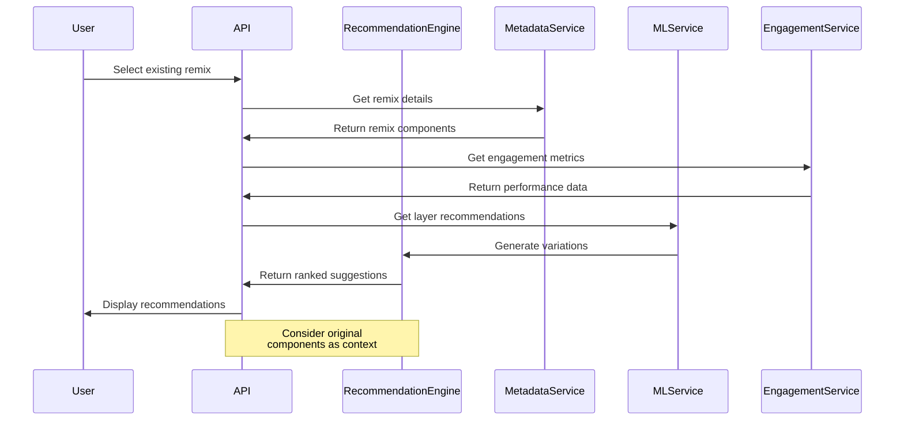

1. **API Implementation**

```typescript
// Request to get recommendations based on existing remix
POST /api/v2/recommendations/from-remix
{
    "remix_id": "REV_C_PO_078",
    "original_components": {
        "song_id": "spotify:track:6v3KW9xbzN5yKLt9YKDYA2",
        "star_layer": "S.01.01.001",
        "look_layer": "L.06.03.001",
        "world_layer": "W.08.08.001",
        "text_layer": "X.001.001.001",
        "moves_layer": "M.04.01.001"
    },
    "variation_options": {
        "creativity_level": 0.7,    // 0-1, higher means more diverse suggestions
        "keep_components": ["star_layer", "look_layer"],  // Components to maintain
        "vary_components": ["world_layer", "text_layer", "moves_layer"]
    },
    "ml_options": {
        "model_version": "v2.1",
        "inference_settings": {
            "consider_engagement": true,
            "temperature": 0.7
        }
    }
}

// Success Response
{
    "status": "success",
    "recommendations": {
        "star_layer": [
            {
                "nna_address": "S.01.01.001",  // Same as original
                "category": "Pop",
                "subcategory": "Latin Pop",
                "score": 1.0,
                "is_original": true
            },
            {
                "nna_address": "S.01.01.002",
                "category": "Pop",
                "subcategory": "Latin Pop",
                "score": 0.92,
                "variation_type": "similar_style"
            }
            // Additional variations...
        ],
        "world_layer": [
            {
                "nna_address": "W.08.08.002",
                "category": "Performance Venues",
                "subcategory": "Arena",
                "score": 0.88,
                "variation_type": "scale_up",
                "compatibility_scores": {
                    "with_original_star": 0.90,
                    "with_original_look": 0.85
                }
            }
            // Additional variations...
        ],
        "text_layer": [
            {
                "nna_address": "X.001.001.002",
                "category": "Text Overlays",
                "subcategory": "Italic",
                "score": 0.87,
                "variation_type": "style_change",
                "compatibility_scores": {
                    "with_original_star": 0.89,
                    "with_original_look": 0.84
                }
            }
            // Additional variations...
        ]
        // Other layers...
    },
    "variation_metadata": {
        "original_metrics": {
            "views": 150000,
            "likes": 12000,
            "remix_count": 45
        },
        "suggested_variations": [
            {
                "description": "Arena Performance Variation",
                "components": {
                    "maintained": ["star", "look"],
                    "varied": ["world", "text", "moves"]
                },
                "predicted_engagement": 0.85
            }
        ]
    }
}

// Error Response
{
    "status": "error",
    "error": {
        "code": "REMIX_NOT_FOUND",
        "message": "The specified remix ID does not exist",
        "details": {
            "remix_id": "REV_C_PO_078",
            "timestamp": "2025-01-27T10:15:30Z"
        }
    }
}
```

1. **Implementation Details**

```python
class RemixBasedRecommender:
    async def generate_remix_recommendations(
        self,
        remix_id: str,
        variation_options: dict
    ) -> dict:
        try:
            # Get original remix details
            original_remix = await self.metadata_service.get_remix(remix_id)
            if not original_remix:
                raise RemixNotFoundException(remix_id)

            # Get engagement metrics
            engagement = await self.engagement_service.get_metrics(remix_id)

            # Generate variations based on original components
            variations = await self.ml_service.generate_variations(
                original_components=original_remix.components,
                engagement_metrics=engagement,
                variation_options=variation_options
            )

            # Score and rank variations
            ranked_variations = await self.rank_variations(
                variations,
                original_remix,
                engagement
            )

            return {
                "status": "success",
                "recommendations": ranked_variations,
                "variation_metadata": self.generate_metadata(
                    original_remix,
                    engagement,
                    variations
                )
            }

        except RemixNotFoundException as e:
            return self.handle_remix_not_found(e)
        except MLServiceException as e:
            return self.handle_ml_service_error(e)
        except Exception as e:
            return self.handle_unexpected_error(e)

    async def rank_variations(
        self,
        variations: list,
        original: Remix,
        engagement: dict
    ) -> dict:
        """
        Rank variations considering:
        - Similarity to original (for maintained components)
        - Novelty (for varied components)
        - Predicted engagement
        - Technical compatibility
        """
        ranked_results = {}
        for layer in LAYER_TYPES:
            layer_variations = variations[layer]
            if layer in original.components:
                # Add original as first recommendation
                ranked_results[layer] = [
                    self.format_original_component(
                        original.components[layer]
                    ),
                    *await self.rank_layer_variations(
                        layer_variations,
                        original,
                        engagement
                    )
                ]
            else:
                ranked_results[layer] = await self.rank_layer_variations(
                    layer_variations,
                    original,
                    engagement
                )
        return ranked_results
```

## 9.5 Trending Remix Creation

**Use Case Description**

User wants to create a remix based on current trends.

1. **API Implementation**

```typescript
POST /api/v2/recommendations/trending
{
    "song_id": "spotify:track:6v3KW9xbzN5yKLt9YKDYA2",
    "trend_context": {
        "platform": "tiktok",
        "timeframe": "last_7_days",
        "region": "global"
    },
    "ml_options": {
        "model_version": "v2.1",
        "feature_flags": {
            "use_trending": true,
            "use_geographical": true
        }
    }
}

// Response
{
    "status": "success",
    "recommendations": {
        // Layer recommendations...
    },
    "trend_metadata": {
        "trend_score": 0.92,
        "trending_combinations": [
            {
                "description": "Latin Pop Star with Modern Club Setting",
                "components": {
                    "star": "S.01.01.001",
                    "world": "W.08.08.001"
                },
                "popularity_score": 0.95
            }
        ]
    }
}
```

## 9.6 Error Handling and Recovery

1. **Common Error Scenarios**

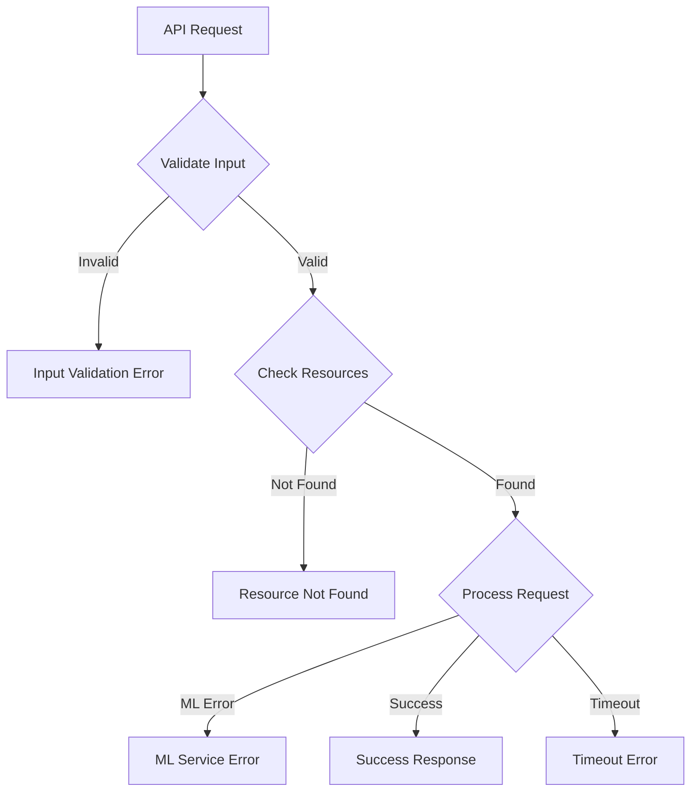

1. **Error Response Standards**

```typescript
// Standard error response structure
interface ErrorResponse {
    status: "error";
    error: {
        code: string;        // Machine-readable error code
        message: string;     // Human-readable error message
        details?: object;    // Additional error context
        timestamp: string;   // Error timestamp
        request_id?: string; // For tracking/debugging
    };
    suggestions?: {         // Optional recovery suggestions
        retry?: boolean;    // Whether retry might help
        alternatives?: any; // Alternative actions
        wait_time?: number; // Suggested wait before retry
    };
}

// Example error handling implementation
class RecommendationErrorHandler {
    handleError(error: Error): ErrorResponse {
        switch (error.constructor) {
            case ValidationError:
                return {
                    status: "error",
                    error: {
                        code: "INVALID_INPUT",
                        message: error.message,
                        details: error.validationErrors,
                        timestamp: new Date().toISOString()
                    },
                    suggestions: {
                        retry: false,
                        alternatives: this.getSuggestions(error)
                    }
                };
            
            case ResourceNotFoundError:
                return {
                    status: "error",
                    error: {
                        code: "RESOURCE_NOT_FOUND",
                        message: error.message,
                        details: {
                            resource_type: error.resourceType,
                            resource_id: error.resourceId
                        },
                        timestamp: new Date().toISOString()
                    },
                    suggestions: {
                        retry: false,
                        alternatives: this.getAlternativeResources(error)
                    }
                };
            
            case MLServiceError:
                return {
                    status: "error",
                    error: {
                        code: "ML_SERVICE_ERROR",
                        message: "Unable to generate recommendations",
                        details: {
                            service: "ml",
                            error_type: error.type
                        },
                        timestamp: new Date().toISOString()
                    },
                    suggestions: {
                        retry: true,
                        wait_time: 5000
                    }
                };
            
            default:
                return {
                    status: "error",
                    error: {
                        code: "INTERNAL_ERROR",
                        message: "An unexpected error occurred",
                        timestamp: new Date().toISOString()
                    }
                };
        }
    }
}
```

1. **Recovery Strategies**

```python
class RecommendationRecoveryStrategy:
    async def handle_ml_service_failure(
        self,
        request: RecommendationRequest
    ) -> Response:
        """
        Fallback strategy when ML service fails
        """
        try:
            # Try rule-based recommendations
            basic_recommendations = await self.rule_engine.get_recommendations(
                request.song_id
            )
            
            # Get cached popular combinations
            popular_combinations = await self.cache.get_popular_combinations(
                request.song_id
            )
            
            return Response(
                status="success",
                recommendations=basic_recommendations,
                metadata={
                    "fallback": True,
                    "strategy": "rule_based",
                    "popular_combinations": popular_combinations
                }
            )
        except Exception as e:
            # Last resort: Return basic presets
            return Response(
                status="partial_success",
                recommendations=self.get_basic_presets(),
                metadata={
                    "fallback": True,
                    "strategy": "basic_presets"
                }
            )

    async def handle_timeout(
        self,
        request: RecommendationRequest,
        partial_results: dict
    ) -> Response:
        """
        Handle timeout scenarios with partial results
        """
        return Response(
            status="partial_success",
            recommendations=partial_results,
            metadata={
                "complete": False,
                "available_layers": list(partial_results.keys()),
                "retry_after": 2000
            }
        )
```

## 9.7 ReViz: Trending Remix Creation

**Scenario**: A ReViz user remixes "Señorita" (G.01.TSW.001) using TikTok trends, leveraging AlgoRhythm’s patent pending AI for rapid, compatible suggestions.

**Flow:**

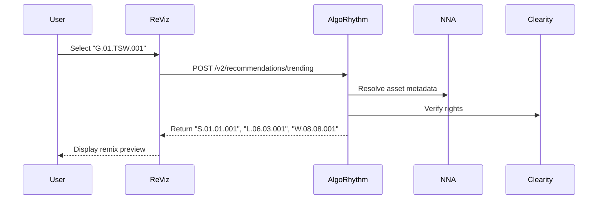

**Solution**: AlgoRhythm analyzes "G.01.TSW.001" (tempo: 117 BPM, genre: Latin Pop) and TikTok engagement data, recommending:

- Star: "S.01.01.001" (Latin Pop Avatar, 95% compatibility).
- Look: "L.06.03.001" (Modern Latin Outfit, 92% score).
- World: "W.08.08.001" (Dance Club, 89% trend match).
- 
1. **API Call**

```typescript
POST /api/v2/recommendations/trending
{
    "song_id": "G.01.TSW.001",
    "trend_context": {
        "platform": "tiktok",
        "timeframe": "last_7_days",
        "region": "global"
    },
    "ml_options": { "model_version": "v2.1" }
}

// Response
{
    "status": "success",
    "recommendations": {
        "star_layer": [{"nna_address": "S.01.01.001", "score": 0.95}],
        "look_layer": [{"nna_address": "L.06.03.001", "score": 0.92}],
        "world_layer": [{"nna_address": "W.08.08.001", "score": 0.89}]
    },
    "trend_metadata": {"trend_score": 0.92, "latency_ms": 42}
}
```

1. **Target Results**:
- **Speed**: Sub-50ms recommendation delivery.
- **Engagement**: 30% higher TikTok views vs. manual selection (ReViz pilot).

This showcases AlgoRhythm’s AI-driven trend analysis, a key IP asset. See [Section 5.1](#5-recommendation-models) for model details.

## 9.8 Advanced Use Case: AI-Driven Layer Selection

```python
class AILayerSelectionService:
    """
    Service for AI-driven automatic layer selection in video remix workflows
    """
    def __init__(self):
        self.recommendation_engine = RecommendationEngine()
        self.user_preference_analyzer = UserPreferenceAnalyzer()
        self.trend_analyzer = TrendAnalyzer()
        self.metrics_collector = MetricsCollector()
        
    async def select_optimal_layers(
        self,
        base_layer_type: str,
        base_layer_id: str,
        context: SelectionContext
    ) -> LayerSelectionResult:
        """
        Automatically select optimal layers for a complete video remix
        based on one anchor layer (usually Song or Star)
        """
        async with self.metrics_collector.track_operation(
            "ai_layer_selection",
            context
        ):
            # Analyze user preferences if user context is available
            user_preferences = None
            if context.user_id:
                user_preferences = await self.user_preference_analyzer.analyze_preferences(
                    context.user_id,
                    base_layer_type,
                    base_layer_id
                )
            
            # Get current trending patterns
            trend_patterns = await self.trend_analyzer.get_trending_patterns(
                base_layer_type,
                base_layer_id,
                context.region
            )
            
            # Create recommendation context
            recommendation_context = RecommendationContext(
                base_layer_type=base_layer_type,
                base_layer_id=base_layer_id,
                user_preferences=user_preferences,
                trend_patterns=trend_patterns,
                selection_criteria=context.selection_criteria
            )
            
            # Generate layer recommendations
            layer_recommendations = await self.recommendation_engine.recommend_layers(
                recommendation_context
            )
            
            # Create complete layer selection
            selection = await self.create_layer_selection(
                base_layer_type,
                base_layer_id,
                layer_recommendations
            )
            
            # Generate explanation
            explanation = await self.generate_selection_explanation(
                selection,
                recommendation_context
            )
            
            return LayerSelectionResult(
                selection=selection,
                explanation=explanation,
                alternatives=await self.generate_alternatives(
                    recommendation_context,
                    selection
                )
            )
    
    async def create_layer_selection(
        self,
        base_layer_type: str,
        base_layer_id: str,
        recommendations: LayerRecommendations
    ) -> LayerSelection:
        """
        Creates a complete layer selection based on recommendations
        """
        # Initialize selection with base layer
        selection = {
            base_layer_type: base_layer_id
        }
        
        # Add top recommendation for each layer
        layer_types = ["G", "S", "L", "M", "W", "X"]
        for layer_type in layer_types:
            if layer_type != base_layer_type and recommendations.get(layer_type):
                top_recommendation = recommendations[layer_type][0]
                selection[layer_type] = top_recommendation.asset_id
        
        return LayerSelection(
            layers=selection,
            compatibility_score=self.calculate_overall_compatibility(recommendations),
            trend_alignment=self.calculate_trend_alignment(recommendations),
            recommendation_confidence=self.calculate_recommendation_confidence(recommendations)
        )
            
    async def generate_selection_explanation(
        self,
        selection: LayerSelection,
        context: RecommendationContext
    ) -> SelectionExplanation:
        """
        Generates human-readable explanation for layer selection
        """
        # Generate overall explanation
        overall_explanation = f"This selection was optimized for {context.selection_criteria.primary_focus} with {selection.compatibility_score:.1f}% compatibility score."
        
        # Generate layer-specific explanations
        layer_explanations = {}
        for layer_type, asset_id in selection.layers.items():
            if layer_type == context.base_layer_type:
                layer_explanations[layer_type] = "Base layer selected by user."
            else:
                layer_explanations[layer_type] = await self.get_layer_explanation(
                    layer_type,
                    asset_id,
                    context
                )
        
        return SelectionExplanation(
            overall=overall_explanation,
            layers=layer_explanations,
            created_at=datetime.now().isoformat()
        )
```

# 10. Performance and Scaling

## 10.1 Caching Strategy

Detailed caching implementation for different types of requests and data:

```python
class MultiLevelCache:
    def __init__(self):
        self.metadata_cache = RedisCache(
            ttl=3600,
            max_size="1GB"
        )
        self.recommendation_cache = RedisCache(
            ttl=1800,
            max_size="5GB"
        )
        self.model_cache = GPUCache(
            ttl=7200,
            max_size="2GB"
        )

    async def get_recommendations(
        self,
        key: str,
        generate_func: Callable
    ) -> dict:
        """
        Multi-level caching with progressive loading
        """
        # Try fast metadata cache
        if metadata := await self.metadata_cache.get(key):
            return self.enrich_recommendations(metadata)
            
        # Try recommendation cache
        if recommendations := await self.recommendation_cache.get(key):
            return recommendations
            
        # Generate new recommendations
        recommendations = await generate_func()
        
        # Cache results
        await self.cache_results(key, recommendations)
        
        return recommendations
```

## 10.2 Load Balancing

Strategies for handling high request volumes:

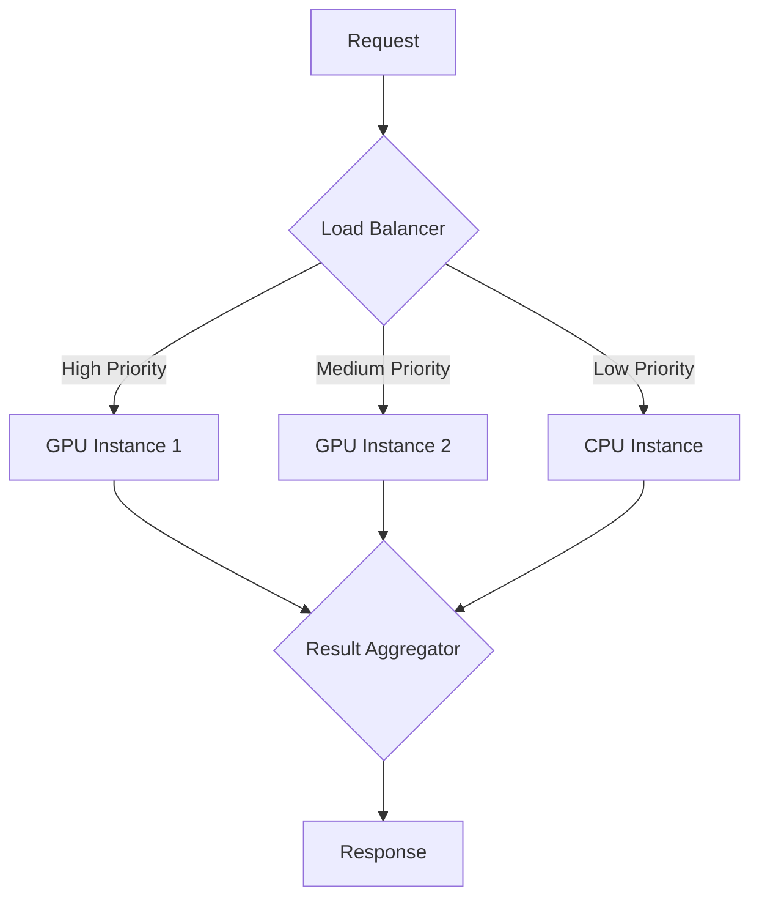

## 10.3 Performance and Scaling Best Practices

```python
class PerformanceAndScalingBestPractices:
    """
    Best practices for AlgoRhythm AI performance optimization and scaling
    """
    def __init__(self):
        self.performance_analyzer = PerformanceAnalyzer()
        self.scaling_advisor = ScalingAdvisor()
        self.resource_optimizer = ResourceOptimizer()
        
    async def get_best_practices(
        self,
        deployment_context: DeploymentContext
    ) -> BestPracticesDocument:
        """
        Generate comprehensive best practices for performance and scaling
        """
        # Analyze current performance characteristics
        performance_analysis = await self.performance_analyzer.analyze_current_performance(
            deployment_context
        )
        
        # Get scaling recommendations
        scaling_recommendations = await self.scaling_advisor.get_recommendations(
            performance_analysis,
            deployment_context
        )
        
        # Get resource optimization guidelines
        optimization_guidelines = await self.resource_optimizer.get_optimization_guidelines(
            performance_analysis,
            deployment_context
        )
        
        return BestPracticesDocument(
            caching_practices=self.generate_caching_practices(deployment_context),
            database_practices=self.generate_database_practices(deployment_context),
            api_optimization=self.generate_api_optimization_practices(deployment_context),
            inference_optimization=self.generate_inference_optimization_practices(deployment_context),
            scaling_strategies=scaling_recommendations,
            resource_optimization=optimization_guidelines,
            monitoring_guidelines=self.generate_monitoring_guidelines(deployment_context)
        )
        
    def generate_caching_practices(
        self,
        context: DeploymentContext
    ) -> List[BestPractice]:
        """
        Generate caching best practices
        """
        return [
            BestPractice(
                title="Use multi-tier caching architecture",
                description="Implement edge, regional, and global caching tiers to optimize for both latency and throughput.",
                implementation="""
                ```python
                class CacheManager:
                    def __init__(self):
                        self.edge_cache = EdgeCache(ttl=300)  # 5 minutes
                        self.regional_cache = RegionalCache(ttl=3600)  # 1 hour
                        self.global_cache = GlobalCache(ttl=86400)  # 24 hours
                        
                    async def get(self, key: str):
                        # Try edge cache first (lowest latency)
                        if result := await self.edge_cache.get(key):
                            return result
                            
                        # Try regional cache next
                        if result := await self.regional_cache.get(key):
                            # Populate edge cache
                            await self.edge_cache.set(key, result)
                            return result
                            
                        # Try global cache last
                        if result := await self.global_cache.get(key):
                            # Populate lower tiers
                            await asyncio.gather(
                                self.regional_cache.set(key, result),
                                self.edge_cache.set(key, result)
                            )
                            return result
                            
                        return None
                ```
                """,
                importance="Critical",
                effort="Medium",
                impact="High"
            ),
            BestPractice(
                title="Implement predictive cache warming",
                description="Use AI-based prediction to proactively cache assets likely to be requested, based on trending and usage patterns.",
                implementation="""
                ```python
                class PredictiveCacheWarmer:
                    async def warm_cache(self, context: RequestContext):
                        # Get trending assets
                        trending = await self.get_trending_assets(context.region)
                        
                        # Get user preference based assets
                        user_preferences = await self.get_user_preferences(context.user_id)
                        
                        # Predict assets likely to be requested
                        predicted_assets = await self.predict_asset_requests(
                            trending, 
                            user_preferences,
                            context
                        )
                        
                        # Warm cache with predicted assets
                        await asyncio.gather(*[
                            self.cache_manager.set(asset_id, asset_data)
                            for asset_id, asset_data in predicted_assets.items()
                        ])
                ```
                """,
                importance="High",
                effort="High",
                impact="High"
            ),
            BestPractice(
                title="Optimize cache invalidation patterns",
                description="Use targeted invalidation patterns to minimize unnecessary cache flushes while maintaining consistency.",
                implementation="""
                ```python
                class InvalidationManager:
                    async def invalidate(self, pattern: str):
                        # Analyze pattern to determine scope
                        scope = self.determine_invalidation_scope(pattern)
                        
                        # Apply selective invalidation
                        if scope == 'asset':
                            # Invalidate only specific asset
                            await self.cache_manager.invalidate_asset(pattern)
                        elif scope == 'layer':
                            # Invalidate specific layer
                            await self.cache_manager.invalidate_layer(pattern)
                        elif scope == 'global':
                            # Full invalidation
                            await self.cache_manager.invalidate_all()
                ```
                """,
                importance="High",
                effort="Medium",
                impact="High"
            )
        ]
        
    def generate_database_practices(
        self,
        context: DeploymentContext
    ) -> List[BestPractice]:
        """
        Generate database optimization best practices
        """
        return [
            BestPractice(
                title="Implement database sharding by layer type",
                description="Shard database by NNA layer type (G, S, L, M, W, B, P, T, R, C, E, N, A, F, X) to optimize query performance and distribute load.",
                implementation="""
                ```python
                class ShardedDatabaseClient:
                    def __init__(self):
                        self.shards = {
                            'G': SongLayerDatabase(),
                            'S': StarLayerDatabase(),
                            'L': LookLayerDatabase(),
                            'M': MovesLayerDatabase(),
                            'W': WorldLayerDatabase(),
                            'B': BrandedLayerDatabase(),
                            'P': PersonalizeLayerDatabase(),
                            'T': TrainingDataLayerDatabase(),
                            'R': RightsLayerDatabase(),
                            'C': CompositesLayerDatabase(),
                            'E': AudioEffectsLayerDatabase(),
                            'N': TransitionsLayerDatabase(),
                            'A': AugmentedRealityLayerDatabase(),
                            'F': FiltersLayerDatabase(),
                            'X': TextLayerDatabase()
                        }
                        
                    async def get_asset(self, asset_id: str):
                        # Extract layer from asset ID
                        layer = asset_id.split('.')[0]
                        
                        # Route to appropriate shard
                        return await self.shards[layer].get_asset(asset_id)
                ```
                """,
                importance="High",
                effort="High",
                impact="High"
            ),
            BestPractice(
                title="Use denormalized data for recommendation queries",
                description="Store pre-computed compatibility scores in denormalized form to accelerate recommendation queries.",
                implementation="""
                ```python
                class RecommendationDatabase:
                    async def get_recommendations(
                        self,
                        base_asset_id: str,
                        target_layer: str
                    ):
                        # Query from denormalized table for fast retrieval
                        return await self.client.query(
                            "SELECT target_id, score, factors FROM asset_compatibility " +
                            "WHERE base_id = ? AND target_layer = ? " +
                            "ORDER BY score DESC LIMIT 20",
                            [base_asset_id, target_layer]
                        )
                ```
                """,
                importance="Medium",
                effort="Medium",
                impact="High"
            )
        ]
        
    def generate_api_optimization_practices(
        self,
        context: DeploymentContext
    ) -> List[BestPractice]:
        """
        Generate API optimization best practices
        """
        return [
            BestPractice(
                title="Implement batch API endpoints",
                description="Provide batch endpoints for common operations to reduce network overhead and improve throughput.",
                implementation="""
                ```python
                @app.route('/api/v2/recommendations/batch', methods=['POST'])
                async def batch_recommendations(request):
                    # Extract batch request
                    batch = request.json.get('requests', [])
                    
                    # Process requests in parallel
                    results = await asyncio.gather(*[
                        process_recommendation_request(req)
                        for req in batch
                    ])
                    
                    return jsonify({
                        'results': results
                    })
                ```
                """,
                importance="High",
                effort="Medium",
                impact="High"
            ),
            BestPractice(
                title="Implement intelligent response compression",
                description="Use context-aware compression for API responses to optimize bandwidth usage.",
                implementation="""
                ```python
                class ResponseCompressor:
                    def compress_response(self, data, context):
                        # Determine optimal compression based on client and data
                        if context.client_supports_brotli and len(data) > 10_000:
                            return self.brotli_compress(data)
                        elif context.client_supports_gzip:
                            return self.gzip_compress(data)
                        else:
                            return data
                ```
                """,
                importance="Medium",
                effort="Low",
                impact="Medium"
            )
        ]
        
    def generate_inference_optimization_practices(
        self,
        context: DeploymentContext
    ) -> List[BestPractice]:
        """
        Generate ML inference optimization best practices
        """
        return [
            BestPractice(
                title="Implement model quantization",
                description="Quantize recommendation models to int8 precision to improve inference performance and reduce memory usage.",
                implementation="""
                ```python
                class ModelOptimizer:
                    def quantize_model(self, model_path, output_path):
                        # Load full precision model
                        full_model = tf.keras.models.load_model(model_path)
                        
                        # Define quantization configuration
                        converter = tf.lite.TFLiteConverter.from_keras_model(full_model)
                        converter.optimizations = [tf.lite.Optimize.DEFAULT]
                        converter.target_spec.supported_types = [tf.int8]
                        
                        # Create representative dataset
                        def representative_dataset():
                            for data in self.get_calibration_data():
                                yield [data]
                        
                        converter.representative_dataset = representative_dataset
                        
                        # Convert model
                        quantized_model = converter.convert()
                        
                        # Save quantized model
                        with open(output_path, 'wb') as f:
                            f.write(quantized_model)
                ```
                """,
                importance="High",
                effort="Medium",
                impact="High"
            ),
            BestPractice(
                title="Implement model serving with TensorRT",
                description="Use TensorRT for high-performance inference on GPU infrastructure.",
                implementation="""
                ```python
                class TensorRTInferenceService:
                    def __init__(self):
                        # Initialize TensorRT engine
                        self.engine = self.build_tensorrt_engine()
                        self.context = self.engine.create_execution_context()
                        
                    def build_tensorrt_engine(self):
                        # Convert model to TensorRT format
                        converter = trt.TrtGraphConverterV2(
                            input_saved_model_dir='saved_model',
                            precision_mode='FP16'
                        )
                        converter.convert()
                        return converter.build(input_fn)
                        
                    async def predict(self, inputs):
                        # Run inference with TensorRT
                        return self.context.execute_async(
                            bindings=self.prepare_bindings(inputs),
                            stream_handle=self.stream.handle
                        )
                ```
                """,
                importance="High",
                effort="High",
                impact="High"
            )
        ]
}
```


## 10.4 Security Best Practices

```python
class SecurityBestPractices:
    """
    Security best practices for AlgoRhythm implementation
    """
    def __init__(self):
        self.security_analyzer = SecurityAnalyzer()
        self.compliance_checker = ComplianceChecker()
        self.threat_modeler = ThreatModeler()
        
    async def get_security_best_practices(
        self,
        deployment_context: DeploymentContext
    ) -> SecurityBestPracticesDocument:
        """Generate comprehensive security best practices"""
        # ... implementation ...
        
    def generate_authentication_practices(
        self,
        requirements: SecurityRequirements
    ) -> List[SecurityBestPractice]:
        """Generate authentication best practices"""
        return [
            # ... authentication practices ...
        ]
        
    def generate_authorization_practices(
        self,
        requirements: SecurityRequirements
    ) -> List[SecurityBestPractice]:
        """Generate authorization best practices"""
        return [
            SecurityBestPractice(
                title="Implement fine-grained RBAC",
                description="Use role-based access control with fine-grained permissions for API endpoints.",
                implementation="""
                ```python
                class AuthorizationService:
                    async def authorize(self, user, resource, action):
                        # Get user roles
                        roles = await self.get_user_roles(user.id)
                        
                        # Check if any role has the required permission
                        for role in roles:
                            permissions = await self.get_role_permissions(role)
                            if self.has_permission(permissions, resource, action):
                                return True
                                
                        # No role has the required permission
                        return False
                        
                    def has_permission(self, permissions, resource, action):
                        # Check for exact permission
                        if f"{resource}:{action}" in permissions:
                            return True
                            
                        # Check for wildcard permissions
                        if f"{resource}:*" in permissions:
                            return True
                            
                        if "*:*" in permissions:
                            return True
                            
                        return False
                ```
                """,
                severity="High",
                effort="High",
                compliance_requirements=["NIST 800-53", "OWASP API Security"]
            ),
            SecurityBestPractice(
                title="Implement attribute-based access control for assets",
                description="Use ABAC to control access to assets based on user attributes and asset metadata.",
                implementation="""
             
              class AssetAccessControl:
                    async def check_asset_access(self, user, asset, operation):
                        # Get user attributes
                        user_attributes = await self.get_user_attributes(user.id)
                        
                        # Get asset attributes
                        asset_attributes = await self.get_asset_attributes(asset.id)
                        
                        # Get operation policy
                        policy = await self.get_access_policy(operation)
                        
                        # Evaluate policy
                        return await self.policy_engine.evaluate(
                            policy, 
                            {
                                'user': user_attributes,
                                'asset': asset_attributes,
                                'context': self.get_request_context()
                            }
                        )
                ```
                """,
                severity="Critical",
                effort="High",
                compliance_requirements=["GDPR", "CCPA", "NIST 800-53"]
            )
        ]
        
    def generate_data_protection_practices(
        self,
        requirements: SecurityRequirements
    ) -> List[SecurityBestPractice]:
        """Generate data protection best practices"""
        return [
            SecurityBestPractice(
                title="Encrypt sensitive data at rest",
                description="Implement field-level encryption for sensitive asset metadata and user data.",
                implementation="""
                ```python
                class DataEncryption:
                    def __init__(self):
                        self.kms = KeyManagementService()
                        
                    async def encrypt_field(self, field_value, context):
                        # Get data encryption key
                        data_key = await self.kms.get_data_key()
                        
                        # Encrypt the field value
                        encrypted_value = self.encrypt_with_key(field_value, data_key.key)
                        
                        # Return encrypted value with encrypted data key
                        return {
                            'value': encrypted_value,
                            'key': data_key.encrypted,
                            'version': data_key.version
                        }
                        
                    async def decrypt_field(self, encrypted_field):
                        # Decrypt the data key
                        data_key = await self.kms.decrypt_data_key(
                            encrypted_field['key'],
                            encrypted_field['version']
                        )
                        
                        # Decrypt the field value
                        return self.decrypt_with_key(encrypted_field['value'], data_key)
                ```
                """,
                severity="Critical",
                effort="High",
                compliance_requirements=["GDPR", "HIPAA", "PCI DSS"]
            ),
            SecurityBestPractice(
                title="Implement secure data disposal",
                description="Securely dispose of sensitive data when no longer needed.",
                implementation="""
                ```python
                class SecureDataDisposal:
                    async def dispose_data(self, data_id, data_type):
                        # Get data disposal policy
                        policy = await self.get_disposal_policy(data_type)
                        
                        if policy.requires_secure_disposal:
                            # Get data location
                            location = await self.get_data_location(data_id, data_type)
                            
                            # Securely dispose data
                            if location.storage_type == 'database':
                                await self.securely_delete_from_database(location)
                            elif location.storage_type == 'file':
                                await self.securely_delete_file(location)
                                
                            # Log disposal
                            await self.log_disposal(data_id, data_type)
                ```
                """,
                severity="High",
                effort="Medium",
                compliance_requirements=["GDPR", "CCPA"]
            )
        ]
}
```

# 11. Appendices

## 11.1 API Documentation

Detailed endpoint specifications, request/response formats, and example usage are specified in the [**NNA API framework Specification**](https://celerity.slab.com/posts/nna-framework-api-specification-1fupkzwa).

## 11.2 Configuration Examples

Sample configurations for development, staging, and production environments.

## 11.3 Performance Benchmarks

Baseline performance metrics and optimization targets.

# 12. Cross-Document Index

Find key topics across the NNA ecosystem:

- **Asset Resolution**:
    - Whitepaper: [NNA Framework Whitepaper](https://celerity.slab.com/posts/0jsj4gsl#hqh5z-3-system-architecture)
    - Implementation Guide: [NNA Framework Technical Implementation Guide](https://celerity.slab.com/posts/xfxe04qg#hy9es-3-service-layer-implementation)
    - API Specification: [NNA Framework API Specification](https://celerity.slab.com/posts/1fupkzwa#hrh8i-2-api-endpoints)
    - AlgoRhythm: [A L G O R H Y T H M](https://celerity.slab.com/posts/4w561767#hnk28-4-nna-framework-integration)
    - Clearity: [Clearity Rights Clearance Platform](https://celerity.slab.com/posts/8ft1v300#4-integration-framework)
- **Caching**:
    - Whitepaper: [NNA Framework Whitepaper](https://celerity.slab.com/posts/0jsj4gsl#hqh5z-3-system-architecture)
    - Implementation Guide: [NNA Framework Technical Implementation Guide](https://celerity.slab.com/posts/xfxe04qg#hy9es-3-service-layer-implementation)
    - API Specification: [NNA Framework API Specification](https://celerity.slab.com/posts/1fupkzwa#h3l82-10-cache-control-and-rate-limiting)
    - AlgoRhythm: [A L G O R H Y T H M](https://celerity.slab.com/posts/4w561767#h0p8b-6-monitoring-and-analytics)
    - Clearity: [Clearity Rights Clearance Platform](https://celerity.slab.com/posts/8ft1v300#6-performance-and-scaling)
- **Rights Management**:
    - Whitepaper: [NNA Framework Whitepaper](https://celerity.slab.com/posts/0jsj4gsl#hqh5z-3-system-architecture)
    - Implementation Guide: [NNA Framework Technical Implementation Guide](https://celerity.slab.com/posts/xfxe04qg#hsghf-5-security-implementation)
    - API Specification: [NNA Framework API Specification](https://celerity.slab.com/posts/1fupkzwa#h1olq-3-authentication-and-security)
    - AlgoRhythm: [A L G O R H Y T H M](https://celerity.slab.com/posts/4w561767#hnk28-4-nna-framework-integration)
    - Clearity: [Clearity Rights Clearance Platform](https://celerity.slab.com/posts/8ft1v300#3-core-services)
- **AI Integration**:
    - Whitepaper: [NNA Framework Whitepaper](https://celerity.slab.com/posts/0jsj4gsl#h5dui-4-integration-architecture)
    - Implementation Guide: [NNA Framework Technical Implementation Guide](https://celerity.slab.com/posts/xfxe04qg#h7xl9-4-data-layer-implementation)
    - API Specification: [NNA Framework API Specification](https://celerity.slab.com/posts/1fupkzwa#hebkb-6-integration-guidelines)
    - AlgoRhythm: [A L G O R H Y T H M](https://celerity.slab.com/posts/4w561767#h29cf-4-recommendation-models)
- **Troubleshooting**:
    - Implementation Guide: [NNA Framework Technical Implementation Guide](https://celerity.slab.com/posts/xfxe04qg#hi4jk-10-troubleshooting-guide)
    - API Specification: [NNA Framework API Specification](https://celerity.slab.com/posts/1fupkzwa#h3pg2-9-error-handling)
    - AlgoRhythm: [A L G O R H Y T H M](https://celerity.slab.com/posts/4w561767#h105q-8-use-cases)


---
