# NNA Registry Service Backend Architecture Overview (July 2025)

## Overview

The NNA Registry Service backend is a modern, enterprise-grade API built with NestJS, supporting fully isolated development, staging, and production environments. It provides robust asset registration, storage, taxonomy validation, authentication, and seamless integration with the frontend.

**Current Status**: ✅ **Backend Fully Operational** - 🔧 **Frontend Integration Recovery Required**

## Key Features

- **Three-Environment Support**: Isolated dev, staging, and production deployments (domains, DBs, storage, CORS)
- **Environment Detection**: Hostname-based with NODE_ENV/env var fallback
- **CORS**: Strict, environment-specific CORS configuration
- **Storage**: Google Cloud Storage in production, local storage in development
- **Authentication**: JWT-based, environment-specific keys
- **Taxonomy Validation**: Uses NNA Layer Taxonomy v1.3
- **Health Endpoint**: `/api/health` reports environment, detection method, and config
- **Frontend Integration**: ✅ Backend ready, 🔧 Frontend API routing needs fix

## Architecture Diagram

```mermaid
graph TD
    Client[Frontend Apps] --> API[NNA Registry Service API]
    API --> Auth[Authentication Module]
    API --> Assets[Assets Module]
    API --> Taxonomy[Taxonomy Module]
    Auth --> MongoDB[(MongoDB - per env)]
    Assets --> MongoDB
    Assets --> Storage[Storage Module]
    Storage --> GCS[Google Cloud Storage]
    Taxonomy --> TaxonomyFile[Taxonomy JSON v1.3]
    API --> Sentry[Sentry Error Monitoring]
    
    subgraph "Current Issue"
        Frontend[Frontend] -.->|❌ Wrong URL| FrontendDomain[Frontend Domain]
        Frontend -.->|✅ Should Use| BackendDomain[Backend Domain]
    end
```



## Environment Isolation

- **Domains**: registry.dev.reviz.dev, registry.stg.reviz.dev, registry.reviz.dev
- **Databases**: Separate MongoDB for each environment
- **Storage**: Separate GCS bucket for each environment
- **CORS**: Only authorized frontend domains per environment

## Health & Monitoring

- `/api/health` returns status, environment, detection method, and config
- Sentry integration for error monitoring

## Production Readiness

- ✅ All CORS, storage, and health checks are working in production
- ✅ Backend systems fully operational
- 🔧 Frontend integration blocked by API routing issue
- ✅ Phase 2B features ready for testing

## Current Integration Issue

### **Problem**
The frontend is making API requests to frontend domains instead of backend domains.

### **Current Behavior**
```
✅ Environment Detection: https://registry.dev.reviz.dev
❌ API Requests: https://nna-registry-frontend-dev.vercel.app/api/auth/login
```

### **Required Fix**
```
✅ Environment Detection: https://registry.dev.reviz.dev
✅ API Requests: https://registry.dev.reviz.dev/api/auth/login
```

### **Frontend Team Action Required**
Update API service configuration to use detected backend URLs:
- `authService.ts` (Line 48)
- `assetService.ts` (Line 243)
- Any other API service files

## Backend Status

### **Development Environment** ✅
- **URL**: `https://registry.dev.reviz.dev`
- **Status**: Healthy and operational
- **Database**: Connected and functional
- **Taxonomy**: Complete with Songs layer
- **Test User**: `ajay@testuser.com` / `password123`

### **Staging Environment** ⏳
- **URL**: `https://registry.stg.reviz.dev`
- **Status**: Pending frontend integration
- **Database**: Ready for testing
- **Taxonomy**: Available

### **Production Environment** ⏳
- **URL**: `https://registry.reviz.dev`
- **Status**: Pending frontend integration
- **Database**: Ready for testing
- **Taxonomy**: Available

## Phase 2B Features Ready

Once the frontend integration is fixed, all Phase 2B features are ready for testing:

### **New Fields**
- ✅ `creatorDescription` - Preserved during asset creation
- ✅ `albumArt` - Album art URL support
- ✅ `aiMetadata` - AI-generated metadata support

### **Songs Layer Assets**
- ✅ Songs layer taxonomy available
- ✅ All 20 Songs categories present
- ✅ Asset creation with creator description working

## Recovery Plan

### **Immediate Actions** (Today)
1. **Frontend Team**: Fix API service configuration
2. **Frontend Team**: Deploy fix to development
3. **Both Teams**: Test integration with provided credentials
4. **Both Teams**: Verify API requests in browser dev tools

### **Next Steps** (Tomorrow)
1. **Frontend Team**: Deploy fix to staging
2. **Both Teams**: Test staging integration
3. **Both Teams**: Validate cross-environment functionality

### **Production Deployment** (Next Day)
1. **Frontend Team**: Deploy fix to production
2. **Both Teams**: Test production integration
3. **Both Teams**: Verify full system functionality

## Testing and Verification

### **Backend Health Check**
```bash
curl https://registry.dev.reviz.dev/api/health
```

### **Authentication Test**
```bash
curl -X POST https://registry.dev.reviz.dev/api/auth/login \
  -H "Content-Type: application/json" \
  -d '{"email":"ajay@testuser.com","password":"password123"}'
```

### **Taxonomy Test**
```bash
curl https://registry.dev.reviz.dev/api/taxonomy/layers
```

### **Swagger Documentation**
- **URL**: `https://registry.dev.reviz.dev/api/docs`
- **Status**: Available and functional
- **Authentication**: JWT token required for protected endpoints

## Support and Escalation

### **Backend Team Support**
- **Status**: All systems operational
- **Health Monitoring**: Active via `/api/health`
- **Error Tracking**: Sentry integration active
- **Database**: MongoDB Atlas with environment isolation

### **Frontend Team Support**
- **Environment Detection**: Working correctly
- **API Configuration**: Needs immediate fix
- **Deployment**: Ready for fix deployment
- **Testing**: Ready for integration testing

### **Escalation Process**
1. **Frontend Issues**: Contact frontend team lead
2. **Backend Issues**: Contact backend team lead
3. **Integration Issues**: Joint frontend-backend team meeting

## Success Criteria

### **Integration Recovery Complete When:**
- [ ] Frontend successfully logs in with test credentials
- [ ] API requests go to correct backend domains
- [ ] Asset creation works with Phase 2B fields
- [ ] Songs layer assets can be created
- [ ] No 401/404 errors in browser console
- [ ] Taxonomy sync functionality working
- [ ] All three environments tested and verified

### **Next Steps After Recovery:**
1. **Phase 2B Testing**: Comprehensive testing of new features
2. **User Migration**: Migrate existing users and assets
3. **Performance Optimization**: Monitor and optimize system performance
4. **Production Monitoring**: Set up comprehensive monitoring and alerting

## References

- See `docs/FRONTEND_BACKEND_INTEGRATION_RECOVERY_GUIDE.md` for detailed recovery steps
- See `docs/architecture/ENVIRONMENT_CONFIGURATION_REFERENCE.md` for canonical configuration
- See `docs/for-backend/FRONTEND_THREE_TIER_PROMOTION_STRATEGY.md` for deployment strategy

---

**Last Updated**: July 18, 2025  
**Status**: ✅ Backend operational, 🔧 Frontend integration recovery required  
**Priority**: URGENT - Frontend API routing fix needed
