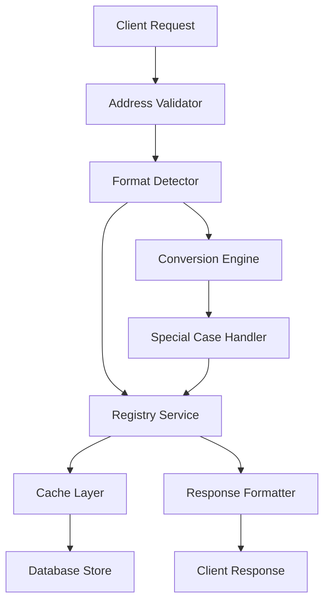

# NNA Dual Addressing System - Complete Implementation Specification
## Part 1 of 4: Overview & Architecture

---

## 1. Overview

The NNA Framework implements a dual addressing system that provides both human-readable and machine-optimized identifiers for all assets. This system ensures seamless interoperability while maintaining usability for content creators and efficiency for automated systems.

## 2. Address Format Specification

### 2.1 Structure

Both addressing formats follow the pattern:
```
[Layer].[Category].[SubCategory].[Sequential]
```

### 2.2 Human-Friendly Names (HFN)
Human-Friendly Names use alphabetic codes for readability:
```
G.POP.TSW.001
│ │   │   └── Sequential ID (001-999)
│ │   └────── Subcategory (3-letter alphabetic code)
│ └────────── Category (3-letter alphabetic code)  
└──────────── Layer (single letter: G, S, L, M, W, etc.)
```

### 2.3 Machine-Friendly Addresses (MFA)
Machine-Friendly Addresses use numeric codes for system efficiency:
```
G.003.042.001
│ │   │   └── Sequential ID (001-999)
│ │   └────── Subcategory (001-999)
│ └────────── Category (001-999)
└──────────── Layer (single letter: G, S, L, M, W, etc.)
```

## 3. Complete Layer Architecture (15 Layers Total)

The NNA Framework supports **15 layers total**, with **10 layers selected for the MVP** implementation and **5 future layers** planned for extensibility.

### 3.1 MVP Layers (10 Layers - Core Implementation)

| Layer Code | Layer Name | Description | Purpose |
|------------|------------|-------------|---------|
| **G** | Song | Musical compositions and audio tracks | Foundation for all remixes |
| **S** | Star | Characters, performers, and avatars | Virtual performers |
| **L** | Look | Visual styles, appearances, and aesthetics | Styling and wardrobe |
| **M** | Moves | Animations, choreography, and movements | Dance and choreography |
| **W** | World | Environments, scenes, and backgrounds | Environmental context |
| **B** | Branded | Premium virtual product placements | Monetization through brands |
| **P** | Personalize | User-uploaded customizations | User-generated content |
| **T** | Training_Data | Datasets for AI training | AI model training |
| **C** | Composites | Aggregated multi-layer assets | Complete compositions |
| **R** | Rights | Provenance and rights tracking | Legal compliance |

### 3.2 Future Layers (5 Layers - Planned Extensions)

| Layer Code | Layer Name | Description | Purpose |
|------------|------------|-------------|---------|
| **E** | Audio Effects | Audio enhancements (voice modulation, etc.) | Professional audio processing |
| **N** | Transitions | Visual and audio transitions | Seamless scene transitions |
| **A** | Augmented Reality | AR elements (face filters, stickers) | Interactive AR overlays |
| **F** | Filters | Visual filters (color grading, effects) | Advanced visual processing |
| **X** | Text | Text overlays (lyrics, captions) | Dynamic text integration |

### 3.3 Layer Capacity and Scalability

Each layer supports up to **999 million assets** with the addressing scheme:
- **Categories**: 999 possible (001-999)
- **Subcategories**: 999 possible per category (001-999)  
- **Sequential IDs**: 999 possible per subcategory (001-999)
- **Total capacity per layer**: 999 × 999 × 999 = ~997 million assets

## 4. Dual Addressing Benefits

### 4.1 Human-Friendly Names (HFN) Benefits
- **Intuitive**: Easy for creators to understand (`G.POP.TSW.001` = Taylor Swift Pop song)
- **Memorable**: Alphabetic codes are easier to remember than numbers
- **Self-Documenting**: Structure reveals asset type and category
- **Search Friendly**: Can be searched and filtered by text patterns

### 4.2 Machine-Friendly Addresses (MFA) Benefits
- **Performance**: Numeric codes optimize database queries and caching
- **Storage Efficient**: Smaller storage footprint in databases
- **Processing Speed**: Faster string comparison and sorting
- **System Integration**: Better for API calls and system-to-system communication

### 4.3 Registry Mapping
- **1:1 Relationship**: Each HFN maps to exactly one MFA
- **Bidirectional**: Can convert in either direction
- **Cached**: Mappings are cached for sub-20ms resolution
- **Versioned**: Registry supports versioning for evolution

## 5. Implementation Architecture Overview

### 5.1 Core Components



### 5.2 Key Services

1. **Address Validator**: Validates format and structure
2. **Format Detector**: Determines if input is HFN or MFA
3. **Registry Service**: Manages bidirectional mappings
4. **Cache Layer**: Provides sub-20ms lookup performance
5. **Conversion Engine**: Handles HFN ↔ MFA conversion
6. **Special Case Handler**: Manages exceptions and edge cases

### 5.3 Performance Targets

| Metric | Target | Purpose |
|--------|--------|---------|
| Address Resolution | <20ms | User experience |
| Cache Hit Rate | >95% | Performance optimization |
| Conversion Accuracy | 100% | Data integrity |
| Error Rate | <0.1% | System reliability |
| Concurrent Requests | 10M+ | Scalability |

## 6. MVP vs Future Layer Strategy

### 6.1 MVP Implementation Priority
The 10 MVP layers provide complete functionality for:
- Music video creation and remixing
- User personalization and customization  
- Brand integration and monetization
- AI training and optimization
- Rights management and compliance

### 6.2 Future Layer Activation
The 5 future layers can be activated incrementally:
- **Phase 2A**: Audio Effects (E) and Transitions (N)
- **Phase 2B**: Augmented Reality (A) and Filters (F)  
- **Phase 2C**: Text overlays (X)

### 6.3 Architectural Benefits
- **No Breaking Changes**: Future layers don't impact MVP functionality
- **Consistent Patterns**: All layers follow same addressing rules
- **Incremental Deployment**: Can activate layers based on business needs
- **Resource Optimization**: Only implement what's actively used

---

**Continue to Part 2 of 4**: Code Implementation & Mapping Systems