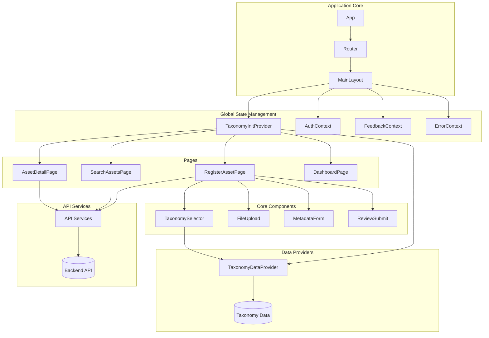

# NNA Registry Service Architecture

## System Overview

The NNA Registry Service is a platform for managing digital assets within a Naming, Numbering, and Addressing (NNA) Framework. The frontend application is built with React and TypeScript, providing a user interface for asset registration, management, and discovery within the NNA ecosystem.

### Core Features

- **Asset Registration**: Register new digital assets with metadata and files
- **Taxonomy Selection**: Categorize assets using the NNA layer taxonomy system
- **Dual Addressing**: Generate and display both Human-Friendly Names (HFN) and Machine-Friendly Addresses (MFA)
- **Asset Search**: Discover assets based on various criteria
- **Asset Details**: View comprehensive asset information

### Technology Stack

- **Frontend Framework**: React 18 with TypeScript
- **UI Components**: Material UI 
- **State Management**: React Context API and custom hooks
- **Routing**: React Router for navigation
- **HTTP Client**: Axios for API requests
- **Form Handling**: React Hook Form for validation

## Architecture Diagram

The application follows a component-based architecture with context providers for global state management. Below is a high-level architecture diagram:

## Key Design Patterns

The application implements several architectural patterns to ensure maintainability, scalability, and performance:

### 1. Provider Pattern

The Provider Pattern is used extensively for global state management:

- **TaxonomyInitProvider**: Ensures taxonomy data is loaded before rendering the app
- **TaxonomyDataProvider**: Centralized provider for all taxonomy operations and data
- **AuthContext**: Manages authentication state and user information
- **FeedbackContext**: Provides user feedback mechanism throughout the app
- **ErrorContext**: Centralized error handling and display

This pattern allows components to access shared state without prop drilling and ensures consistent data access across the application.

### 2. Component Composition

The application uses component composition to build complex UIs from smaller, reusable components:

- **TaxonomySelector**: Composed of LayerGrid, CategoryGrid, and SubcategoryGrid
- **RegisterAssetPage**: Composed of multiple form components for different steps
- **ErrorBoundary**: Wraps components to catch and handle errors gracefully

This approach enhances maintainability and reusability while keeping components focused on specific responsibilities.

### 3. Custom Hooks

Custom hooks encapsulate and reuse stateful logic across components:

- **useTaxonomy**: Provides access to taxonomy data with built-in error handling
- **useAuth**: Manages authentication state and operations
- **useFileUpload**: Handles file upload operations with progress tracking

Custom hooks separate concerns and provide a clean API for components to interact with complex logic.

### 4. Memoization and Performance Optimization

Performance optimization is implemented through:

- **React.memo**: Prevents unnecessary re-renders of components
- **useMemo**: Memoizes expensive calculations
- **useCallback**: Maintains stable function references
- **Custom comparison functions**: Optimizes when components should re-render

These patterns ensure efficient rendering and optimal performance, particularly for taxonomy data which can be complex.

## Taxonomy System

The NNA Framework defines a structured taxonomy for categorizing digital assets:

### Taxonomy Structure

1. **Layers**: Top-level categories (e.g., Songs, Stars, Looks)
   - Represented by single-letter codes (G, S, L, etc.)
   
2. **Categories**: Subdivisions within layers
   - Example: Within the 'Stars' layer (S), categories include POP, HIP, EDM, etc.
   
3. **Subcategories**: Specific types within categories
   - Example: Within 'POP' category, subcategories include BAS (Base), HPM (Hipster Male), etc.

### Implementation Approach

The taxonomy system is implemented using a flattened structure for efficient lookups:

1. **Initialization**:
   - Taxonomy data is loaded at app initialization
   - Data is processed and cached for optimal performance

2. **Selection Flow**:
   - Layer selection → Category selection → Subcategory selection
   - Each selection narrows down the available options for the next level

3. **Error Handling**:
   - Multiple fallback mechanisms for data loading issues
   - Context-based error recovery

## Dual Addressing System

The NNA Framework uses two addressing formats for digital assets:

### Human-Friendly Names (HFN)

- Format: `Layer.Category.Subcategory.SequentialNumber`
- Example: `S.POP.HPM.001`
- Purpose: Readable by humans, provides context about the asset's classification

### Machine-Friendly Addresses (MFA)

- Format: `LayerCode.CategoryCode.SubcategoryCode.SequentialNumber`
- Example: `2.004.003.001`
- Purpose: Numeric representation optimized for machine processing

### Address Generation

The system generates both HFN and MFA addresses:

1. User selects taxonomy (Layer, Category, Subcategory)
2. System assigns a sequential number
3. Both HFN and MFA are generated based on mapping tables
4. Special cases are handled with dedicated logic

## Data Flow

Data flows through the application in the following manner:

1. **Initialization**:
   - App loads taxonomy data via TaxonomyInitProvider
   - Authentication state is initialized

2. **User Registration Flow**:
   - User selects Layer → Category → Subcategory
   - User uploads asset files
   - User enters metadata
   - System generates addresses (HFN/MFA)
   - User submits asset registration

3. **Data Persistence**:
   - Form data is submitted to backend API
   - Files are uploaded to storage service
   - Asset is registered in the database

4. **Retrieval Flow**:
   - User searches or browses assets
   - System retrieves asset data from backend
   - Data is formatted and displayed

## Error Handling Strategy

The application implements a multi-tiered approach to error handling:

1. **Global Error Boundary**:
   - Catches unhandled errors at the application level
   - Prevents entire application crashes

2. **Context-Based Error Handling**:
   - ErrorContext provides centralized error state management
   - Components can report and handle errors consistently

3. **Component-Level Error Handling**:
   - Try/catch blocks for async operations
   - Fallback UI for error states

4. **Service-Level Error Handling**:
   - API service includes error interception and formatting
   - Retry mechanisms for transient failures

5. **User Feedback**:
   - FeedbackContext provides toast notifications for errors
   - Inline error messages for form validations

## Extensibility and Scalability

The architecture is designed for extensibility and scalability:

1. **Modular Component Structure**:
   - New features can be added as new components
   - Existing components can be extended or replaced

2. **Context Providers**:
   - New context providers can be added for additional global state
   - Existing providers can be enhanced or modified

3. **API Service Abstraction**:
   - API services are abstracted for easier backend changes
   - New endpoints can be added with minimal changes

4. **Feature Toggles**:
   - Support for enabling/disabling features
   - Version switching capabilities