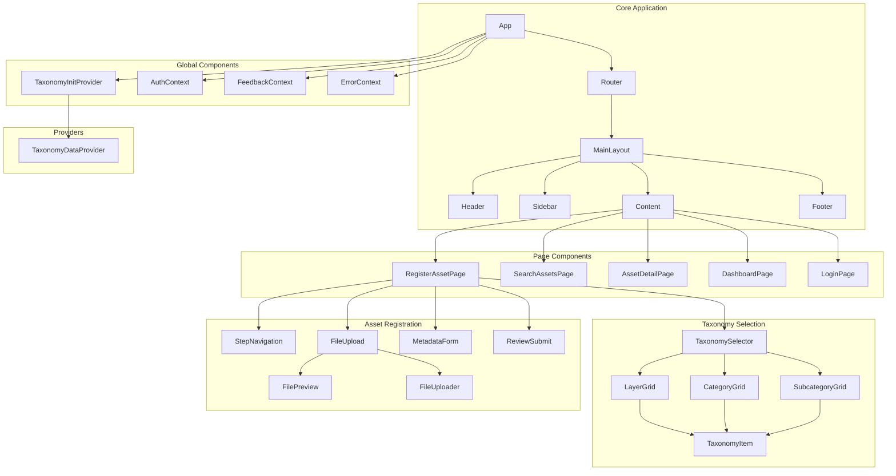
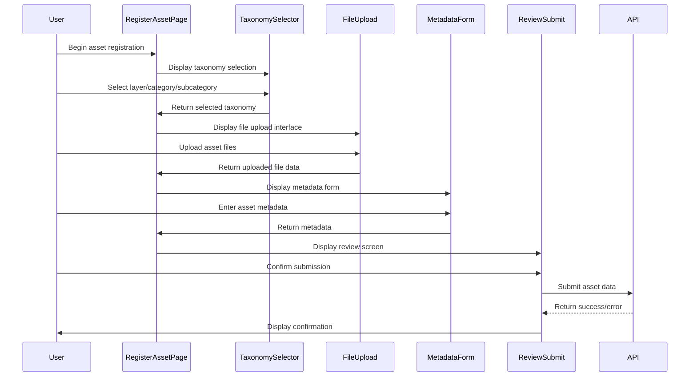

# NNA Registry Service Implementation Details

This document provides detailed technical implementation information for the NNA Registry Service frontend application, focusing on component structure, data flow, state management, and optimization techniques.

## Table of Contents

- [Component Hierarchy](#component-hierarchy)
- [Data Flow](#data-flow)
- [State Management](#state-management)
- [Performance Optimizations](#performance-optimizations)
- [API Integration](#api-integration)
- [Common Design Patterns](#common-design-patterns)
- [Taxonomy Implementation](#taxonomy-implementation)
- [Error Handling](#error-handling)

## Component Hierarchy

The application follows a hierarchical component structure, organized by functionality:



### Key Components

#### Core Components

| Component | Description | Purpose |
|-----------|-------------|---------|
| `App.tsx` | Root application component | Entry point, global providers setup |
| `MainLayout.tsx` | Application layout container | Consistent UI layout structure |
| `TaxonomyInitProvider.tsx` | Taxonomy data initialization | Ensures taxonomy data is loaded before rendering |

#### Page Components

| Component | Description | Purpose |
|-----------|-------------|---------|
| `RegisterAssetPage.tsx` | Asset registration page | Multi-step form for asset creation |
| `SearchAssetsPage.tsx` | Asset search page | Search interface for discovering assets |
| `AssetDetailPage.tsx` | Asset detail page | Display comprehensive asset information |
| `DashboardPage.tsx` | User dashboard | Overview of user's assets and activities |

#### Taxonomy Components

| Component | Description | Purpose |
|-----------|-------------|---------|
| `TaxonomySelector.tsx` | Main taxonomy selector | Container for all taxonomy selection components |
| `LayerGrid.tsx` | Layer selection grid | Selection interface for NNA layers |
| `CategoryGrid.tsx` | Category selection grid | Selection interface for layer categories |
| `SubcategoryGrid.tsx` | Subcategory selection grid | Selection interface for category subcategories |
| `TaxonomyItem.tsx` | Individual taxonomy item | Reusable item component for layers/categories/subcategories |

#### Form Components

| Component | Description | Purpose |
|-----------|-------------|---------|
| `FileUpload.tsx` | File upload interface | Handles asset file uploads |
| `MetadataForm.tsx` | Asset metadata form | Collects asset metadata information |
| `ReviewSubmit.tsx` | Review and submit form | Finalizes asset registration |

## Data Flow

### Taxonomy Data Flow

The taxonomy system follows a specific data flow pattern to ensure consistency and performance:

1. **Data Loading**:
   ```mermaid
   sequenceDiagram
       participant App
       participant TaxonomyInitProvider
       participant TaxonomyDataProvider
       participant API
       
       App->>TaxonomyInitProvider: Mount
       TaxonomyInitProvider->>TaxonomyDataProvider: Initialize
       TaxonomyDataProvider->>API: Fetch taxonomy data
       API-->>TaxonomyDataProvider: Return taxonomy data
       TaxonomyDataProvider-->>TaxonomyInitProvider: Process and store data
       TaxonomyInitProvider-->>App: Render children when ready
   ```

2. **Selection Flow**:
   ```mermaid
   sequenceDiagram
       participant User
       participant TaxonomySelector
       participant LayerGrid
       participant CategoryGrid
       participant SubcategoryGrid
       participant TaxonomyDataProvider
       
       User->>LayerGrid: Select layer
       LayerGrid->>TaxonomySelector: onLayerSelect(layer)
       TaxonomySelector->>TaxonomyDataProvider: getCategories(layer)
       TaxonomyDataProvider-->>CategoryGrid: Return categories
       CategoryGrid->>User: Display categories
       
       User->>CategoryGrid: Select category
       CategoryGrid->>TaxonomySelector: onCategorySelect(category)
       TaxonomySelector->>TaxonomyDataProvider: getSubcategories(layer, category)
       TaxonomyDataProvider-->>SubcategoryGrid: Return subcategories
       SubcategoryGrid->>User: Display subcategories
       
       User->>SubcategoryGrid: Select subcategory
       SubcategoryGrid->>TaxonomySelector: onSubcategorySelect(subcategory)
       TaxonomySelector->>TaxonomyDataProvider: generateAddresses(layer, category, subcategory)
       TaxonomyDataProvider-->>TaxonomySelector: Return HFN/MFA addresses
   ```

### Asset Registration Flow

The asset registration process flows through multiple steps:



## State Management

The application uses a combination of state management approaches:

### Context API

Global state is managed through React Context:

```tsx
// TaxonomyContext.tsx
import React, { createContext, useContext, useState, useEffect } from 'react';
import { TaxonomyData, TaxonomyState } from './types';
import { fetchTaxonomyData } from '../api/taxonomyService';

const initialState: TaxonomyState = {
  taxonomyData: null,
  loading: true,
  error: null,
  selectedLayer: '',
  selectedCategory: '',
  selectedSubcategory: '',
};

const TaxonomyContext = createContext<{
  state: TaxonomyState;
  selectLayer: (layer: string) => void;
  selectCategory: (category: string) => void;
  selectSubcategory: (subcategory: string) => void;
  refreshTaxonomyData: () => void;
} | undefined>(undefined);

export const TaxonomyProvider: React.FC = ({ children }) => {
  const [state, setState] = useState<TaxonomyState>(initialState);
  
  // Implementation details...
  
  return (
    <TaxonomyContext.Provider 
      value={{ 
        state, 
        selectLayer, 
        selectCategory, 
        selectSubcategory,
        refreshTaxonomyData
      }}
    >
      {children}
    </TaxonomyContext.Provider>
  );
};

export const useTaxonomy = () => {
  const context = useContext(TaxonomyContext);
  if (!context) {
    throw new Error('useTaxonomy must be used within a TaxonomyProvider');
  }
  return context;
};
```

### Component State

Component-specific state is managed through React hooks:

```tsx
const [files, setFiles] = useState<File[]>([]);
const [activeStep, setActiveStep] = useState(0);
const [formData, setFormData] = useState<AssetFormData>(initialFormData);
```

### Custom Hooks

Complex state logic is encapsulated in custom hooks:

```tsx
// useTaxonomyData.ts
export const useTaxonomyData = () => {
  const [taxonomyData, setTaxonomyData] = useState<TaxonomyData | null>(null);
  const [loadingState, setLoadingState] = useState<'loading' | 'loaded' | 'error'>('loading');
  const [error, setError] = useState<Error | null>(null);
  
  // Implementation details...
  
  return {
    taxonomyData,
    loadingState,
    error,
    getCategories,
    getSubcategories,
    refreshTaxonomyData
  };
};
```

## Performance Optimizations

### Memoization with React.memo

Components are wrapped with React.memo to prevent unnecessary re-renders:

```tsx
// TaxonomyItem.tsx
const TaxonomyItem: React.FC<TaxonomyItemProps> = ({ 
  item, 
  isActive,
  onClick,
  onDoubleClick,
  dataTestId
}) => {
  // Component implementation...
};

// Custom comparison function for memoization
const arePropsEqual = (prevProps: TaxonomyItemProps, nextProps: TaxonomyItemProps) => {
  // Deep comparison of the item props to prevent unnecessary re-renders
  const itemEqual = 
    prevProps.item.code === nextProps.item.code &&
    prevProps.item.name === nextProps.item.name &&
    prevProps.item.numericCode === nextProps.item.numericCode;
  
  const propsEqual = 
    itemEqual &&
    prevProps.isActive === nextProps.isActive &&
    prevProps.dataTestId === nextProps.dataTestId;
  
  // Skip comparison of event handlers as they should be wrapped in useCallback in parent
  
  return propsEqual;
};

// Add displayName for debugging in React DevTools
TaxonomyItem.displayName = 'TaxonomyItem';

export default React.memo(TaxonomyItem, arePropsEqual);
```

### useMemo for Computed Values

Expensive calculations are memoized with useMemo:

```tsx
// LayerGrid.tsx
const getLayerNumericCode = useMemo(() => {
  const codeMap: Record<string, string> = {
    'G': '1',
    'S': '2',
    'L': '3',
    'M': '4',
    'W': '5',
    // ...more mappings
  };
  return (layer: string): string => codeMap[layer] || '';
}, []);

const layers = useMemo(() => {
  debugLog(`[LayerGrid] Creating layer items from taxonomy data`);
  return Object.keys(taxonomyData.layers).map(layer => {
    // Create a simple item representation for each layer
    return {
      code: layer,
      name: getLayerName(layer),
      numericCode: getLayerNumericCode(layer)
    };
  });
}, [taxonomyData, getLayerName, getLayerNumericCode]);
```

### useCallback for Stable Function References

Event handlers are wrapped with useCallback to maintain stable references:

```tsx
// SubcategoryGrid.tsx
const handleSubcategorySelect = useCallback((subcategory: string, isDoubleClick?: boolean) => {
  // Special log for Star+POP selections for debugging
  const isStarPop = layer === 'S' && category === 'POP';
  if (isStarPop) {
    debugLog(
      `[SUBCATEGORY SELECT] Selecting S.POP.${subcategory} (double-click: ${Boolean(isDoubleClick)})`
    );
    logger.taxonomy(LogLevel.DEBUG, `Star Pop subcategory selected: ${subcategory}`);
  }
  
  // Call the parent handler
  onSubcategorySelect(subcategory, isDoubleClick);
}, [layer, category, onSubcategorySelect]);
```

### Data Structure Optimization

Optimized data structures for faster access:

```tsx
// Before: Switch statement
const getAcceptedFileTypesByLayer = (layerCode?: string): string => {
  switch (layerCode) {
    case 'G': // Songs
      return 'audio/mpeg,audio/wav,audio/ogg,audio/flac,audio/aac';
    case 'S': // Stars
      return 'image/jpeg,image/png,image/gif,image/svg+xml';
    // more cases...
  }
};

// After: Lookup object
const getAcceptedFileTypesByLayer = (layerCode?: string): string => {
  // This lookup table could be moved to a constant to avoid recreation, but keeping it here for clarity
  const fileTypesMap: Record<string, string> = {
    'G': 'audio/mpeg,audio/wav,audio/ogg,audio/flac,audio/aac', // Songs
    'S': 'image/jpeg,image/png,image/gif,image/svg+xml', // Stars
    // more mappings...
  };
  
  // Use lookup table instead of switch for better performance
  return fileTypesMap[layerCode || ''] || 'image/*,audio/*,video/*,application/json,application/pdf';
};
```

### Environment-Aware Logging

Conditional logging to prevent performance impact in production:

```tsx
// logger.ts
export const isDebugMode = (): boolean => {
  return process.env.NODE_ENV !== 'production';
};

export const debugLog = (message: string, ...args: any[]): void => {
  if (isDebugMode()) {
    console.log(message, ...args);
  }
};

export enum LogLevel {
  DEBUG = 'debug',
  INFO = 'info',
  WARN = 'warn',
  ERROR = 'error'
}

export const logger = {
  taxonomy: (level: LogLevel, message: string, data?: any) => {
    if (isDebugMode() || level === LogLevel.ERROR) {
      const logMethod = console[level] || console.log;
      logMethod(`[TAXONOMY] ${message}`, data || '');
    }
  },
  ui: (level: LogLevel, message: string, data?: any) => {
    if (isDebugMode() || level === LogLevel.ERROR) {
      const logMethod = console[level] || console.log;
      logMethod(`[UI] ${message}`, data || '');
    }
  }
};
```

## API Integration

The application interacts with the backend through a service layer:

### API Service Structure

```tsx
// api.ts
import axios, { AxiosInstance, AxiosRequestConfig } from 'axios';

// Create a base axios instance with common configuration
const createApiClient = (): AxiosInstance => {
  const client = axios.create({
    baseURL: process.env.REACT_APP_API_URL || '/api',
    timeout: 30000,
    headers: {
      'Content-Type': 'application/json',
    },
  });

  // Request interceptor for auth
  client.interceptors.request.use(
    (config) => {
      const token = localStorage.getItem('auth_token');
      if (token) {
        config.headers.Authorization = `Bearer ${token}`;
      }
      return config;
    },
    (error) => Promise.reject(error)
  );
  
  // Response interceptor for error handling
  client.interceptors.response.use(
    (response) => response,
    (error) => {
      if (error.response) {
        if (error.response.status === 401) {
          // Handle unauthorized
          localStorage.removeItem('auth_token');
          window.location.href = '/login';
        }
        
        // Format error message
        const errorMessage = error.response.data.message || 'An error occurred';
        return Promise.reject(new Error(errorMessage));
      }
      return Promise.reject(error);
    }
  );
  
  return client;
};

const apiClient = createApiClient();

export default apiClient;
```

### Asset Service Example

```tsx
// assetService.ts
import apiClient from './api';
import { Asset, AssetFormData, AssetSearchParams } from '../types/asset.types';

export const assetService = {
  // Get a list of assets with optional search parameters
  async getAssets(params?: AssetSearchParams): Promise<Asset[]> {
    try {
      const response = await apiClient.get('/assets', { params });
      return response.data;
    } catch (error) {
      console.error('Error fetching assets:', error);
      throw error;
    }
  },
  
  // Get a single asset by ID
  async getAssetById(id: string): Promise<Asset> {
    try {
      const response = await apiClient.get(`/assets/${id}`);
      return response.data;
    } catch (error) {
      console.error(`Error fetching asset with ID ${id}:`, error);
      throw error;
    }
  },
  
  // Create a new asset
  async createAsset(data: AssetFormData): Promise<Asset> {
    try {
      // Create FormData for file uploads
      const formData = new FormData();
      
      // Add metadata fields
      Object.entries(data.metadata).forEach(([key, value]) => {
        formData.append(key, value);
      });
      
      // Add taxonomy information
      formData.append('layer', data.layer);
      formData.append('category', data.category);
      formData.append('subcategory', data.subcategory);
      
      // Add files
      data.files.forEach(file => {
        formData.append('files', file);
      });
      
      const response = await apiClient.post('/assets', formData, {
        headers: {
          'Content-Type': 'multipart/form-data'
        }
      });
      
      return response.data;
    } catch (error) {
      console.error('Error creating asset:', error);
      throw error;
    }
  }
};
```

## Common Design Patterns

### Form Handling with React Hook Form

```tsx
// MetadataForm.tsx
import { useForm } from 'react-hook-form';

interface MetadataFormProps {
  initialData?: AssetMetadata;
  onSubmit: (data: AssetMetadata) => void;
}

const MetadataForm: React.FC<MetadataFormProps> = ({ initialData, onSubmit }) => {
  const { 
    register, 
    handleSubmit, 
    formState: { errors },
    reset
  } = useForm<AssetMetadata>({
    defaultValues: initialData || {}
  });
  
  const submitHandler = (data: AssetMetadata) => {
    onSubmit(data);
  };
  
  // Form rendering...
};
```

### Render Props Pattern for Complex Components

```tsx
// ConditionalRender.tsx
interface ConditionalRenderProps {
  condition: boolean;
  renderIfTrue: () => React.ReactNode;
  renderIfFalse: () => React.ReactNode;
}

const ConditionalRender: React.FC<ConditionalRenderProps> = ({
  condition,
  renderIfTrue,
  renderIfFalse
}) => {
  return <>{condition ? renderIfTrue() : renderIfFalse()}</>;
};

// Usage
<ConditionalRender
  condition={isLoading}
  renderIfTrue={() => <LoadingSpinner />}
  renderIfFalse={() => <DataDisplay data={data} />}
/>
```

### Higher-Order Components (HOC)

```tsx
// withErrorBoundary.tsx
const withErrorBoundary = <P extends object>(
  Component: React.ComponentType<P>,
  fallback?: React.ReactNode
) => {
  const WithErrorBoundary: React.FC<P> = (props) => {
    return (
      <ErrorBoundary fallback={fallback}>
        <Component {...props} />
      </ErrorBoundary>
    );
  };
  
  WithErrorBoundary.displayName = `WithErrorBoundary(${
    Component.displayName || Component.name || 'Component'
  })`;
  
  return WithErrorBoundary;
};

// Usage
const SafeComponent = withErrorBoundary(MyComponent);
```

## Taxonomy Implementation

The taxonomy system is implemented with a focus on performance and error resilience:

### Data Structure

```tsx
// Taxonomy data structure
interface TaxonomyData {
  layers: Record<string, Layer>;
  mappings: {
    hfnToMfa: Record<string, string>;
    mfaToHfn: Record<string, string>;
  };
}

interface Layer {
  code: string;
  name: string;
  numericCode: string;
  categories: Record<string, Category>;
}

interface Category {
  code: string;
  name: string;
  numericCode: string;
  subcategories: Record<string, Subcategory>;
}

interface Subcategory {
  code: string;
  name: string;
  numericCode: string;
}

// Simplified representation for UI components
interface TaxonomyItem {
  code: string;
  name: string;
  numericCode: string;
}
```

### Optimized Lookup

```tsx
// taxonomyDataProvider.tsx
const getCategories = useCallback((layer: string): TaxonomyItem[] => {
  if (!taxonomyData || !taxonomyData.layers[layer]) {
    return [];
  }
  
  return Object.entries(taxonomyData.layers[layer].categories).map(
    ([code, category]) => ({
      code,
      name: category.name,
      numericCode: category.numericCode
    })
  );
}, [taxonomyData]);

const getSubcategories = useCallback((layer: string, category: string): TaxonomyItem[] => {
  if (
    !taxonomyData || 
    !taxonomyData.layers[layer] || 
    !taxonomyData.layers[layer].categories[category]
  ) {
    return [];
  }
  
  return Object.entries(
    taxonomyData.layers[layer].categories[category].subcategories
  ).map(([code, subcategory]) => ({
    code,
    name: subcategory.name,
    numericCode: subcategory.numericCode
  }));
}, [taxonomyData]);
```

### Address Generation

```tsx
// taxonomyFormatter.ts
const formatHFN = (layer: string, category: string, subcategory: string, sequentialNumber: string): string => {
  // Format sequential number with leading zeros
  const formattedNumber = sequentialNumber.padStart(3, '0');
  return `${layer}.${category}.${subcategory}.${formattedNumber}`;
};

const formatMFA = (
  layerCode: string, 
  categoryCode: string, 
  subcategoryCode: string, 
  sequentialNumber: string
): string => {
  // Format sequential number with leading zeros
  const formattedNumber = sequentialNumber.padStart(3, '0');
  return `${layerCode}.${categoryCode}.${subcategoryCode}.${formattedNumber}`;
};

const convertHFNtoMFA = (hfn: string, taxonomyData: TaxonomyData): string => {
  // Direct mapping lookup
  if (taxonomyData.mappings.hfnToMfa[hfn]) {
    return taxonomyData.mappings.hfnToMfa[hfn];
  }
  
  // Parse HFN parts
  const [layer, category, subcategory, sequentialNumber] = hfn.split('.');
  
  // Get numeric codes
  const layerNumericCode = taxonomyData.layers[layer]?.numericCode;
  const categoryNumericCode = taxonomyData.layers[layer]?.categories[category]?.numericCode;
  const subcategoryNumericCode = 
    taxonomyData.layers[layer]?.categories[category]?.subcategories[subcategory]?.numericCode;
  
  if (!layerNumericCode || !categoryNumericCode || !subcategoryNumericCode) {
    throw new Error(`Invalid HFN: ${hfn}`);
  }
  
  return formatMFA(
    layerNumericCode,
    categoryNumericCode,
    subcategoryNumericCode,
    sequentialNumber
  );
};
```

## Error Handling

The application implements a comprehensive error handling strategy:

### Error Boundary Component

```tsx
// ErrorBoundary.tsx
import React, { Component, ErrorInfo, ReactNode } from 'react';

interface ErrorBoundaryProps {
  children: ReactNode;
  fallback?: ReactNode | ((error: Error, resetError: () => void) => ReactNode);
  onError?: (error: Error, errorInfo: ErrorInfo) => void;
}

interface ErrorBoundaryState {
  hasError: boolean;
  error: Error | null;
}

class ErrorBoundary extends Component<ErrorBoundaryProps, ErrorBoundaryState> {
  constructor(props: ErrorBoundaryProps) {
    super(props);
    this.state = {
      hasError: false,
      error: null
    };
  }

  static getDerivedStateFromError(error: Error): ErrorBoundaryState {
    return { hasError: true, error };
  }

  componentDidCatch(error: Error, errorInfo: ErrorInfo): void {
    // Log the error
    console.error('Error caught by ErrorBoundary:', error, errorInfo);
    
    // Call onError prop if provided
    if (this.props.onError) {
      this.props.onError(error, errorInfo);
    }
  }

  resetError = (): void => {
    this.setState({ hasError: false, error: null });
  }

  render(): ReactNode {
    if (this.state.hasError) {
      // Render fallback UI
      if (this.props.fallback) {
        if (typeof this.props.fallback === 'function') {
          return this.props.fallback(this.state.error!, this.resetError);
        }
        return this.props.fallback;
      }
      
      // Default fallback UI
      return (
        <div className="error-boundary">
          <h2>Something went wrong.</h2>
          <p>{this.state.error?.message || 'An unknown error occurred.'}</p>
          <button onClick={this.resetError}>Try again</button>
        </div>
      );
    }

    return this.props.children;
  }
}

export default ErrorBoundary;
```

### Async Error Handling

```tsx
// useAsyncOperation.ts
import { useState, useEffect, useCallback } from 'react';

interface AsyncOperationState<T> {
  data: T | null;
  loading: boolean;
  error: Error | null;
}

export function useAsyncOperation<T, P extends any[]>(
  asyncFn: (...args: P) => Promise<T>,
  initialState: T | null = null
) {
  const [state, setState] = useState<AsyncOperationState<T>>({
    data: initialState,
    loading: false,
    error: null
  });

  const execute = useCallback(
    async (...args: P) => {
      setState(prev => ({ ...prev, loading: true, error: null }));
      
      try {
        const result = await asyncFn(...args);
        setState({ data: result, loading: false, error: null });
        return result;
      } catch (error) {
        setState(prev => ({ 
          ...prev, 
          loading: false, 
          error: error instanceof Error ? error : new Error(String(error)) 
        }));
        throw error;
      }
    },
    [asyncFn]
  );

  return {
    ...state,
    execute
  };
}
```

### Error Context for Global Error State

```tsx
// ErrorContext.tsx
import React, { createContext, useContext, useState, useCallback } from 'react';

interface ErrorContextType {
  error: Error | null;
  setError: (error: Error | null) => void;
  clearError: () => void;
}

const ErrorContext = createContext<ErrorContextType | undefined>(undefined);

export const ErrorProvider: React.FC = ({ children }) => {
  const [error, setErrorState] = useState<Error | null>(null);
  
  const setError = useCallback((error: Error | null) => {
    setErrorState(error);
    
    // Optionally log to monitoring service
    if (error) {
      console.error('Global error:', error);
      // logErrorToMonitoringService(error);
    }
  }, []);
  
  const clearError = useCallback(() => {
    setErrorState(null);
  }, []);
  
  return (
    <ErrorContext.Provider value={{ error, setError, clearError }}>
      {children}
    </ErrorContext.Provider>
  );
};

export const useError = () => {
  const context = useContext(ErrorContext);
  if (!context) {
    throw new Error('useError must be used within an ErrorProvider');
  }
  return context;
};
```

This implementation document provides a detailed technical overview of the NNA Registry Service frontend application, including component structure, data flow patterns, state management approaches, and optimization techniques. It serves as a comprehensive reference for developers working on the application.