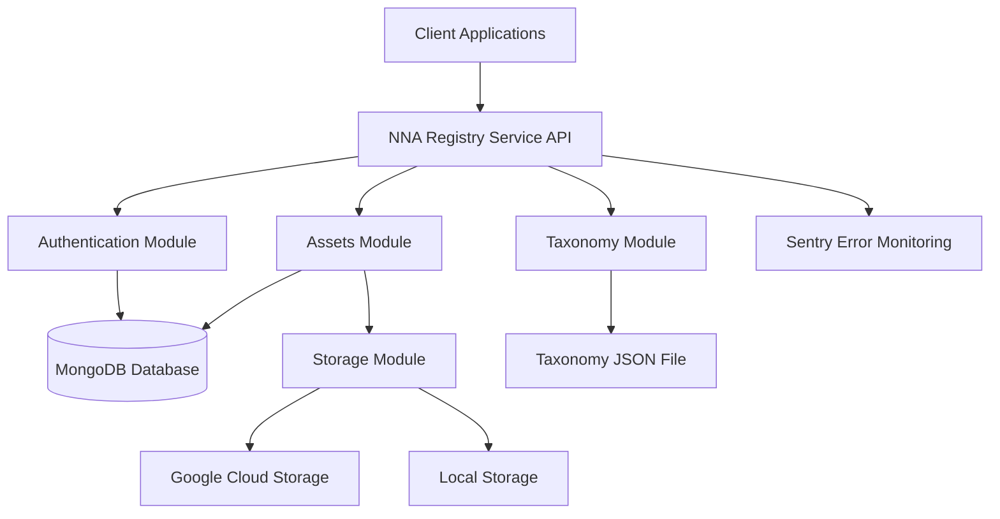

# NNA Registry Service - Project Documentation

## Project Overview

The NNA Registry Service is a crucial component of the NNA Framework for ReViz's AI-powered video remixing platform. It implements a dual addressing system (Human-Friendly Names and NNA Addresses) for digital assets across various layers (Songs, Stars, Looks, Moves, Worlds, etc.).

### Key Features

- **Asset Registration**: Register assets with proper taxonomy classification
- **Asset Retrieval**: Look up assets by friendly name or NNA address
- **Asset Management**: Update, delete, search, and curate assets
- **Authentication**: Secure access with JWT-based authentication and role-based authorization
- **Google Cloud Storage**: Store and retrieve asset files with organized folder structure
- **Taxonomy Validation**: Validate assets against the NNA Layer Taxonomy v1.2
- **API Documentation**: Comprehensive Swagger documentation
- **Error Tracking**: Integration with Sentry for monitoring and error tracking

## Architecture

The NNA Registry Service follows a modular architecture based on NestJS:



### Technology Stack

- **Backend Framework**: NestJS
- **Database**: MongoDB (with Mongoose ODM)
- **Authentication**: JWT (JSON Web Tokens)
- **Storage**: Google Cloud Storage (with local fallback for development)
- **API Documentation**: Swagger / OpenAPI
- **Error Tracking**: Sentry
- **Containerization**: Docker
- **Testing**: Jest

## Module Structure

### Authentication Module

The Authentication Module handles user registration, login, and authorization:

- **auth.controller.ts**: Exposes `/auth` endpoints for registration, login, profile, and admin operations
- **auth.service.ts**: Implements the business logic for authentication and user management
- **jwt.strategy.ts**: Implements JWT token validation strategy
- **guards**: JWT and Role-based access control
- **DTOs**: Data Transfer Objects for validation and documentation

### Assets Module

The Assets Module manages digital assets with their metadata:

- **assets.controller.ts**: Exposes RESTful endpoints for asset management
- **assets.service.ts**: Implements asset creation, search, update, and deletion logic
- **DTOs**: Create, Update, and Search data validation objects

### Storage Module

The Storage Module handles file storage and retrieval:

- **storage.service.ts**: Implements file upload/download with GCP or local filesystem
- Supports development mode with local storage fallback

### Taxonomy Module

The Taxonomy Module validates asset classification:

- **taxonomy.service.ts**: Loads taxonomy data and validates layer/category/subcategory combinations
- Uses enhanced NNA Layer Taxonomy v1.2 for validation

## Core Data Models

### Asset Schema

The Asset model defines the structure for digital assets:

```typescript
@Schema({ timestamps: true })
export class Asset extends Document {
  @Prop({ required: true })
  layer: string;

  @Prop({ required: true })
  category: string;

  @Prop({ required: true })
  subcategory: string;

  @Prop({ required: true, unique: true })
  name: string; // Human-Friendly Name (HFN)

  @Prop({ required: true, unique: true })
  nna_address: string; // NNA Address

  @Prop({ required: true })
  gcpStorageUrl: string;

  @Prop({ required: true })
  source: string;

  @Prop({ type: [String], default: [] })
  tags: string[];

  @Prop()
  description: string;

  @Prop({ type: Object })
  trainingData?: {
    prompts?: string[];
    images?: string[];
    videos?: string[];
  };

  @Prop({ type: Object })
  rights?: {
    source?: string;
    rights_split?: string;
  };

  @Prop({ type: [String], default: [] })
  components?: string[];

  @Prop()
  registered_by: string;

  @Prop()
  createdAt: Date;

  @Prop()
  updatedAt: Date;
}
```

### User Schema

The User model defines the structure for user accounts:

```typescript
@Schema({ timestamps: true })
export class User extends Document {
  @Prop({ required: true, unique: true, match: /^[\w-\.]+@([\w-]+\.)+[\w-]{2,4}$/ })
  email: string;

  @Prop({ required: true, minlength: 6 })
  password: string;

  @Prop({ enum: ['user', 'admin'], default: 'user' })
  role: string;

  @Prop()
  createdAt: Date;

  @Prop()
  updatedAt: Date;

  async comparePassword(candidatePassword: string): Promise<boolean> {
    return bcrypt.compare(candidatePassword, this.password);
  }
}
```

## API Endpoints

### Authentication Endpoints

- **POST /auth/register**: Register a new user
  - Body: `{ "email": "user@example.com", "password": "password123" }`
  - Response: `{ "token": "jwt_token_here" }`

- **POST /auth/login**: Login with credentials
  - Body: `{ "email": "user@example.com", "password": "password123" }`
  - Response: `{ "token": "jwt_token_here" }`

- **GET /auth/profile**: Get user profile (protected)
  - Headers: `Authorization: Bearer jwt_token_here`
  - Response: `{ "email": "user@example.com", "role": "user" }`

- **POST /auth/make-admin**: Promote a user to admin (admin only)
  - Headers: `Authorization: Bearer admin_jwt_token`
  - Body: `{ "email": "user@example.com" }`
  - Response: `{ "email": "user@example.com", "role": "admin" }`

### Asset Endpoints

- **POST /assets**: Register a new asset (multipart form with file)
  - Headers: `Authorization: Bearer jwt_token_here`
  - Form Data:
    - `file`: Asset file
    - `layer`: Asset layer (e.g., "S")
    - `category`: Asset category (e.g., "Pop")
    - `subcategory`: Asset subcategory (e.g., "Base")
    - `source`: Asset source (e.g., "ReViz")
    - `tags[]`: Asset tags
    - `description`: Asset description
    - `trainingData`: JSON object with prompts/images/videos
    - `rights`: JSON object with rights information
    - `components[]`: Array of component IDs

- **GET /assets**: Search assets with filters
  - Headers: `Authorization: Bearer jwt_token_here`
  - Query Parameters:
    - `layer`: Filter by layer
    - `category`: Filter by category
    - `search`: Text search
    - `page`: Page number
    - `limit`: Items per page

- **GET /assets/:name**: Get asset by name
  - Headers: `Authorization: Bearer jwt_token_here`
  - Path Parameter: `name` - The Human-Friendly Name

- **PUT /assets/:name**: Update an asset
  - Headers: `Authorization: Bearer jwt_token_here`
  - Path Parameter: `name` - The Human-Friendly Name
  - Body: Asset properties to update

- **DELETE /assets/:name**: Delete an asset (admin only)
  - Headers: `Authorization: Bearer admin_jwt_token`
  - Path Parameter: `name` - The Human-Friendly Name

- **POST /assets/curate/:name**: Curate an asset (admin only)
  - Headers: `Authorization: Bearer admin_jwt_token`
  - Path Parameter: `name` - The Human-Friendly Name

## Storage Implementation

The service supports both GCP Cloud Storage and local storage:

- **Development Mode**:
  - Files are stored locally in the `storage` directory
  - File paths follow the structure: `storage/{layer}/{category}/{subcategory}/{filename}`
  - URLs use the `file://` protocol

- **Production Mode**:
  - Files are stored in Google Cloud Storage
  - File paths follow the structure: `{layer}/{category}/{subcategory}/{filename}`
  - Public URLs are generated for access

The storage mode is determined by the `NODE_ENV` environment variable:
- `NODE_ENV=development`: Local storage
- `NODE_ENV=production`: GCP Cloud Storage

## Environment Configuration

The application uses environment variables for configuration:

```
PORT=3001
NODE_ENV=development
MONGODB_URI=mongodb://localhost:27017/nna-registry
JWT_SECRET=your_jwt_secret
GCP_PROJECT_ID=your_gcp_project_id
GCP_BUCKET_NAME=your_gcp_bucket_name
GOOGLE_APPLICATION_CREDENTIALS=/path/to/credentials.json
SENTRY_DSN=your_sentry_dsn
```

## Testing

The project includes several types of tests:

- **Unit Tests**: Test individual components in isolation
  - Run with: `npm test`

- **End-to-End Tests**: Test complete flows and API endpoints
  - Run with: `npm run test:e2e`

- **API Tests**: Test API endpoints with bash scripts or Postman
  - Run with: `npm run test:api`

## Deployment Options

The NNA Registry Service can be deployed in several ways:

- **Local Development**: Run with `npm run start:dev`
- **Docker Containers**: See [Docker Deployment Guide](DOCKER_DEPLOYMENT.md)
- **Cloud Hosting**: Deploy to Google Cloud Run, AWS, or Kubernetes

## Development Workflow

1. Set up the development environment
2. Run the application in development mode
3. Use Swagger UI to test API endpoints
4. Implement new features or fix bugs
5. Run tests to ensure everything works
6. Commit changes to the repository
7. Deploy using the preferred method

## Further Documentation

- [Docker Installation Guide](INSTALL_DOCKER.md)
- [Docker Deployment Guide](DOCKER_DEPLOYMENT.md)
- [API Testing Guide](test/README.md)
- [Swagger Asset Creation Example](swagger-asset-example.md)

## Troubleshooting

### MongoDB Connection Issues

- Check if MongoDB is running
- Verify the connection string in .env
- Check network connectivity and firewall settings

### Storage Issues

- For development mode, ensure the storage directory exists and is writable
- For production mode, verify GCP credentials and bucket permissions
- Check environment variables for proper configuration

### Authentication Issues

- Check JWT_SECRET configuration
- Verify token expiration and validation
- Check user roles for protected endpoints